Communicated emotions LA
================

### Import Data

``` r
setwd("C:\\Users\\Pablo M. Flores\\OneDrive\\Pablo Flores Bautista\\UCDavis\\PhD\\Papers\\2020 Communicated emotions\\Paper\\Git repository\\communicated emotions")

Base <- read.csv("DDBB_to_RR_LA.csv", header = TRUE)

# Creation time series by five minutes
sadness_LA <- aggregate(sadness~one_minutes, data = Base, sum)
anger_LA <- aggregate(anger~one_minutes, data = Base, sum)
fear_LA <- aggregate(fear~one_minutes, data = Base, sum)
disgust_LA <- aggregate(disgust~one_minutes, data = Base, sum)
joy_LA <- aggregate(joy~one_minutes, data = Base, sum)
count_LA <- aggregate(count~one_minutes, data = Base, sum)

#Time Series variables mean
sadness <- sadness_LA$sadness
anger <- anger_LA$anger
fear <- fear_LA$fear
disgust <- disgust_LA$disgust
joy <- joy_LA$joy
count <- count_LA$count

emotions_LA <- as.data.frame(cbind(sadness, anger, fear, disgust, joy, count))
```

### Change point analysis

Based on the variation of the amount of tweets the process is divided in
phases

``` r
library('forecast')
```

    ## Registered S3 method overwritten by 'quantmod':
    ##   method            from
    ##   as.zoo.data.frame zoo

``` r
library('changepoint')
```

    ## Loading required package: zoo

    ## 
    ## Attaching package: 'zoo'

    ## The following objects are masked from 'package:base':
    ## 
    ##     as.Date, as.Date.numeric

    ## Successfully loaded changepoint package version 2.2.2
    ##  NOTE: Predefined penalty values changed in version 2.2.  Previous penalty values with a postfix 1 i.e. SIC1 are now without i.e. SIC and previous penalties without a postfix i.e. SIC are now with a postfix 0 i.e. SIC0. See NEWS and help files for further details.

``` r
ggtsdisplay(emotions_LA$count, plot.type = "partial", points = FALSE, smooth = TRUE,
                      main = 'Tweets about LA earthquake',
                      xlab = 'Time', ylab = 'Variation')
```

    ## `geom_smooth()` using formula 'y ~ x'

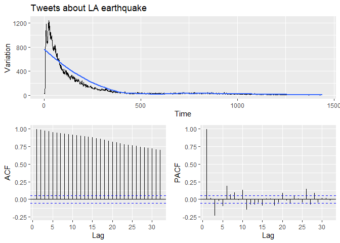<!-- -->

``` r
cp_count <- cpt.var(emotions_LA[,6], method='PELT')

plot(cp_count, main='Change points tweets during LA earthquake')
```

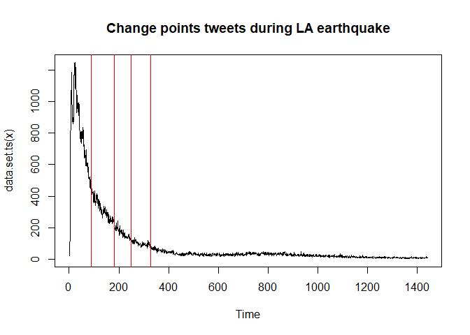<!-- -->

``` r
detach('package:changepoint')
```

### Time series plots

``` r
ggtsdisplay(emotions_LA$sadness, plot.type = "partial", points = FALSE, smooth = TRUE,
                      main = 'LA earthquake (Sadness)',
                      xlab = 'Time', ylab = 'Variation')
```

    ## `geom_smooth()` using formula 'y ~ x'

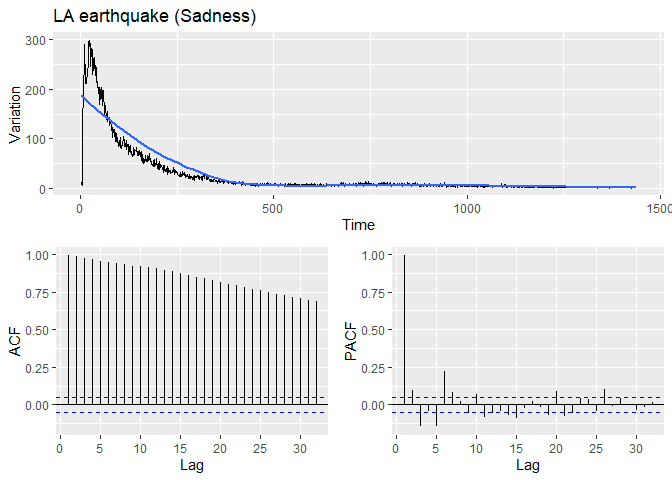<!-- -->

``` r
ggtsdisplay(emotions_LA$anger, plot.type = "partial", points = FALSE, smooth = TRUE,
                      main = 'LA earthquake (Anger)',
                      xlab = 'Time', ylab = 'Variation')
```

    ## `geom_smooth()` using formula 'y ~ x'

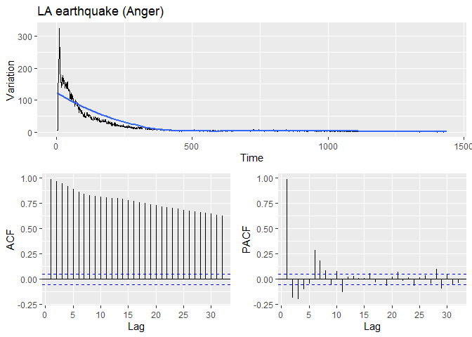<!-- -->

``` r
ggtsdisplay(emotions_LA$fear, plot.type = "partial", points = FALSE, smooth = TRUE,
                      main = 'LA earthquake (Fear)',
                      xlab = 'Time', ylab = 'Variation')
```

    ## `geom_smooth()` using formula 'y ~ x'

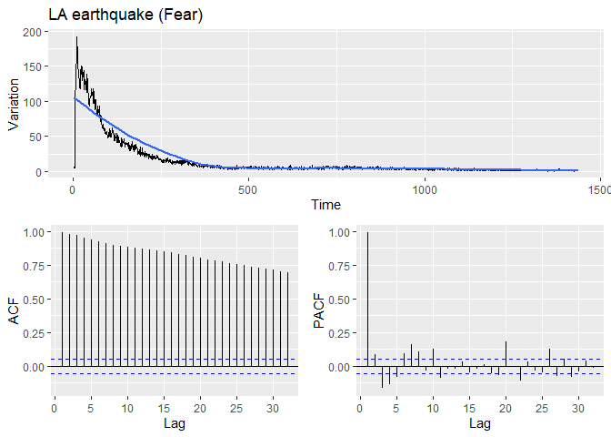<!-- -->

``` r
ggtsdisplay(emotions_LA$disgust, plot.type = "partial", points = FALSE, smooth = TRUE,
                      main = 'LA earthquake (Disgust)',
                      xlab = 'Time', ylab = 'Variation')
```

    ## `geom_smooth()` using formula 'y ~ x'

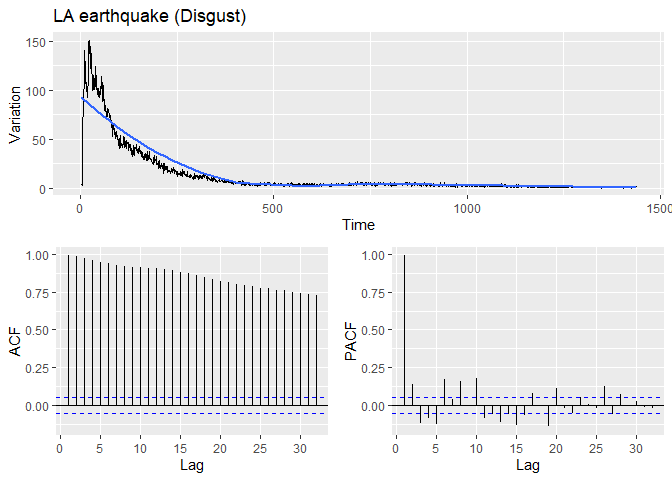<!-- -->

``` r
ggtsdisplay(emotions_LA$joy, plot.type = "partial", points = FALSE, smooth = TRUE,
                      main = 'LA earthquake (Joy)',
                      xlab = 'Time', ylab = 'Variation')
```

    ## `geom_smooth()` using formula 'y ~ x'

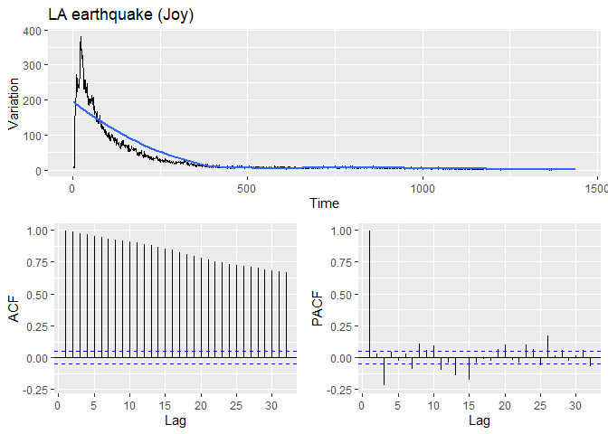<!-- -->

``` r
detach('package:forecast')
```

### Univariate analysis

Adjust models to the different time series

``` r
#auto.arima(emotions_LA$sadness)

#auto.arima(emotions_LA$anger)

#auto.arima(emotions_LA$fear)

#auto.arima(emotions_LA$disgust)

#auto.arima(emotions_LA$joy)

#detach('package:forecast')
```

## Granger Causality

### Toda-Yamamoto Granger causality correction

The work developed for Toda and Yamamoto (1995) allows to adjust the
Granger-causality test in cases in which the time series under analysis
are non-stationary. Using the Toda-Yamamoto procedure it is possible to
analyze time series even if they are cointegrated to determine their
Granger-causality. To perform Toda-Yamamoto we (1) determine the maximum
order of integration for each one of the time series, (2) determine the
lag for the VAR model, (3) determine if the time series are
cointegrated, (4) compute the VAR model, (5) test Granger causality
using Toda-Yamamoto.

``` r
toda.yamamoto <- function(var, max.oi) {
  # It requires the VAR function plus the maximum order of integration with the time series at level
  ty.df <- eval(var$call$y);
  ty.varnames <- colnames(ty.df);
  ty.lags <- var$p + max.oi;
  ty.augmented_var <- VAR(ty.df, ty.lags, type=var$type);
  
  ty.results <- data.frame(predictor = character(0), causes = character(0), chisq = numeric(0), p = numeric(0));
  
  for (current_variable in ty.varnames) {
    # Construct the restriction matrix: to test if *current_variable* causes any of the others,
    # Test if the lagged values of current variable (ignoring the lags added with max.oi) are jointly insignificant
    
    ty.restrictions <- as.matrix(Bcoef(ty.augmented_var))*0+1;
    ty.coefres <- head(grep(current_variable, colnames(ty.restrictions), value=T), -1);
    ty.restrictions[which(rownames(ty.restrictions) != current_variable), ty.coefres] <- 0;
    # Estimate restricted var
    ty.restricted_var <- restrict(ty.augmented_var, 'manual', resmat=ty.restrictions);
    
    for (k in 1:length(ty.varnames)) {
      if (ty.varnames[k] != current_variable) {
        my.wald <- waldtest(ty.augmented_var$varresult[[k]], ty.restricted_var$varresult[[k]], test='Chisq');
        ty.results <- rbind(ty.results, data.frame(
          predictor = current_variable, 
          causes = ty.varnames[k], 
          chisq = as.numeric(my.wald$Chisq[2]), 
          p = my.wald$`Pr(>Chisq)`[2])
        );
      }
    }
  }
  return(ty.results);
}
```

The analysis is performed in all the stages defined by the change point
analysis previously performed

**Stage 1**

``` r
library('vars')
```

    ## Loading required package: MASS

    ## Loading required package: strucchange

    ## Loading required package: sandwich

    ## Loading required package: urca

    ## Loading required package: lmtest

``` r
library('forecast')

cp_emotions_LA <- changepoint::cpts(cp_count)

# Plot
ts.plot(emotions_LA[1:cp_emotions_LA[1],1:5], col=c('red', 'blue', 'skyblue', 'orange', 'black'), main='Time series stage 1')
legend("topright",c("Sadness","Anger","Fear","Disgust","Joy"),col=c('red', 'blue', 'skyblue', 'orange', 'black'),lwd=c(2),bty="n")
```

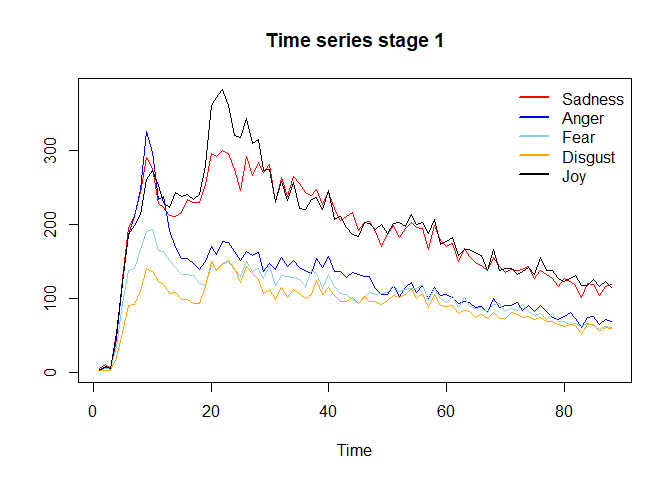<!-- -->

``` r
# (1) order of integration
auto.arima(emotions_LA$sadness[1:cp_emotions_LA[1]])
```

    ## Series: emotions_LA$sadness[1:cp_emotions_LA[1]] 
    ## ARIMA(0,2,1) 
    ## 
    ## Coefficients:
    ##           ma1
    ##       -0.9104
    ## s.e.   0.0518
    ## 
    ## sigma^2 estimated as 482.5:  log likelihood=-388.11
    ## AIC=780.22   AICc=780.36   BIC=785.13

``` r
auto.arima(emotions_LA$anger[1:cp_emotions_LA[1]])
```

    ## Series: emotions_LA$anger[1:cp_emotions_LA[1]] 
    ## ARIMA(5,1,1) 
    ## 
    ## Coefficients:
    ##          ar1     ar2     ar3      ar4      ar5      ma1
    ##       0.7273  0.1007  0.0884  -0.0313  -0.4431  -0.7233
    ## s.e.  0.1267  0.1260  0.1255   0.1255   0.1092   0.1224
    ## 
    ## sigma^2 estimated as 268.7:  log likelihood=-365.67
    ## AIC=745.34   AICc=746.76   BIC=762.6

``` r
auto.arima(emotions_LA$fear[1:cp_emotions_LA[1]])
```

    ## Series: emotions_LA$fear[1:cp_emotions_LA[1]] 
    ## ARIMA(3,1,3) 
    ## 
    ## Coefficients:
    ##          ar1      ar2     ar3      ma1     ma2      ma3
    ##       2.1914  -1.6856  0.3931  -2.3540  2.1955  -0.7853
    ## s.e.  0.2214   0.4159  0.2338   0.1832  0.3218   0.1744
    ## 
    ## sigma^2 estimated as 145.3:  log likelihood=-339.36
    ## AIC=692.72   AICc=694.14   BIC=709.98

``` r
auto.arima(emotions_LA$disgust[1:cp_emotions_LA[1]])
```

    ## Series: emotions_LA$disgust[1:cp_emotions_LA[1]] 
    ## ARIMA(0,1,0) 
    ## 
    ## sigma^2 estimated as 140.5:  log likelihood=-338.55
    ## AIC=679.1   AICc=679.15   BIC=681.57

``` r
auto.arima(emotions_LA$joy[1:cp_emotions_LA[1]])
```

    ## Series: emotions_LA$joy[1:cp_emotions_LA[1]] 
    ## ARIMA(1,2,2) 
    ## 
    ## Coefficients:
    ##           ar1     ma1      ma2
    ##       -0.9858  0.0650  -0.8342
    ## s.e.   0.0382  0.0961   0.0987
    ## 
    ## sigma^2 estimated as 490.7:  log likelihood=-387.9
    ## AIC=783.81   AICc=784.3   BIC=793.62

``` r
# (2) lag selection
var_lag <- tsDyn::lags.select(emotions_LA[1:cp_emotions_LA[1],1:5], lag=10)
var_lag
```

    ## Best AIC:  lag= 10 
    ## Best BIC:  lag= 1 
    ## Best HQ :  lag= 3

``` r
# (3) Cointegration
coi_1 <- ca.jo(emotions_LA[1:cp_emotions_LA[1],1:5], type = 'trace', K=3)
summary(coi_1)
```

    ## 
    ## ###################### 
    ## # Johansen-Procedure # 
    ## ###################### 
    ## 
    ## Test type: trace statistic , with linear trend 
    ## 
    ## Eigenvalues (lambda):
    ## [1] 0.34267758 0.22294027 0.14609563 0.10451299 0.07092413
    ## 
    ## Values of teststatistic and critical values of test:
    ## 
    ##           test 10pct  5pct  1pct
    ## r <= 4 |  6.25  6.50  8.18 11.65
    ## r <= 3 | 15.64 15.66 17.95 23.52
    ## r <= 2 | 29.06 28.71 31.52 37.22
    ## r <= 1 | 50.50 45.23 48.28 55.43
    ## r = 0  | 86.17 66.49 70.60 78.87
    ## 
    ## Eigenvectors, normalised to first column:
    ## (These are the cointegration relations)
    ## 
    ##            sadness.l3   anger.l3    fear.l3 disgust.l3     joy.l3
    ## sadness.l3   1.000000  1.0000000  1.0000000  1.0000000   1.000000
    ## anger.l3     8.496206  2.4319733 -0.8145124  0.4466184   2.071070
    ## fear.l3    -29.020469 -7.3877551  0.3609658 -0.7487574  -7.561461
    ## disgust.l3  52.996300  2.1209257  0.3922088 -0.9022508 -10.109184
    ## joy.l3     -11.022476 -0.3355828 -0.7153751 -0.4219415   6.586054
    ## 
    ## Weights W:
    ## (This is the loading matrix)
    ## 
    ##            sadness.l3   anger.l3     fear.l3   disgust.l3       joy.l3
    ## sadness.d -0.03374481 0.03690994 -0.13461520 -0.004745087  0.002202852
    ## anger.d   -0.03082019 0.06150264  0.07603934 -0.008628100  0.003996204
    ## fear.d    -0.01502003 0.07270490 -0.06438179  0.036221828  0.004718935
    ## disgust.d -0.01750803 0.01379504 -0.02253581  0.098333975  0.001869667
    ## joy.d     -0.03068494 0.06974081 -0.10781936  0.148088746 -0.010326341

``` r
# (4) VAR
var_result_1 <- VAR(emotions_LA[1:cp_emotions_LA[1],1:5], p=3)

#VAR stabilty
roots(var_result_1)
```

    ##  [1] 0.9426223 0.9426223 0.7755518 0.7755518 0.6941923 0.6743389 0.6743389
    ##  [8] 0.6388921 0.6388921 0.6049850 0.5934504 0.5934504 0.4358921 0.3687717
    ## [15] 0.3687717

``` r
serial.test(var_result_1)
```

    ## 
    ##  Portmanteau Test (asymptotic)
    ## 
    ## data:  Residuals of VAR object var_result_1
    ## Chi-squared = 336.58, df = 325, p-value = 0.3175

``` r
# (5) Toda-Yamamoto

toda.yamamoto(var_result_1, max.oi=2)
```

    ##    predictor  causes     chisq          p
    ## 1    sadness   anger  2.111526 0.71525518
    ## 2    sadness    fear  2.303462 0.68013881
    ## 3    sadness disgust  4.031330 0.40178241
    ## 4    sadness     joy  4.622093 0.32831486
    ## 5      anger sadness  8.251450 0.08278958
    ## 6      anger    fear  4.539640 0.33787301
    ## 7      anger disgust  3.822994 0.43049063
    ## 8      anger     joy  6.151222 0.18813597
    ## 9       fear sadness  7.725896 0.10215101
    ## 10      fear   anger  5.622588 0.22916221
    ## 11      fear disgust  5.634312 0.22817319
    ## 12      fear     joy  2.903733 0.57406262
    ## 13   disgust sadness 14.728622 0.00529847
    ## 14   disgust   anger  5.298119 0.25805306
    ## 15   disgust    fear  9.910810 0.04195717
    ## 16   disgust     joy  7.199343 0.12572145
    ## 17       joy sadness 10.103594 0.03871834
    ## 18       joy   anger  1.549930 0.81776167
    ## 19       joy    fear  3.990911 0.40723727
    ## 20       joy disgust  7.059680 0.13276781

**Stage 2**

``` r
# Plot
ts.plot(emotions_LA[cp_emotions_LA[1]:cp_emotions_LA[2],1:5], col=c('red', 'blue', 'skyblue', 'orange', 'black'), main='Time series stage 2')
legend("topright",c("Sadness","Anger","Fear","Disgust","Joy"),col=c('red', 'blue', 'skyblue', 'orange', 'black'),lwd=c(2),bty="n")
```

<!-- -->

``` r
# (1) order of integration
auto.arima(emotions_LA$sadness[cp_emotions_LA[1]:cp_emotions_LA[2]])
```

    ## Series: emotions_LA$sadness[cp_emotions_LA[1]:cp_emotions_LA[2]] 
    ## ARIMA(0,1,1) with drift 
    ## 
    ## Coefficients:
    ##           ma1    drift
    ##       -0.7467  -0.5488
    ## s.e.   0.0793   0.1928
    ## 
    ## sigma^2 estimated as 51.63:  log likelihood=-318.15
    ## AIC=642.29   AICc=642.56   BIC=649.92

``` r
auto.arima(emotions_LA$anger[cp_emotions_LA[1]:cp_emotions_LA[2]])
```

    ## Series: emotions_LA$anger[cp_emotions_LA[1]:cp_emotions_LA[2]] 
    ## ARIMA(0,1,1) with drift 
    ## 
    ## Coefficients:
    ##           ma1    drift
    ##       -0.6086  -0.3563
    ## s.e.   0.0838   0.1701
    ## 
    ## sigma^2 estimated as 17.5:  log likelihood=-267.12
    ## AIC=540.24   AICc=540.51   BIC=547.87

``` r
auto.arima(emotions_LA$fear[cp_emotions_LA[1]:cp_emotions_LA[2]])
```

    ## Series: emotions_LA$fear[cp_emotions_LA[1]:cp_emotions_LA[2]] 
    ## ARIMA(0,1,1) with drift 
    ## 
    ## Coefficients:
    ##           ma1    drift
    ##       -0.8722  -0.2624
    ## s.e.   0.0747   0.0594
    ## 
    ## sigma^2 estimated as 17.6:  log likelihood=-267.88
    ## AIC=541.77   AICc=542.03   BIC=549.4

``` r
auto.arima(emotions_LA$disgust[cp_emotions_LA[1]:cp_emotions_LA[2]])
```

    ## Series: emotions_LA$disgust[cp_emotions_LA[1]:cp_emotions_LA[2]] 
    ## ARIMA(0,1,1) with drift 
    ## 
    ## Coefficients:
    ##           ma1    drift
    ##       -0.7730  -0.2728
    ## s.e.   0.0811   0.0893
    ## 
    ## sigma^2 estimated as 13.65:  log likelihood=-255.66
    ## AIC=517.32   AICc=517.59   BIC=524.95

``` r
auto.arima(emotions_LA$joy[cp_emotions_LA[1]:cp_emotions_LA[2]])
```

    ## Series: emotions_LA$joy[cp_emotions_LA[1]:cp_emotions_LA[2]] 
    ## ARIMA(2,1,2) with drift 
    ## 
    ## Coefficients:
    ##           ar1     ar2      ma1      ma2    drift
    ##       -0.0776  0.3788  -0.6463  -0.2815  -0.5964
    ## s.e.   0.5521  0.1376   0.5974   0.4766   0.0796
    ## 
    ## sigma^2 estimated as 38.07:  log likelihood=-302.57
    ## AIC=617.14   AICc=618.11   BIC=632.4

``` r
# (2) lag selection
var_lag <- tsDyn::lags.select(emotions_LA[cp_emotions_LA[1]:cp_emotions_LA[2],1:5], lag=10, include='trend')
var_lag
```

    ## Best AIC:  lag= 1 
    ## Best BIC:  lag= 1 
    ## Best HQ :  lag= 1

``` r
# (3) Cointegration
coi_2 <- ca.jo(emotions_LA[cp_emotions_LA[1]:cp_emotions_LA[2],1:5], type = 'trace', ecdet = 'trend', K=3)
summary(coi_2)
```

    ## 
    ## ###################### 
    ## # Johansen-Procedure # 
    ## ###################### 
    ## 
    ## Test type: trace statistic , with linear trend in cointegration 
    ## 
    ## Eigenvalues (lambda):
    ## [1] 0.3575049 0.2625434 0.2290383 0.1302729 0.1168240 0.0000000
    ## 
    ## Values of teststatistic and critical values of test:
    ## 
    ##            test 10pct  5pct  1pct
    ## r <= 4 |  11.43 10.49 12.25 16.26
    ## r <= 3 |  24.27 22.76 25.32 30.45
    ## r <= 2 |  48.20 39.06 42.44 48.45
    ## r <= 1 |  76.22 59.14 62.99 70.05
    ## r = 0  | 116.92 83.20 87.31 96.58
    ## 
    ## Eigenvectors, normalised to first column:
    ## (These are the cointegration relations)
    ## 
    ##            sadness.l3   anger.l3     fear.l3 disgust.l3     joy.l3   trend.l3
    ## sadness.l3  1.0000000  1.0000000  1.00000000  1.0000000  1.0000000  1.0000000
    ## anger.l3    0.1689042  2.9993248 -0.97264850 -6.3100942  4.2632684 -2.2406624
    ## fear.l3    -1.0973578 -0.3466074  0.06556306 -5.2190986 -4.7584888  0.4430631
    ## disgust.l3 -2.5470891 -1.3020314 -0.08569908  8.5754599 -1.8983722  1.1502175
    ## joy.l3      0.3088147 -2.5765571 -0.03493503  1.0942642  1.9016749 -0.7273822
    ## trend.l3   -0.1811660 -0.4370004  0.19566671 -0.1799782  0.9713255 -0.7345868
    ## 
    ## Weights W:
    ## (This is the loading matrix)
    ## 
    ##           sadness.l3    anger.l3    fear.l3  disgust.l3      joy.l3
    ## sadness.d  0.7448734  0.02443300 -0.8729566  0.02565295 -0.08117290
    ## anger.d    0.5256651 -0.02636946 -0.0195722  0.02135040 -0.05303240
    ## fear.d     0.5692800  0.07755567 -0.3555696  0.05973619 -0.01188103
    ## disgust.d  0.6314171  0.02303964 -0.1436578 -0.01628859 -0.02665458
    ## joy.d      0.3126977  0.31871180 -0.3619398  0.04491480 -0.06423011
    ##                trend.l3
    ## sadness.d -5.783006e-15
    ## anger.d   -6.746006e-15
    ## fear.d    -2.790987e-15
    ## disgust.d -8.153370e-15
    ## joy.d      7.678449e-15

``` r
# (4) VAR
var_result_2 <- VAR(emotions_LA[cp_emotions_LA[1]:cp_emotions_LA[2],1:5], p=3, type = 'trend')

#VAR stabilty
roots(var_result_2)
```

    ##  [1] 0.9903430 0.7449778 0.7449778 0.6857620 0.6857620 0.6172713 0.5510369
    ##  [8] 0.5510369 0.5288724 0.5288724 0.5089958 0.4529954 0.2461389 0.1554480
    ## [15] 0.1554480

``` r
serial.test(var_result_2)
```

    ## 
    ##  Portmanteau Test (asymptotic)
    ## 
    ## data:  Residuals of VAR object var_result_2
    ## Chi-squared = 359.4, df = 325, p-value = 0.09168

``` r
# (5) Toda-Yamamoto

toda.yamamoto(var_result_2, max.oi=1)
```

    ##    predictor  causes     chisq          p
    ## 1    sadness   anger 8.7778762 0.03239467
    ## 2    sadness    fear 5.3365573 0.14874775
    ## 3    sadness disgust 8.7457281 0.03286975
    ## 4    sadness     joy 1.8456577 0.60505006
    ## 5      anger sadness 3.9518357 0.26671220
    ## 6      anger    fear 3.5637264 0.31259059
    ## 7      anger disgust 2.6612835 0.44684691
    ## 8      anger     joy 1.3526467 0.71667115
    ## 9       fear sadness 1.2400816 0.74340800
    ## 10      fear   anger 3.2589938 0.35339084
    ## 11      fear disgust 2.6283338 0.45254390
    ## 12      fear     joy 2.3311166 0.50658601
    ## 13   disgust sadness 0.6086514 0.89444901
    ## 14   disgust   anger 4.3969656 0.22166691
    ## 15   disgust    fear 0.6440547 0.88627707
    ## 16   disgust     joy 0.6593630 0.88271794
    ## 17       joy sadness 1.5239257 0.67675940
    ## 18       joy   anger 6.1084626 0.10645088
    ## 19       joy    fear 2.3422747 0.50447060
    ## 20       joy disgust 1.5274220 0.67595596

**Stage 3**

``` r
# Plot
ts.plot(emotions_LA[cp_emotions_LA[2]:cp_emotions_LA[3],1:5], col=c('red', 'blue', 'skyblue', 'orange', 'black'), main='Time series stage 3')
legend("topright",c("Sadness","Anger","Fear","Disgust","Joy"),col=c('red', 'blue', 'skyblue', 'orange', 'black'),lwd=c(2),bty="n")
```

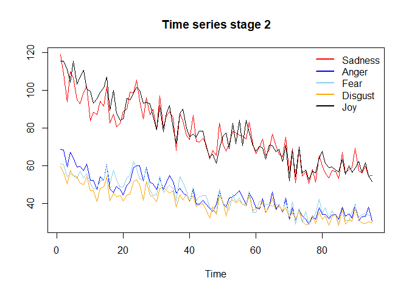<!-- -->

``` r
# (1) order of integration
auto.arima(emotions_LA$sadness[cp_emotions_LA[2]:cp_emotions_LA[3]])
```

    ## Series: emotions_LA$sadness[cp_emotions_LA[2]:cp_emotions_LA[3]] 
    ## ARIMA(3,1,1) with drift 
    ## 
    ## Coefficients:
    ##          ar1      ar2      ar3      ma1    drift
    ##       0.0006  -0.0600  -0.0560  -0.8976  -0.3013
    ## s.e.  0.1779   0.1629   0.1568   0.1492   0.0729
    ## 
    ## sigma^2 estimated as 23.84:  log likelihood=-196.62
    ## AIC=405.24   AICc=406.66   BIC=418.37

``` r
auto.arima(emotions_LA$anger[cp_emotions_LA[2]:cp_emotions_LA[3]])
```

    ## Series: emotions_LA$anger[cp_emotions_LA[2]:cp_emotions_LA[3]] 
    ## ARIMA(5,1,0) with drift 
    ## 
    ## Coefficients:
    ##           ar1      ar2      ar3      ar4      ar5    drift
    ##       -0.9658  -0.8615  -0.7398  -0.4639  -0.2194  -0.1794
    ## s.e.   0.1200   0.1603   0.1690   0.1576   0.1205   0.0829
    ## 
    ## sigma^2 estimated as 8.49:  log likelihood=-161.84
    ## AIC=337.68   AICc=339.61   BIC=353.01

``` r
auto.arima(emotions_LA$fear[cp_emotions_LA[2]:cp_emotions_LA[3]])
```

    ## Series: emotions_LA$fear[cp_emotions_LA[2]:cp_emotions_LA[3]] 
    ## ARIMA(1,1,2) 
    ## 
    ## Coefficients:
    ##          ar1      ma1     ma2
    ##       0.9873  -1.9350  0.9451
    ## s.e.  0.0292   0.0803  0.0790
    ## 
    ## sigma^2 estimated as 7.748:  log likelihood=-161.5
    ## AIC=330.99   AICc=331.65   BIC=339.75

``` r
auto.arima(emotions_LA$disgust[cp_emotions_LA[2]:cp_emotions_LA[3]])
```

    ## Series: emotions_LA$disgust[cp_emotions_LA[2]:cp_emotions_LA[3]] 
    ## ARIMA(0,1,1) with drift 
    ## 
    ## Coefficients:
    ##           ma1    drift
    ##       -0.8739  -0.1935
    ## s.e.   0.0889   0.0465
    ## 
    ## sigma^2 estimated as 6.853:  log likelihood=-156.87
    ## AIC=319.75   AICc=320.13   BIC=326.31

``` r
auto.arima(emotions_LA$joy[cp_emotions_LA[2]:cp_emotions_LA[3]])
```

    ## Series: emotions_LA$joy[cp_emotions_LA[2]:cp_emotions_LA[3]] 
    ## ARIMA(0,1,1) with drift 
    ## 
    ## Coefficients:
    ##           ma1    drift
    ##       -0.8692  -0.2736
    ## s.e.   0.1225   0.0742
    ## 
    ## sigma^2 estimated as 17.02:  log likelihood=-186.88
    ## AIC=379.76   AICc=380.15   BIC=386.33

``` r
# (2) lag selection
var_lag <- tsDyn::lags.select(emotions_LA[cp_emotions_LA[2]:cp_emotions_LA[3],1:5], lag=10, include = 'trend')
var_lag
```

    ## Best AIC:  lag= 10 
    ## Best BIC:  lag= 1 
    ## Best HQ :  lag= 10

``` r
# (3) Cointegration
coi_3 <- ca.jo(emotions_LA[cp_emotions_LA[2]:cp_emotions_LA[3],1:5], type = 'trace', ecdet = 'trend', K=3)
summary(coi_3)
```

    ## 
    ## ###################### 
    ## # Johansen-Procedure # 
    ## ###################### 
    ## 
    ## Test type: trace statistic , with linear trend in cointegration 
    ## 
    ## Eigenvalues (lambda):
    ## [1] 0.4291986 0.3892722 0.2526183 0.1326464 0.1222005 0.0000000
    ## 
    ## Values of teststatistic and critical values of test:
    ## 
    ##            test 10pct  5pct  1pct
    ## r <= 4 |   8.34 10.49 12.25 16.26
    ## r <= 3 |  17.45 22.76 25.32 30.45
    ## r <= 2 |  36.08 39.06 42.44 48.45
    ## r <= 1 |  67.64 59.14 62.99 70.05
    ## r = 0  | 103.53 83.20 87.31 96.58
    ## 
    ## Eigenvectors, normalised to first column:
    ## (These are the cointegration relations)
    ## 
    ##             sadness.l3  anger.l3    fear.l3  disgust.l3     joy.l3   trend.l3
    ## sadness.l3  1.00000000  1.000000  1.0000000  1.00000000  1.0000000  1.0000000
    ## anger.l3    3.96820210 12.029116  2.4983082 -0.32160319 -3.3219032 -0.2674611
    ## fear.l3    -3.51539294 11.778399 -5.7336774 -0.69951680 -4.2239316 -0.8677645
    ## disgust.l3 -4.77705229 -3.253031  3.6969027 -0.82279906  5.8160310  0.0174737
    ## joy.l3      1.59614242 -5.354519 -2.9836992 -0.06717597  2.7683382 -0.1798466
    ## trend.l3    0.04810211  2.423472 -0.1921625 -0.05190060  0.9504999  0.5267918
    ## 
    ## Weights W:
    ## (This is the loading matrix)
    ## 
    ##            sadness.l3    anger.l3     fear.l3  disgust.l3       joy.l3
    ## sadness.d  0.14882449 -0.13886587  0.00617694 -0.42069086 -0.022780566
    ## anger.d   -0.08420502 -0.08236067 -0.06335267 -0.03396690 -0.007216362
    ## fear.d     0.07552431 -0.07456486  0.05268732  0.15235003  0.010284535
    ## disgust.d  0.11337399 -0.06629866 -0.03198303  0.06382418 -0.033878321
    ## joy.d     -0.20088933 -0.08732651  0.09629913  0.12751448 -0.055876125
    ##                trend.l3
    ## sadness.d -2.734260e-15
    ## anger.d   -5.583312e-15
    ## fear.d     2.348171e-16
    ## disgust.d  2.323270e-16
    ## joy.d     -3.098048e-15

``` r
# (4) VAR
var_result_3 <- VAR(emotions_LA[cp_emotions_LA[2]:cp_emotions_LA[3],1:5], p=3, type = 'trend')

#VAR stabilty
roots(var_result_3)
```

    ##  [1] 0.98852582 0.69307753 0.69307753 0.68151879 0.66708296 0.66328261
    ##  [7] 0.66328261 0.65360160 0.65360160 0.57905609 0.55895566 0.55895566
    ## [13] 0.53773482 0.53773482 0.08284733

``` r
serial.test(var_result_3)
```

    ## 
    ##  Portmanteau Test (asymptotic)
    ## 
    ## data:  Residuals of VAR object var_result_3
    ## Chi-squared = 323.37, df = 325, p-value = 0.5151

``` r
# (5) Toda-Yamamoto

toda.yamamoto(var_result_3, max.oi=1)
```

    ##    predictor  causes     chisq          p
    ## 1    sadness   anger 4.5421893 0.20855783
    ## 2    sadness    fear 4.7999251 0.18704769
    ## 3    sadness disgust 5.5670731 0.13468149
    ## 4    sadness     joy 5.6978636 0.12727166
    ## 5      anger sadness 5.8683041 0.11819630
    ## 6      anger    fear 0.7453611 0.86248617
    ## 7      anger disgust 5.4002319 0.14472913
    ## 8      anger     joy 5.1910865 0.15832781
    ## 9       fear sadness 8.3329496 0.03960921
    ## 10      fear   anger 5.1405545 0.16178966
    ## 11      fear disgust 8.7497207 0.03281038
    ## 12      fear     joy 3.4057290 0.33319613
    ## 13   disgust sadness 0.9720797 0.80800740
    ## 14   disgust   anger 1.7975009 0.61547893
    ## 15   disgust    fear 2.3523422 0.50256775
    ## 16   disgust     joy 2.1762655 0.53663844
    ## 17       joy sadness 8.1216332 0.04356367
    ## 18       joy   anger 7.6913579 0.05284023
    ## 19       joy    fear 7.6626638 0.05352298
    ## 20       joy disgust 8.9386477 0.03011782

**Stage 4**

``` r
# Plot
ts.plot(emotions_LA[cp_emotions_LA[3]:cp_emotions_LA[4],1:5], col=c('red', 'blue', 'skyblue', 'orange', 'black'), main='Time series stage 4')
legend("topright",c("Sadness","Anger","Fear","Disgust","Joy"),col=c('red', 'blue', 'skyblue', 'orange', 'black'),lwd=c(2),bty="n")
```

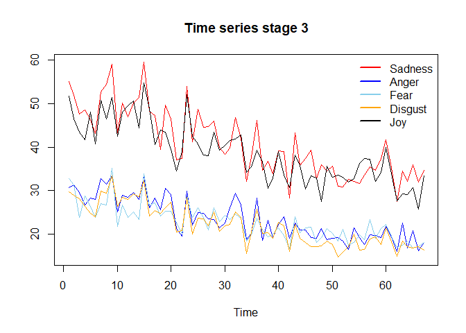<!-- -->

``` r
# (1) order of integration
auto.arima(emotions_LA$sadness[cp_emotions_LA[3]:cp_emotions_LA[4]])
```

    ## Series: emotions_LA$sadness[cp_emotions_LA[3]:cp_emotions_LA[4]] 
    ## ARIMA(0,1,1) 
    ## 
    ## Coefficients:
    ##           ma1
    ##       -0.7034
    ## s.e.   0.1062
    ## 
    ## sigma^2 estimated as 11.55:  log likelihood=-211.23
    ## AIC=426.46   AICc=426.61   BIC=431.22

``` r
auto.arima(emotions_LA$anger[cp_emotions_LA[3]:cp_emotions_LA[4]])
```

    ## Series: emotions_LA$anger[cp_emotions_LA[3]:cp_emotions_LA[4]] 
    ## ARIMA(0,1,1) 
    ## 
    ## Coefficients:
    ##           ma1
    ##       -0.7745
    ## s.e.   0.0838
    ## 
    ## sigma^2 estimated as 3.895:  log likelihood=-167.86
    ## AIC=339.72   AICc=339.88   BIC=344.49

``` r
auto.arima(emotions_LA$fear[cp_emotions_LA[3]:cp_emotions_LA[4]])
```

    ## Series: emotions_LA$fear[cp_emotions_LA[3]:cp_emotions_LA[4]] 
    ## ARIMA(0,1,1) 
    ## 
    ## Coefficients:
    ##           ma1
    ##       -0.8405
    ## s.e.   0.0622
    ## 
    ## sigma^2 estimated as 3.789:  log likelihood=-166.9
    ## AIC=337.81   AICc=337.96   BIC=342.57

``` r
auto.arima(emotions_LA$disgust[cp_emotions_LA[3]:cp_emotions_LA[4]])
```

    ## Series: emotions_LA$disgust[cp_emotions_LA[3]:cp_emotions_LA[4]] 
    ## ARIMA(0,1,1) 
    ## 
    ## Coefficients:
    ##           ma1
    ##       -0.8081
    ## s.e.   0.0622
    ## 
    ## sigma^2 estimated as 3.16:  log likelihood=-159.56
    ## AIC=323.12   AICc=323.28   BIC=327.89

``` r
auto.arima(emotions_LA$joy[cp_emotions_LA[3]:cp_emotions_LA[4]])
```

    ## Series: emotions_LA$joy[cp_emotions_LA[3]:cp_emotions_LA[4]] 
    ## ARIMA(0,1,1) 
    ## 
    ## Coefficients:
    ##           ma1
    ##       -0.8094
    ## s.e.   0.0665
    ## 
    ## sigma^2 estimated as 9.628:  log likelihood=-204.13
    ## AIC=412.27   AICc=412.42   BIC=417.03

``` r
# (2) lag selection
var_lag <- tsDyn::lags.select(emotions_LA[cp_emotions_LA[3]:cp_emotions_LA[4],1:5], lag=10)
var_lag
```

    ## Best AIC:  lag= 10 
    ## Best BIC:  lag= 1 
    ## Best HQ :  lag= 1

``` r
# (3) Cointegration
coi_4 <- ca.jo(emotions_LA[cp_emotions_LA[3]:cp_emotions_LA[4],1:5], type = 'trace', K=3)
summary(coi_4)
```

    ## 
    ## ###################### 
    ## # Johansen-Procedure # 
    ## ###################### 
    ## 
    ## Test type: trace statistic , with linear trend 
    ## 
    ## Eigenvalues (lambda):
    ## [1] 0.46363994 0.40148113 0.32895199 0.20157813 0.07793199
    ## 
    ## Values of teststatistic and critical values of test:
    ## 
    ##            test 10pct  5pct  1pct
    ## r <= 4 |   6.33  6.50  8.18 11.65
    ## r <= 3 |  23.89 15.66 17.95 23.52
    ## r <= 2 |  55.00 28.71 31.52 37.22
    ## r <= 1 |  95.04 45.23 48.28 55.43
    ## r = 0  | 143.63 66.49 70.60 78.87
    ## 
    ## Eigenvectors, normalised to first column:
    ## (These are the cointegration relations)
    ## 
    ##            sadness.l3  anger.l3    fear.l3 disgust.l3     joy.l3
    ## sadness.l3  1.0000000  1.000000  1.0000000  1.0000000   1.000000
    ## anger.l3   -3.5202240 -2.103902 -0.7098856  1.3505083  -2.997224
    ## fear.l3    -3.3227971  0.919811  0.3977140 -1.5120730   1.135995
    ## disgust.l3  5.4965245 -2.484902  0.2349904 -1.6470414 -10.351781
    ## joy.l3     -0.7757309  1.267225 -0.9565547 -0.2309302  -6.534819
    ## 
    ## Weights W:
    ## (This is the loading matrix)
    ## 
    ##            sadness.l3    anger.l3    fear.l3  disgust.l3      joy.l3
    ## sadness.d  0.02176238 -0.10849883 -0.8592009 -0.13262175 0.021618301
    ## anger.d    0.11392822  0.26288513 -0.2214430 -0.14231978 0.012640228
    ## fear.d     0.24147683  0.02229561 -0.3993330  0.23379515 0.008915877
    ## disgust.d -0.10370542  0.14212918 -0.3286979  0.08430520 0.012079669
    ## joy.d     -0.03536708 -0.31612681  0.2405651  0.08592559 0.021854896

``` r
# (4) VAR
var_result_4 <- VAR(emotions_LA[cp_emotions_LA[3]:cp_emotions_LA[4],1:5], p=3)

#VAR stabilty
roots(var_result_4)
```

    ##  [1] 0.82614207 0.68181122 0.68181122 0.66511526 0.66511526 0.63721285
    ##  [7] 0.63070350 0.63070350 0.56155543 0.56155543 0.44436074 0.39250681
    ## [13] 0.39250681 0.20807792 0.06095404

``` r
serial.test(var_result_4)
```

    ## 
    ##  Portmanteau Test (asymptotic)
    ## 
    ## data:  Residuals of VAR object var_result_4
    ## Chi-squared = 300.41, df = 325, p-value = 0.8324

``` r
# (5) Toda-Yamamoto

toda.yamamoto(var_result_4, max.oi=1)
```

    ##    predictor  causes     chisq          p
    ## 1    sadness   anger 1.7427294 0.62747623
    ## 2    sadness    fear 0.2505450 0.96904443
    ## 3    sadness disgust 3.3876384 0.33563009
    ## 4    sadness     joy 3.6184682 0.30571910
    ## 5      anger sadness 3.9000478 0.27246140
    ## 6      anger    fear 4.0104552 0.26033737
    ## 7      anger disgust 4.4423795 0.21748785
    ## 8      anger     joy 5.2090835 0.15711181
    ## 9       fear sadness 2.2410616 0.52390586
    ## 10      fear   anger 0.9629467 0.81021672
    ## 11      fear disgust 1.4148056 0.70206792
    ## 12      fear     joy 4.4178158 0.21973912
    ## 13   disgust sadness 5.7636193 0.12369444
    ## 14   disgust   anger 0.9941274 0.80267295
    ## 15   disgust    fear 1.8238469 0.60975938
    ## 16   disgust     joy 3.0568422 0.38294399
    ## 17       joy sadness 3.4623393 0.32567953
    ## 18       joy   anger 3.7361998 0.29139488
    ## 19       joy    fear 1.9649678 0.57970952
    ## 20       joy disgust 9.2742619 0.02585816

**Stage 5**

``` r
# Plot
ts.plot(emotions_LA[cp_emotions_LA[4]:dim(emotions_LA)[1],1:5], col=c('red', 'blue', 'skyblue', 'orange', 'black'), main='Time series stage 5')
legend("topright",c("Sadness","Anger","Fear","Disgust","Joy"),col=c('red', 'blue', 'skyblue', 'orange', 'black'),lwd=c(2),bty="n")
```

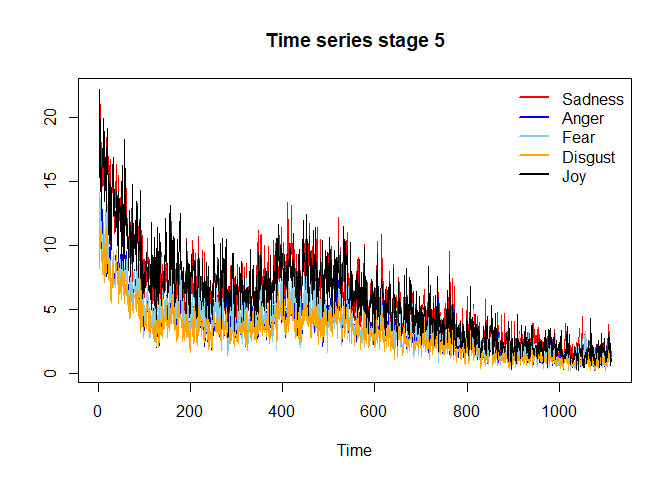<!-- -->

``` r
# (1) order of integration
auto.arima(emotions_LA$sadness[cp_emotions_LA[4]:dim(emotions_LA)[1]])
```

    ## Series: emotions_LA$sadness[cp_emotions_LA[4]:dim(emotions_LA)[1]] 
    ## ARIMA(1,1,2) with drift 
    ## 
    ## Coefficients:
    ##          ar1      ma1     ma2    drift
    ##       0.9852  -1.8756  0.8788  -0.0162
    ## s.e.  0.0124   0.0191  0.0184   0.0098
    ## 
    ## sigma^2 estimated as 2.296:  log likelihood=-2038.69
    ## AIC=4087.39   AICc=4087.44   BIC=4112.46

``` r
auto.arima(emotions_LA$anger[cp_emotions_LA[4]:dim(emotions_LA)[1]])
```

    ## Series: emotions_LA$anger[cp_emotions_LA[4]:dim(emotions_LA)[1]] 
    ## ARIMA(1,1,2) with drift 
    ## 
    ## Coefficients:
    ##           ar1     ma1      ma2    drift
    ##       -0.9410  0.0901  -0.8275  -0.0085
    ## s.e.   0.0495  0.0467   0.0394   0.0040
    ## 
    ## sigma^2 estimated as 0.9733:  log likelihood=-1561.5
    ## AIC=3133   AICc=3133.06   BIC=3158.07

``` r
auto.arima(emotions_LA$fear[cp_emotions_LA[4]:dim(emotions_LA)[1]])
```

    ## Series: emotions_LA$fear[cp_emotions_LA[4]:dim(emotions_LA)[1]] 
    ## ARIMA(1,1,2) with drift 
    ## 
    ## Coefficients:
    ##           ar1      ma1      ma2    drift
    ##       -0.1747  -0.7234  -0.1385  -0.0087
    ## s.e.   0.8586   0.8655   0.7678   0.0040
    ## 
    ## sigma^2 estimated as 1.269:  log likelihood=-1709.19
    ## AIC=3428.39   AICc=3428.44   BIC=3453.46

``` r
auto.arima(emotions_LA$disgust[cp_emotions_LA[4]:dim(emotions_LA)[1]])
```

    ## Series: emotions_LA$disgust[cp_emotions_LA[4]:dim(emotions_LA)[1]] 
    ## ARIMA(1,1,2) with drift 
    ## 
    ## Coefficients:
    ##           ar1     ma1      ma2    drift
    ##       -0.9130  0.0610  -0.8101  -0.0076
    ## s.e.   0.0665  0.0619   0.0524   0.0033
    ## 
    ## sigma^2 estimated as 0.7103:  log likelihood=-1386.34
    ## AIC=2782.68   AICc=2782.73   BIC=2807.75

``` r
auto.arima(emotions_LA$joy[cp_emotions_LA[4]:dim(emotions_LA)[1]])
```

    ## Series: emotions_LA$joy[cp_emotions_LA[4]:dim(emotions_LA)[1]] 
    ## ARIMA(1,1,1) with drift 
    ## 
    ## Coefficients:
    ##          ar1      ma1    drift
    ##       0.0079  -0.8971  -0.0134
    ## s.e.  0.0331   0.0136   0.0050
    ## 
    ## sigma^2 estimated as 2.506:  log likelihood=-2087.89
    ## AIC=4183.78   AICc=4183.82   BIC=4203.84

``` r
# (2) lag selection
var_lag <- tsDyn::lags.select(emotions_LA[cp_emotions_LA[4]:dim(emotions_LA)[1],1:5], lag=30, include='trend')
var_lag
```

    ## Best AIC:  lag= 8 
    ## Best BIC:  lag= 2 
    ## Best HQ :  lag= 3

``` r
# (3) Cointegration
coi_5 <- ca.jo(emotions_LA[cp_emotions_LA[4]:dim(emotions_LA)[1],1:5], type = 'trace', K=8)
summary(coi_5)
```

    ## 
    ## ###################### 
    ## # Johansen-Procedure # 
    ## ###################### 
    ## 
    ## Test type: trace statistic , with linear trend 
    ## 
    ## Eigenvalues (lambda):
    ## [1] 0.132067610 0.112750170 0.093430006 0.057730803 0.008780241
    ## 
    ## Values of teststatistic and critical values of test:
    ## 
    ##            test 10pct  5pct  1pct
    ## r <= 4 |   9.75  6.50  8.18 11.65
    ## r <= 3 |  75.45 15.66 17.95 23.52
    ## r <= 2 | 183.84 28.71 31.52 37.22
    ## r <= 1 | 316.03 45.23 48.28 55.43
    ## r = 0  | 472.54 66.49 70.60 78.87
    ## 
    ## Eigenvectors, normalised to first column:
    ## (These are the cointegration relations)
    ## 
    ##             sadness.l8   anger.l8    fear.l8 disgust.l8     joy.l8
    ## sadness.l8  1.00000000   1.000000  1.0000000  1.0000000  1.0000000
    ## anger.l8    1.04820404  -6.019661 -1.8359938 -0.3774849 -0.8340387
    ## fear.l8    -0.35364368  16.916827  0.3205328 -1.4802529 -0.3539934
    ## disgust.l8 -2.42503792  15.652170 -0.3806405  0.7400187 -0.1727352
    ## joy.l8     -0.09297642 -15.977416  0.1177292 -0.2492190  2.1939081
    ## 
    ## Weights W:
    ## (This is the loading matrix)
    ## 
    ##            sadness.l8    anger.l8     fear.l8  disgust.l8       joy.l8
    ## sadness.d -0.44407381 -0.02603780  0.03462775 -0.21729319 -0.013869438
    ## anger.d   -0.30671102 -0.01357913  0.37052832 -0.02179849 -0.006637258
    ## fear.d    -0.15274425 -0.03088732 -0.03492188  0.13764438 -0.008452694
    ## disgust.d  0.13726958 -0.01593935  0.21553898 -0.11089881 -0.006766753
    ## joy.d      0.04852625  0.01042982  0.12962067  0.08180400 -0.019116325

``` r
# (4) VAR
var_result_5 <- VAR(emotions_LA[cp_emotions_LA[4]:dim(emotions_LA)[1],1:5], p=8, type='trend')

#VAR stability
roots(var_result_5)
```

    ##  [1] 0.9949405 0.8646049 0.8122300 0.8122300 0.7979088 0.7979088 0.7961994
    ##  [8] 0.7961994 0.7847384 0.7847384 0.7806534 0.7734099 0.7734099 0.7576389
    ## [15] 0.7576389 0.7393453 0.7393453 0.7340347 0.7340347 0.7294652 0.7294652
    ## [22] 0.7219077 0.7219077 0.7165447 0.7165447 0.6969200 0.6969200 0.6914831
    ## [29] 0.6914831 0.6900455 0.6900455 0.6858546 0.6507737 0.6236225 0.6236225
    ## [36] 0.5860754 0.5860754 0.5736283 0.5736283 0.2052031

``` r
serial.test(var_result_5)
```

    ## 
    ##  Portmanteau Test (asymptotic)
    ## 
    ## data:  Residuals of VAR object var_result_5
    ## Chi-squared = 336.5, df = 200, p-value = 5.092e-09

``` r
# (5) Toda-Yamamoto

toda.yamamoto(var_result_5, max.oi=1)
```

    ##    predictor  causes     chisq            p
    ## 1    sadness   anger 10.045343 2.618578e-01
    ## 2    sadness    fear 14.026299 8.108251e-02
    ## 3    sadness disgust 14.473278 7.023355e-02
    ## 4    sadness     joy  6.103029 6.356922e-01
    ## 5      anger sadness 15.498689 5.014397e-02
    ## 6      anger    fear  4.275699 8.314317e-01
    ## 7      anger disgust  4.936333 7.643588e-01
    ## 8      anger     joy  9.323864 3.157161e-01
    ## 9       fear sadness  2.173292 9.752329e-01
    ## 10      fear   anger  6.003754 6.468113e-01
    ## 11      fear disgust  7.768045 4.564501e-01
    ## 12      fear     joy  5.632950 6.882699e-01
    ## 13   disgust sadness  9.652464 2.902703e-01
    ## 14   disgust   anger 12.357699 1.359435e-01
    ## 15   disgust    fear  3.102921 9.277335e-01
    ## 16   disgust     joy  5.049432 7.522799e-01
    ## 17       joy sadness 60.366347 3.949940e-10
    ## 18       joy   anger 56.730090 2.032828e-09
    ## 19       joy    fear 77.173769 1.808324e-13
    ## 20       joy disgust 58.831374 7.897832e-10
