Communicated emotions Turkey
================

### Import Data

``` r
setwd("C:\\Users\\Pablo M. Flores\\OneDrive\\Pablo Flores Bautista\\UCDavis\\PhD\\Papers\\2020 Communicated emotions\\Paper\\Git repository\\communicated emotions")

Base <- read.csv("DDBB_to_RR_Turkey.csv", header = TRUE)

# Creation time series by five minutes
sadness_TK <- aggregate(sadness~one_minutes, data = Base, sum)
anger_TK <- aggregate(anger~one_minutes, data = Base, sum)
fear_TK <- aggregate(fear~one_minutes, data = Base, sum)
disgust_TK <- aggregate(disgust~one_minutes, data = Base, sum)
joy_TK <- aggregate(joy~one_minutes, data = Base, sum)
count_TK <- aggregate(count~one_minutes, data = Base, sum)

#Time Series variables mean
sadness <- sadness_TK$sadness
anger <- anger_TK$anger
fear <- fear_TK$fear
disgust <- disgust_TK$disgust
joy <- joy_TK$joy
count <- count_TK$count

emotions_TK <- as.data.frame(cbind(sadness, anger, fear, disgust, joy, count))
```

### Change point analysis

Based on the variation of the amount of tweets the process is divided in
phases

``` r
library('forecast')
```

    ## Registered S3 method overwritten by 'quantmod':
    ##   method            from
    ##   as.zoo.data.frame zoo

``` r
library('changepoint')
```

    ## Loading required package: zoo

    ## 
    ## Attaching package: 'zoo'

    ## The following objects are masked from 'package:base':
    ## 
    ##     as.Date, as.Date.numeric

    ## Successfully loaded changepoint package version 2.2.2
    ##  NOTE: Predefined penalty values changed in version 2.2.  Previous penalty values with a postfix 1 i.e. SIC1 are now without i.e. SIC and previous penalties without a postfix i.e. SIC are now with a postfix 0 i.e. SIC0. See NEWS and help files for further details.

``` r
ggtsdisplay(emotions_TK$count, plot.type = "partial", points = FALSE, smooth = TRUE,
                      main = 'Tweets about Turkey earthquake',
                      xlab = 'Time', ylab = 'Variation')
```

    ## `geom_smooth()` using formula 'y ~ x'

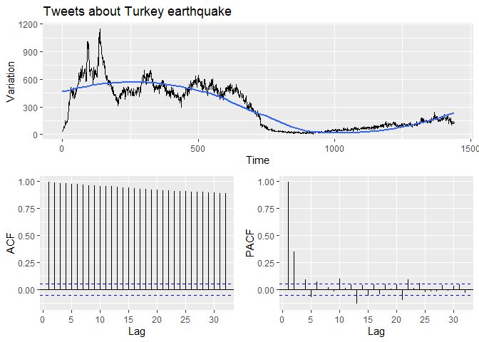<!-- -->

``` r
cp_count <- cpt.var(emotions_TK[,6], method='PELT')

plot(cp_count, main='Change points tweets during Turkey earthquake')
```

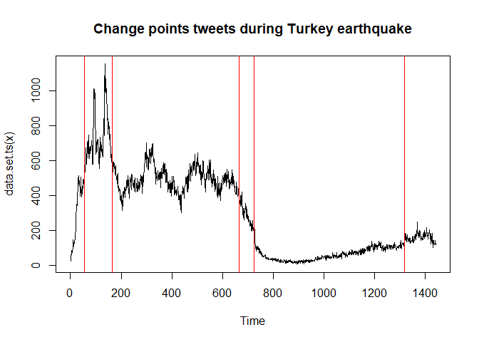<!-- -->

``` r
detach('package:changepoint')
```

### Time series plots

``` r
ggtsdisplay(emotions_TK$sadness, plot.type = "partial", points = FALSE, smooth = TRUE,
                      main = 'Turkey earthquake (Sadness)',
                      xlab = 'Time', ylab = 'Variation')
```

    ## `geom_smooth()` using formula 'y ~ x'

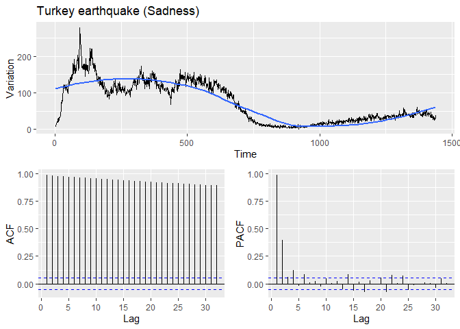<!-- -->

``` r
ggtsdisplay(emotions_TK$anger, plot.type = "partial", points = FALSE, smooth = TRUE,
                      main = 'Turkey earthquake (Anger)',
                      xlab = 'Time', ylab = 'Variation')
```

    ## `geom_smooth()` using formula 'y ~ x'

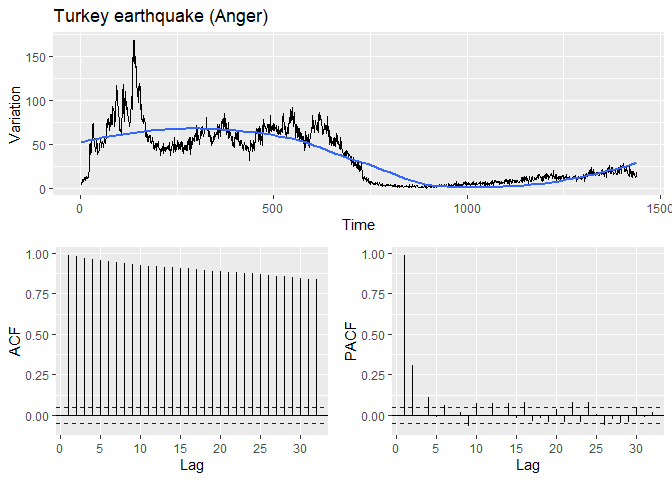<!-- -->

``` r
ggtsdisplay(emotions_TK$fear, plot.type = "partial", points = FALSE, smooth = TRUE,
                      main = 'Turkey earthquake (Fear)',
                      xlab = 'Time', ylab = 'Variation')
```

    ## `geom_smooth()` using formula 'y ~ x'

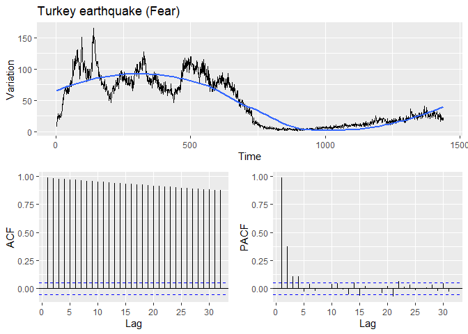<!-- -->

``` r
ggtsdisplay(emotions_TK$disgust, plot.type = "partial", points = FALSE, smooth = TRUE,
                      main = 'Turkey earthquake (Disgust)',
                      xlab = 'Time', ylab = 'Variation')
```

    ## `geom_smooth()` using formula 'y ~ x'

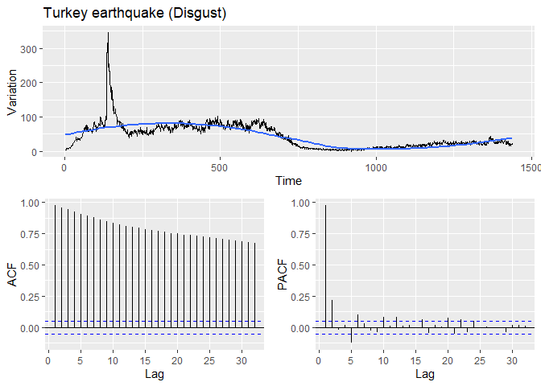<!-- -->

``` r
ggtsdisplay(emotions_TK$joy, plot.type = "partial", points = FALSE, smooth = TRUE,
                      main = 'Turkey earthquake (Joy)',
                      xlab = 'Time', ylab = 'Variation')
```

    ## `geom_smooth()` using formula 'y ~ x'

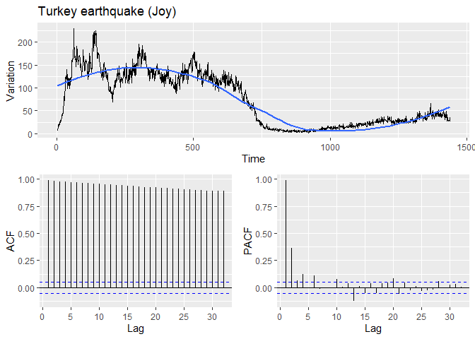<!-- -->

``` r
detach('package:forecast')
```

### Univariate analysis

Adjust models to the different time series

``` r
#auto.arima(emotions_TK$sadness)

#auto.arima(emotions_TK$anger)

#auto.arima(emotions_TK$fear)

#auto.arima(emotions_TK$disgust)

#auto.arima(emotions_TK$joy)

#detach('package:forecast')
```

## Granger Causality

### Toda-Yamamoto Granger causality correction

The work developed for Toda and Yamamoto (1995) allows to adjust the
Granger-causality test in cases in which the time series under analysis
are non-stationary. Using the Toda-Yamamoto procedure it is possible to
analyze time series even if they are cointegrated to determine their
Granger-causality. To perform Toda-Yamamoto we (1) determine the maximum
order of integration for each one of the time series, (2) determine the
lag for the VAR model, (3) determine if the time series are
cointegrated, (4) compute the VAR model, (5) test Granger causality
using Toda-Yamamoto.

``` r
toda.yamamoto <- function(var, max.oi) {
  # It requires the VAR function plus the maximum order of integration with the time series at level
  ty.df <- eval(var$call$y);
  ty.varnames <- colnames(ty.df);
  ty.lags <- var$p + max.oi;
  ty.augmented_var <- VAR(ty.df, ty.lags, type=var$type);
  
  ty.results <- data.frame(predictor = character(0), causes = character(0), chisq = numeric(0), p = numeric(0));
  
  for (current_variable in ty.varnames) {
    # Construct the restriction matrix: to test if *current_variable* causes any of the others,
    # Test if the lagged values of current variable (ignoring the lags added with max.oi) are jointly insignificant
    
    ty.restrictions <- as.matrix(Bcoef(ty.augmented_var))*0+1;
    ty.coefres <- head(grep(current_variable, colnames(ty.restrictions), value=T), -1);
    ty.restrictions[which(rownames(ty.restrictions) != current_variable), ty.coefres] <- 0;
    # Estimate restricted var
    ty.restricted_var <- restrict(ty.augmented_var, 'manual', resmat=ty.restrictions);
    
    for (k in 1:length(ty.varnames)) {
      if (ty.varnames[k] != current_variable) {
        my.wald <- waldtest(ty.augmented_var$varresult[[k]], ty.restricted_var$varresult[[k]], test='Chisq');
        ty.results <- rbind(ty.results, data.frame(
          predictor = current_variable, 
          causes = ty.varnames[k], 
          chisq = as.numeric(my.wald$Chisq[2]), 
          p = my.wald$`Pr(>Chisq)`[2])
        );
      }
    }
  }
  return(ty.results);
}
```

The analysis is performed in all the stages defined by the change point
analysis previously performed

**Stage 1**

``` r
library('vars')
```

    ## Loading required package: MASS

    ## Loading required package: strucchange

    ## Loading required package: sandwich

    ## Loading required package: urca

    ## Loading required package: lmtest

``` r
library('forecast')

cp_emotions_TK <- changepoint::cpts(cp_count)

# Plot
ts.plot(emotions_TK[1:cp_emotions_TK[1],1:5], col=c('red', 'blue', 'skyblue', 'orange', 'black'), main='Time series stage 1')
legend("topright",c("Sadness","Anger","Fear","Disgust","Joy"),col=c('red', 'blue', 'skyblue', 'orange', 'black'),lwd=c(2),bty="n")
```

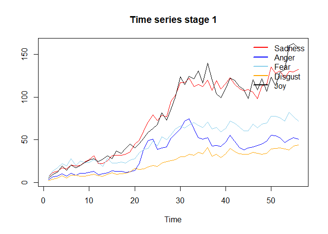<!-- -->

``` r
# (1) order of integration
auto.arima(emotions_TK$sadness[1:cp_emotions_TK[1]])
```

    ## Series: emotions_TK$sadness[1:cp_emotions_TK[1]] 
    ## ARIMA(1,1,2) with drift 
    ## 
    ## Coefficients:
    ##           ar1     ma1     ma2   drift
    ##       -0.7311  0.7244  0.3743  2.2514
    ## s.e.   0.1473  0.1720  0.1301  0.9818
    ## 
    ## sigma^2 estimated as 39.29:  log likelihood=-177.21
    ## AIC=364.43   AICc=365.65   BIC=374.46

``` r
auto.arima(emotions_TK$anger[1:cp_emotions_TK[1]])
```

    ## Series: emotions_TK$anger[1:cp_emotions_TK[1]] 
    ## ARIMA(2,1,2) 
    ## 
    ## Coefficients:
    ##          ar1      ar2     ma1     ma2
    ##       0.1599  -0.7343  0.2351  0.9062
    ## s.e.  0.1243   0.1122  0.0834  0.1103
    ## 
    ## sigma^2 estimated as 21.72:  log likelihood=-161.69
    ## AIC=333.38   AICc=334.61   BIC=343.42

``` r
auto.arima(emotions_TK$fear[1:cp_emotions_TK[1]])
```

    ## Series: emotions_TK$fear[1:cp_emotions_TK[1]] 
    ## ARIMA(1,1,0) with drift 
    ## 
    ## Coefficients:
    ##           ar1   drift
    ##       -0.3827  1.1842
    ## s.e.   0.1267  0.4606
    ## 
    ## sigma^2 estimated as 22.91:  log likelihood=-163.23
    ## AIC=332.45   AICc=332.92   BIC=338.47

``` r
auto.arima(emotions_TK$disgust[1:cp_emotions_TK[1]])
```

    ## Series: emotions_TK$disgust[1:cp_emotions_TK[1]] 
    ## ARIMA(0,1,1) with drift 
    ## 
    ## Coefficients:
    ##           ma1   drift
    ##       -0.4524  0.7350
    ## s.e.   0.1242  0.1937
    ## 
    ## sigma^2 estimated as 6.913:  log likelihood=-130.31
    ## AIC=266.61   AICc=267.08   BIC=272.63

``` r
auto.arima(emotions_TK$joy[1:cp_emotions_TK[1]])
```

    ## Series: emotions_TK$joy[1:cp_emotions_TK[1]] 
    ## ARIMA(1,1,0) with drift 
    ## 
    ## Coefficients:
    ##           ar1   drift
    ##       -0.3454  2.7897
    ## s.e.   0.1256  0.9791
    ## 
    ## sigma^2 estimated as 98.11:  log likelihood=-203.2
    ## AIC=412.41   AICc=412.88   BIC=418.43

``` r
# (2) lag selection
var_lag <- tsDyn::lags.select(emotions_TK[1:cp_emotions_TK[1],1:5], lag=10)
var_lag
```

    ## Best AIC:  lag= 8 
    ## Best BIC:  lag= 8 
    ## Best HQ :  lag= 8

``` r
# (3) Cointegration
coi_1 <- ca.jo(emotions_TK[1:cp_emotions_TK[1],1:5], type = 'trace', ecdet='const', K=8)
summary(coi_1)
```

    ## 
    ## ###################### 
    ## # Johansen-Procedure # 
    ## ###################### 
    ## 
    ## Test type: trace statistic , without linear trend and constant in cointegration 
    ## 
    ## Eigenvalues (lambda):
    ## [1]  9.978475e-01  9.654229e-01  4.728066e-01  4.136546e-01  2.170366e-01
    ## [6] -1.397290e-17
    ## 
    ## Values of teststatistic and critical values of test:
    ## 
    ##            test 10pct  5pct  1pct
    ## r <= 4 |  11.74  7.52  9.24 12.97
    ## r <= 3 |  37.37 17.85 19.96 24.60
    ## r <= 2 |  68.10 32.00 34.91 41.07
    ## r <= 1 | 229.60 49.65 53.12 60.16
    ## r = 0  | 524.37 71.86 76.07 84.45
    ## 
    ## Eigenvectors, normalised to first column:
    ## (These are the cointegration relations)
    ## 
    ##            sadness.l8   anger.l8    fear.l8 disgust.l8     joy.l8   constant
    ## sadness.l8  1.0000000  1.0000000  1.0000000  1.0000000  1.0000000  1.0000000
    ## anger.l8   -0.6231056 -1.2914758 -0.7346122 -0.7162568 -0.1797823 -1.8499923
    ## fear.l8     0.3880524  1.4826596 -0.8525718 -1.3631153 -1.6854739 -4.3942831
    ## disgust.l8 -1.4669433 -7.1533361 -0.1662402 -1.9770089 -1.4502585  5.2008107
    ## joy.l8     -0.4914103  0.8726718 -0.2604771  0.6306521  0.3317131  0.4679433
    ## constant   -3.3367107 -3.7467362 12.2827683 17.2975262 18.8252536 30.8017427
    ## 
    ## Weights W:
    ## (This is the loading matrix)
    ## 
    ##           sadness.l8   anger.l8   fear.l8  disgust.l8      joy.l8      constant
    ## sadness.d -1.3781009 -0.5810276 1.1372307 0.205045146  0.09517369 -8.725598e-13
    ## anger.d   -0.2892928 -1.0594007 0.8002803 0.005543225  0.28882056 -1.061606e-12
    ## fear.d    -0.6082931 -1.5972251 0.2816695 0.302517829  0.17786555 -1.624281e-12
    ## disgust.d  0.1686678  0.3581153 0.2752989 0.176252523  0.02878010  4.265468e-13
    ## joy.d      1.3467040 -1.8469904 0.5039573 0.629526203 -0.58352000 -1.412870e-12

``` r
# (4) VAR
var_result_1 <- VAR(emotions_TK[1:cp_emotions_TK[1],1:5], p=3)

#VAR stabilty
roots(var_result_1)
```

    ##  [1] 0.9604338 0.8765025 0.8344493 0.8115045 0.8115045 0.7446531 0.7446531
    ##  [8] 0.6042980 0.6042980 0.5416981 0.5416981 0.5240807 0.5240807 0.2900413
    ## [15] 0.2900413

``` r
serial.test(var_result_1)
```

    ## 
    ##  Portmanteau Test (asymptotic)
    ## 
    ## data:  Residuals of VAR object var_result_1
    ## Chi-squared = 326.75, df = 325, p-value = 0.4624

``` r
# (5) Toda-Yamamoto

toda.yamamoto(var_result_1, max.oi=1)
```

    ##    predictor  causes     chisq           p
    ## 1    sadness   anger  9.555673 0.022746405
    ## 2    sadness    fear  6.583149 0.086440382
    ## 3    sadness disgust  7.441404 0.059083293
    ## 4    sadness     joy  3.788160 0.285266283
    ## 5      anger sadness  2.873186 0.411593462
    ## 6      anger    fear  1.166450 0.761061729
    ## 7      anger disgust  5.715339 0.126311469
    ## 8      anger     joy  3.037979 0.385806623
    ## 9       fear sadness  2.848933 0.415507882
    ## 10      fear   anger  5.998783 0.111669444
    ## 11      fear disgust  4.021244 0.259179260
    ## 12      fear     joy  2.562887 0.464033165
    ## 13   disgust sadness  9.709996 0.021199162
    ## 14   disgust   anger 14.614313 0.002177748
    ## 15   disgust    fear  1.411195 0.702912757
    ## 16   disgust     joy  1.409333 0.703348466
    ## 17       joy sadness 10.133263 0.017466664
    ## 18       joy   anger  6.003528 0.111438687
    ## 19       joy    fear  8.266707 0.040809578
    ## 20       joy disgust  6.458434 0.091316258

**Stage 2**

``` r
# Plot
ts.plot(emotions_TK[cp_emotions_TK[1]:cp_emotions_TK[2],1:5], col=c('red', 'blue', 'skyblue', 'orange', 'black'), main='Time series stage 2')
legend("topright",c("Sadness","Anger","Fear","Disgust","Joy"),col=c('red', 'blue', 'skyblue', 'orange', 'black'),lwd=c(2),bty="n")
```

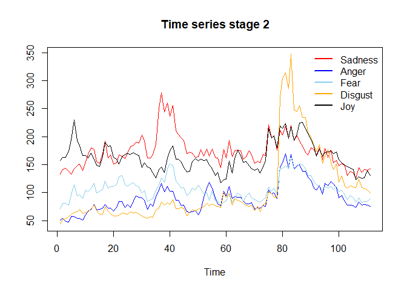<!-- -->

``` r
# (1) order of integration
auto.arima(emotions_TK$sadness[cp_emotions_TK[1]:cp_emotions_TK[2]])
```

    ## Series: emotions_TK$sadness[cp_emotions_TK[1]:cp_emotions_TK[2]] 
    ## ARIMA(2,0,1) with non-zero mean 
    ## 
    ## Coefficients:
    ##           ar1     ar2     ma1      mean
    ##       -0.1182  0.8505  0.9090  169.7484
    ## s.e.   0.0537  0.0498  0.0599    9.6790
    ## 
    ## sigma^2 estimated as 231.4:  log likelihood=-458.61
    ## AIC=927.23   AICc=927.8   BIC=940.78

``` r
auto.arima(emotions_TK$anger[cp_emotions_TK[1]:cp_emotions_TK[2]])
```

    ## Series: emotions_TK$anger[cp_emotions_TK[1]:cp_emotions_TK[2]] 
    ## ARIMA(1,1,2) 
    ## 
    ## Coefficients:
    ##           ar1     ma1     ma2
    ##       -0.8288  0.7797  0.1816
    ## s.e.   0.1202  0.1391  0.1191
    ## 
    ## sigma^2 estimated as 117:  log likelihood=-416.63
    ## AIC=841.26   AICc=841.64   BIC=852.06

``` r
auto.arima(emotions_TK$fear[cp_emotions_TK[1]:cp_emotions_TK[2]])
```

    ## Series: emotions_TK$fear[cp_emotions_TK[1]:cp_emotions_TK[2]] 
    ## ARIMA(2,0,1) with non-zero mean 
    ## 
    ## Coefficients:
    ##           ar1     ar2     ma1      mean
    ##       -0.1084  0.8612  0.9359  103.5210
    ## s.e.   0.0556  0.0507  0.0652    7.0512
    ## 
    ## sigma^2 estimated as 102.5:  log likelihood=-413.34
    ## AIC=836.67   AICc=837.24   BIC=850.22

``` r
auto.arima(emotions_TK$disgust[cp_emotions_TK[1]:cp_emotions_TK[2]])
```

    ## Series: emotions_TK$disgust[cp_emotions_TK[1]:cp_emotions_TK[2]] 
    ## ARIMA(0,1,0) 
    ## 
    ## sigma^2 estimated as 523.7:  log likelihood=-500.43
    ## AIC=1002.86   AICc=1002.9   BIC=1005.56

``` r
auto.arima(emotions_TK$joy[cp_emotions_TK[1]:cp_emotions_TK[2]])
```

    ## Series: emotions_TK$joy[cp_emotions_TK[1]:cp_emotions_TK[2]] 
    ## ARIMA(2,0,1) with non-zero mean 
    ## 
    ## Coefficients:
    ##           ar1     ar2     ma1      mean
    ##       -0.0995  0.8435  0.8926  161.7215
    ## s.e.   0.0587  0.0524  0.0687    8.6645
    ## 
    ## sigma^2 estimated as 175.8:  log likelihood=-443.22
    ## AIC=896.44   AICc=897.01   BIC=909.99

``` r
# (2) lag selection
var_lag <- tsDyn::lags.select(emotions_TK[cp_emotions_TK[1]:cp_emotions_TK[2],1:5], lag=10)
var_lag
```

    ## Best AIC:  lag= 1 
    ## Best BIC:  lag= 1 
    ## Best HQ :  lag= 1

``` r
# (3) Cointegration
coi_2 <- ca.jo(emotions_TK[cp_emotions_TK[1]:cp_emotions_TK[2],1:5], type = 'trace', ecdet = 'const', K=3)
summary(coi_2)
```

    ## 
    ## ###################### 
    ## # Johansen-Procedure # 
    ## ###################### 
    ## 
    ## Test type: trace statistic , without linear trend and constant in cointegration 
    ## 
    ## Eigenvalues (lambda):
    ## [1] 0.2226531 0.2033026 0.1012221 0.0829360 0.0299388 0.0000000
    ## 
    ## Values of teststatistic and critical values of test:
    ## 
    ##           test 10pct  5pct  1pct
    ## r <= 4 |  3.28  7.52  9.24 12.97
    ## r <= 3 | 12.63 17.85 19.96 24.60
    ## r <= 2 | 24.16 32.00 34.91 41.07
    ## r <= 1 | 48.71 49.65 53.12 60.16
    ## r = 0  | 75.91 71.86 76.07 84.45
    ## 
    ## Eigenvectors, normalised to first column:
    ## (These are the cointegration relations)
    ## 
    ##             sadness.l3   anger.l3     fear.l3   disgust.l3      joy.l3
    ## sadness.l3   1.0000000   1.000000   1.0000000    1.0000000    1.000000
    ## anger.l3    -1.1327518 -10.668067   1.0398784   -4.5411645   -0.977084
    ## fear.l3     -1.3155428   5.016022  -0.1895465    6.1483723    3.953121
    ## disgust.l3   0.4503264   4.353270   0.1371595    0.9153399   -1.598393
    ## joy.l3       0.3338978  -6.712056  -1.3096937    1.0776356   -1.296837
    ## constant   -32.0570284 898.506159 -51.4062944 -686.5837901 -127.288808
    ##                 constant
    ## sadness.l3    1.00000000
    ## anger.l3     -2.29479637
    ## fear.l3      -1.03757177
    ## disgust.l3   -0.04122405
    ## joy.l3        3.23295105
    ## constant   -853.24780213
    ## 
    ## Weights W:
    ## (This is the loading matrix)
    ## 
    ##            sadness.l3     anger.l3      fear.l3  disgust.l3        joy.l3
    ## sadness.d -0.06765365  0.019696859 -0.055544851 -0.03123769  0.0001930473
    ## anger.d    0.16081223  0.015051623 -0.045294446 -0.01057241  0.0074877183
    ## fear.d     0.20976372  0.004529258 -0.008628737 -0.01973021 -0.0013610227
    ## disgust.d  0.32683004 -0.022053464 -0.042542978 -0.02867025  0.0221698192
    ## joy.d      0.11743806  0.025987837  0.027230236 -0.02310299  0.0074484598
    ##                constant
    ## sadness.d -5.632876e-18
    ## anger.d    2.229424e-17
    ## fear.d     1.706847e-17
    ## disgust.d  1.435401e-17
    ## joy.d      2.122112e-17

``` r
# (4) VAR
var_result_2 <- VAR(emotions_TK[cp_emotions_TK[1]:cp_emotions_TK[2],1:5], p=2)

#VAR stabilty
roots(var_result_2)
```

    ##  [1] 0.92160804 0.85910278 0.84325517 0.84325517 0.51639699 0.51639699
    ##  [7] 0.23606846 0.23606846 0.19984148 0.06983192

``` r
serial.test(var_result_2)
```

    ## 
    ##  Portmanteau Test (asymptotic)
    ## 
    ## data:  Residuals of VAR object var_result_2
    ## Chi-squared = 308.97, df = 350, p-value = 0.9441

``` r
# (5) Toda-Yamamoto

toda.yamamoto(var_result_2, max.oi=1)
```

    ##    predictor  causes      chisq         p
    ## 1    sadness   anger 1.06412332 0.5873927
    ## 2    sadness    fear 2.72697382 0.2557674
    ## 3    sadness disgust 0.39371353 0.8213083
    ## 4    sadness     joy 7.74591209 0.0207968
    ## 5      anger sadness 1.35206688 0.5086305
    ## 6      anger    fear 0.45588582 0.7961697
    ## 7      anger disgust 1.41526445 0.4928097
    ## 8      anger     joy 0.04562738 0.9774446
    ## 9       fear sadness 2.39956721 0.3012594
    ## 10      fear   anger 0.42859568 0.8071080
    ## 11      fear disgust 0.94362504 0.6238705
    ## 12      fear     joy 1.66008229 0.4360313
    ## 13   disgust sadness 0.07966247 0.9609516
    ## 14   disgust   anger 1.43271147 0.4885293
    ## 15   disgust    fear 0.11401148 0.9445886
    ## 16   disgust     joy 0.02055978 0.9897728
    ## 17       joy sadness 4.60209349 0.1001540
    ## 18       joy   anger 2.95793340 0.2278730
    ## 19       joy    fear 0.62180203 0.7327864
    ## 20       joy disgust 2.27423280 0.3207426

**Stage 3**

``` r
# Plot
ts.plot(emotions_TK[cp_emotions_TK[2]:cp_emotions_TK[3],1:5], col=c('red', 'blue', 'skyblue', 'orange', 'black'), main='Time series stage 3')
legend("topright",c("Sadness","Anger","Fear","Disgust","Joy"),col=c('red', 'blue', 'skyblue', 'orange', 'black'),lwd=c(2),bty="n")
```

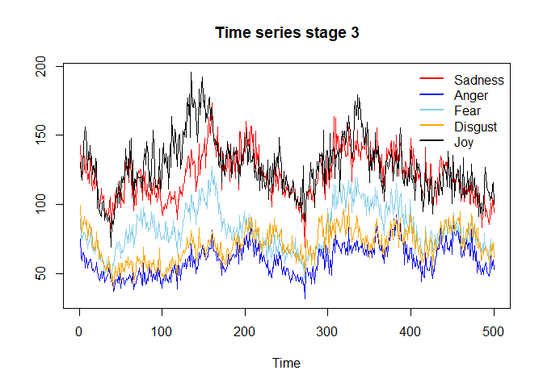<!-- -->

``` r
# (1) order of integration
auto.arima(emotions_TK$sadness[cp_emotions_TK[2]:cp_emotions_TK[3]])
```

    ## Series: emotions_TK$sadness[cp_emotions_TK[2]:cp_emotions_TK[3]] 
    ## ARIMA(1,1,1) 
    ## 
    ## Coefficients:
    ##           ar1      ma1
    ##       -0.0330  -0.5945
    ## s.e.   0.0796   0.0671
    ## 
    ## sigma^2 estimated as 90.91:  log likelihood=-1832.49
    ## AIC=3670.99   AICc=3671.03   BIC=3683.62

``` r
auto.arima(emotions_TK$anger[cp_emotions_TK[2]:cp_emotions_TK[3]])
```

    ## Series: emotions_TK$anger[cp_emotions_TK[2]:cp_emotions_TK[3]] 
    ## ARIMA(1,1,1) 
    ## 
    ## Coefficients:
    ##           ar1      ma1
    ##       -0.0367  -0.5539
    ## s.e.   0.0801   0.0677
    ## 
    ## sigma^2 estimated as 32:  log likelihood=-1571.95
    ## AIC=3149.91   AICc=3149.95   BIC=3162.54

``` r
auto.arima(emotions_TK$fear[cp_emotions_TK[2]:cp_emotions_TK[3]])
```

    ## Series: emotions_TK$fear[cp_emotions_TK[2]:cp_emotions_TK[3]] 
    ## ARIMA(1,1,1) 
    ## 
    ## Coefficients:
    ##           ar1      ma1
    ##       -0.0298  -0.5720
    ## s.e.   0.0728   0.0584
    ## 
    ## sigma^2 estimated as 48.46:  log likelihood=-1675.51
    ## AIC=3357.02   AICc=3357.07   BIC=3369.66

``` r
auto.arima(emotions_TK$disgust[cp_emotions_TK[2]:cp_emotions_TK[3]])
```

    ## Series: emotions_TK$disgust[cp_emotions_TK[2]:cp_emotions_TK[3]] 
    ## ARIMA(1,1,1) 
    ## 
    ## Coefficients:
    ##          ar1      ma1
    ##       0.0164  -0.6156
    ## s.e.  0.0812   0.0669
    ## 
    ## sigma^2 estimated as 44.34:  log likelihood=-1653.35
    ## AIC=3312.7   AICc=3312.75   BIC=3325.33

``` r
auto.arima(emotions_TK$joy[cp_emotions_TK[2]:cp_emotions_TK[3]])
```

    ## Series: emotions_TK$joy[cp_emotions_TK[2]:cp_emotions_TK[3]] 
    ## ARIMA(0,1,1) 
    ## 
    ## Coefficients:
    ##           ma1
    ##       -0.5827
    ## s.e.   0.0406
    ## 
    ## sigma^2 estimated as 124.3:  log likelihood=-1910.95
    ## AIC=3825.9   AICc=3825.92   BIC=3834.32

``` r
# (2) lag selection
var_lag <- tsDyn::lags.select(emotions_TK[cp_emotions_TK[2]:cp_emotions_TK[3],1:5], lag=10)
var_lag
```

    ## Best AIC:  lag= 3 
    ## Best BIC:  lag= 2 
    ## Best HQ :  lag= 3

``` r
# (3) Cointegration
coi_3 <- ca.jo(emotions_TK[cp_emotions_TK[2]:cp_emotions_TK[3],1:5], type = 'trace', ecdet = 'const', K=4)
summary(coi_3)
```

    ## 
    ## ###################### 
    ## # Johansen-Procedure # 
    ## ###################### 
    ## 
    ## Test type: trace statistic , without linear trend and constant in cointegration 
    ## 
    ## Eigenvalues (lambda):
    ## [1] 5.757569e-02 4.934354e-02 3.610633e-02 1.985386e-02 1.089490e-02
    ## [6] 2.081668e-17
    ## 
    ## Values of teststatistic and critical values of test:
    ## 
    ##           test 10pct  5pct  1pct
    ## r <= 4 |  5.43  7.52  9.24 12.97
    ## r <= 3 | 15.38 17.85 19.96 24.60
    ## r <= 2 | 33.62 32.00 34.91 41.07
    ## r <= 1 | 58.72 49.65 53.12 60.16
    ## r = 0  | 88.13 71.86 76.07 84.45
    ## 
    ## Eigenvectors, normalised to first column:
    ## (These are the cointegration relations)
    ## 
    ##            sadness.l4   anger.l4      fear.l4  disgust.l4      joy.l4
    ## sadness.l4    1.00000   1.000000   1.00000000  1.00000000    1.000000
    ## anger.l4   -306.37623   1.108559  -0.19760643 -1.41686247   -1.730919
    ## fear.l4     136.84703   1.278937  -0.61633448 -0.53202253    9.678147
    ## disgust.l4  228.82668  -1.935828   0.06494425 -0.77488788   -6.166581
    ## joy.l4      -69.20399  -2.119297  -0.03765549  0.07226769    1.152512
    ## constant   -484.42697 115.056944 -57.90745111 52.66841190 -529.331147
    ##                constant
    ## sadness.l4    1.0000000
    ## anger.l4     -1.5606820
    ## fear.l4      -0.9141536
    ## disgust.l4    2.1553992
    ## joy.l4       -0.1318974
    ## constant   -327.8636282
    ## 
    ## Weights W:
    ## (This is the loading matrix)
    ## 
    ##              sadness.l4     anger.l4     fear.l4 disgust.l4        joy.l4
    ## sadness.d -0.0002171098 -0.004268226 -0.18487934 0.02501869 -0.0001427595
    ## anger.d    0.0001293037 -0.002550203 -0.05552652 0.03963682  0.0006293840
    ## fear.d    -0.0003065902 -0.009026157 -0.06426340 0.03673630 -0.0025118705
    ## disgust.d -0.0004341692  0.020584106 -0.06833844 0.03646685  0.0005247651
    ## joy.d      0.0004614641  0.052023712 -0.12925313 0.03136288 -0.0029581570
    ##                constant
    ## sadness.d  1.493587e-17
    ## anger.d    2.445423e-18
    ## fear.d     1.097153e-17
    ## disgust.d -1.407807e-17
    ## joy.d     -1.740449e-17

``` r
# (4) VAR
var_result_3 <- VAR(emotions_TK[cp_emotions_TK[2]:cp_emotions_TK[3],1:5], p=4)

#VAR stabilty
roots(var_result_3)
```

    ##  [1] 0.9718255 0.9671572 0.9398215 0.9019841 0.8881859 0.5857807 0.5857807
    ##  [8] 0.5632297 0.5632297 0.5492062 0.5492062 0.5421262 0.5421262 0.5076560
    ## [15] 0.5076560 0.4828067 0.4828067 0.4527373 0.4527373 0.3150836

``` r
serial.test(var_result_3)
```

    ## 
    ##  Portmanteau Test (asymptotic)
    ## 
    ## data:  Residuals of VAR object var_result_3
    ## Chi-squared = 339.98, df = 300, p-value = 0.05573

``` r
# (5) Toda-Yamamoto

toda.yamamoto(var_result_3, max.oi=1)
```

    ##    predictor  causes     chisq          p
    ## 1    sadness   anger 4.2924066 0.36787691
    ## 2    sadness    fear 7.0801308 0.13171379
    ## 3    sadness disgust 1.0865189 0.89640519
    ## 4    sadness     joy 2.2373338 0.69220037
    ## 5      anger sadness 2.2687544 0.68646344
    ## 6      anger    fear 3.5239887 0.47424019
    ## 7      anger disgust 0.5930743 0.96383017
    ## 8      anger     joy 7.1223121 0.12956405
    ## 9       fear sadness 5.4667521 0.24266749
    ## 10      fear   anger 4.1342757 0.38813851
    ## 11      fear disgust 2.4097569 0.66086475
    ## 12      fear     joy 6.0082516 0.19853289
    ## 13   disgust sadness 9.0268501 0.06043185
    ## 14   disgust   anger 2.6144457 0.62426628
    ## 15   disgust    fear 8.7896979 0.06657645
    ## 16   disgust     joy 3.4342367 0.48794799
    ## 17       joy sadness 2.3728050 0.66754732
    ## 18       joy   anger 3.7598378 0.43948277
    ## 19       joy    fear 3.2304583 0.52002550
    ## 20       joy disgust 1.8921524 0.75558646

**Stage 4**

``` r
# Plot
ts.plot(emotions_TK[cp_emotions_TK[3]:cp_emotions_TK[4],1:5], col=c('red', 'blue', 'skyblue', 'orange', 'black'), main='Time series stage 4')
legend("topright",c("Sadness","Anger","Fear","Disgust","Joy"),col=c('red', 'blue', 'skyblue', 'orange', 'black'),lwd=c(2),bty="n")
```

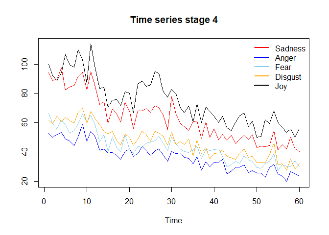<!-- -->

``` r
# (1) order of integration
auto.arima(emotions_TK$sadness[cp_emotions_TK[3]:cp_emotions_TK[4]])
```

    ## Series: emotions_TK$sadness[cp_emotions_TK[3]:cp_emotions_TK[4]] 
    ## ARIMA(0,1,1) with drift 
    ## 
    ## Coefficients:
    ##           ma1    drift
    ##       -0.7021  -0.8630
    ## s.e.   0.1076   0.2553
    ## 
    ## sigma^2 estimated as 41.25:  log likelihood=-192.77
    ## AIC=391.53   AICc=391.97   BIC=397.76

``` r
auto.arima(emotions_TK$anger[cp_emotions_TK[3]:cp_emotions_TK[4]])
```

    ## Series: emotions_TK$anger[cp_emotions_TK[3]:cp_emotions_TK[4]] 
    ## ARIMA(3,1,0) with drift 
    ## 
    ## Coefficients:
    ##           ar1      ar2      ar3    drift
    ##       -0.5436  -0.3801  -0.2126  -0.4890
    ## s.e.   0.1265   0.1354   0.1276   0.2357
    ## 
    ## sigma^2 estimated as 15.53:  log likelihood=-162.79
    ## AIC=335.59   AICc=336.72   BIC=345.97

``` r
auto.arima(emotions_TK$fear[cp_emotions_TK[3]:cp_emotions_TK[4]])
```

    ## Series: emotions_TK$fear[cp_emotions_TK[3]:cp_emotions_TK[4]] 
    ## ARIMA(0,1,1) with drift 
    ## 
    ## Coefficients:
    ##           ma1    drift
    ##       -0.6026  -0.5434
    ## s.e.   0.1476   0.2466
    ## 
    ## sigma^2 estimated as 22.29:  log likelihood=-174.49
    ## AIC=354.98   AICc=355.42   BIC=361.22

``` r
auto.arima(emotions_TK$disgust[cp_emotions_TK[3]:cp_emotions_TK[4]])
```

    ## Series: emotions_TK$disgust[cp_emotions_TK[3]:cp_emotions_TK[4]] 
    ## ARIMA(0,1,1) with drift 
    ## 
    ## Coefficients:
    ##           ma1    drift
    ##       -0.6980  -0.5471
    ## s.e.   0.1313   0.1845
    ## 
    ## sigma^2 estimated as 20.83:  log likelihood=-172.6
    ## AIC=351.2   AICc=351.64   BIC=357.43

``` r
auto.arima(emotions_TK$joy[cp_emotions_TK[3]:cp_emotions_TK[4]])
```

    ## Series: emotions_TK$joy[cp_emotions_TK[3]:cp_emotions_TK[4]] 
    ## ARIMA(0,1,1) 
    ## 
    ## Coefficients:
    ##           ma1
    ##       -0.4593
    ## s.e.   0.1111
    ## 
    ## sigma^2 estimated as 64.53:  log likelihood=-206.26
    ## AIC=416.52   AICc=416.73   BIC=420.68

``` r
# (2) lag selection
var_lag <- tsDyn::lags.select(emotions_TK[cp_emotions_TK[3]:cp_emotions_TK[4],1:5], lag=12)
var_lag
```

    ## Best AIC:  lag= 9 
    ## Best BIC:  lag= 9 
    ## Best HQ :  lag= 9

``` r
# (3) Cointegration
coi_4 <- ca.jo(emotions_TK[cp_emotions_TK[3]:cp_emotions_TK[4],1:5], type = 'trace', ecdet='const', K=4)
summary(coi_4)
```

    ## 
    ## ###################### 
    ## # Johansen-Procedure # 
    ## ###################### 
    ## 
    ## Test type: trace statistic , without linear trend and constant in cointegration 
    ## 
    ## Eigenvalues (lambda):
    ## [1] 5.237222e-01 3.060204e-01 2.681846e-01 2.568094e-01 7.643143e-02
    ## [6] 2.443199e-16
    ## 
    ## Values of teststatistic and critical values of test:
    ## 
    ##            test 10pct  5pct  1pct
    ## r <= 4 |   4.45  7.52  9.24 12.97
    ## r <= 3 |  21.07 17.85 19.96 24.60
    ## r <= 2 |  38.56 32.00 34.91 41.07
    ## r <= 1 |  59.02 49.65 53.12 60.16
    ## r = 0  | 100.55 71.86 76.07 84.45
    ## 
    ## Eigenvectors, normalised to first column:
    ## (These are the cointegration relations)
    ## 
    ##            sadness.l4   anger.l4    fear.l4 disgust.l4     joy.l4  constant
    ## sadness.l4  1.0000000  1.0000000  1.0000000   1.000000  1.0000000  1.000000
    ## anger.l4    1.2460739 -1.5901605 -0.7686716 -17.763107 -3.1345026 -0.317379
    ## fear.l4    -0.7459864 -1.0283813 -0.1123073  14.974615  1.6734785  1.006497
    ## disgust.l4 -1.2536273  0.9876819 -2.0884205   3.798823  0.7628482 -6.327835
    ## joy.l4     -0.3562160 -0.1316977  0.9891695  -2.222512 -1.0003218  1.609187
    ## constant    9.5215853  3.7826616 -7.7587039 -55.948694 14.3690143 92.434431
    ## 
    ## Weights W:
    ## (This is the loading matrix)
    ## 
    ##            sadness.l4    anger.l4    fear.l4  disgust.l4     joy.l4
    ## sadness.d -0.35146642  0.14282321 0.06924420 -0.09485131 0.11163752
    ## anger.d   -0.07481044  0.30409339 0.22294431 -0.02910791 0.08828121
    ## fear.d     0.04455627  0.58556601 0.12970642 -0.06340977 0.03383617
    ## disgust.d  0.36415278 -0.05568994 0.30686106 -0.04628121 0.07167517
    ## joy.d      1.09652487  0.29358655 0.02593285 -0.07398842 0.16650257
    ##                constant
    ## sadness.d  2.901909e-15
    ## anger.d    3.456582e-16
    ## fear.d    -6.228166e-16
    ## disgust.d -3.777518e-15
    ## joy.d     -6.943030e-15

``` r
# (4) VAR
var_result_4 <- VAR(emotions_TK[cp_emotions_TK[3]:cp_emotions_TK[4],1:5], p=2)

#VAR stabilty
roots(var_result_4)
```

    ##  [1] 0.9560011 0.6616730 0.6616730 0.5801285 0.5801285 0.5019347 0.5019347
    ##  [8] 0.4047489 0.4047489 0.3254243

``` r
serial.test(var_result_4)
```

    ## 
    ##  Portmanteau Test (asymptotic)
    ## 
    ## data:  Residuals of VAR object var_result_4
    ## Chi-squared = 310.25, df = 350, p-value = 0.938

``` r
# (5) Toda-Yamamoto

toda.yamamoto(var_result_4, max.oi=1)
```

    ##    predictor  causes      chisq          p
    ## 1    sadness   anger 3.54704449 0.16973409
    ## 2    sadness    fear 1.56980539 0.45616409
    ## 3    sadness disgust 1.90510003 0.38575608
    ## 4    sadness     joy 2.43898717 0.29537971
    ## 5      anger sadness 2.13479832 0.34390179
    ## 6      anger    fear 0.06635210 0.96736824
    ## 7      anger disgust 0.13452776 0.93494846
    ## 8      anger     joy 6.74906088 0.03423419
    ## 9       fear sadness 0.80351357 0.66914347
    ## 10      fear   anger 0.88097159 0.64372363
    ## 11      fear disgust 1.68535433 0.43055631
    ## 12      fear     joy 3.07084290 0.21536491
    ## 13   disgust sadness 1.01976731 0.60056545
    ## 14   disgust   anger 0.18582488 0.91127329
    ## 15   disgust    fear 0.29119598 0.86450517
    ## 16   disgust     joy 1.54929633 0.46086590
    ## 17       joy sadness 0.55969993 0.75589714
    ## 18       joy   anger 0.05645413 0.97216760
    ## 19       joy    fear 1.03643876 0.59558011
    ## 20       joy disgust 0.89162099 0.64030510

**Stage 5**

``` r
# Plot
ts.plot(emotions_TK[cp_emotions_TK[4]:cp_emotions_TK[5],1:5], col=c('red', 'blue', 'skyblue', 'orange', 'black'), main='Time series stage 5')
legend("topright",c("Sadness","Anger","Fear","Disgust","Joy"),col=c('red', 'blue', 'skyblue', 'orange', 'black'),lwd=c(2),bty="n")
```

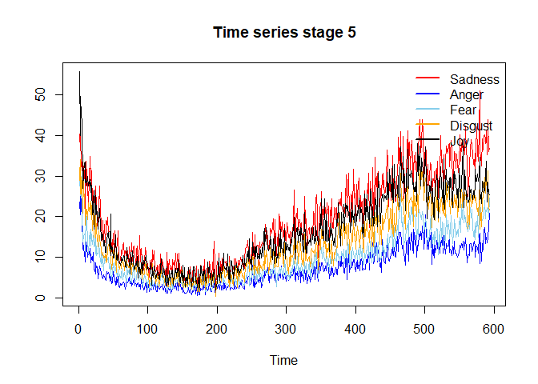<!-- -->

``` r
# (1) order of integration
auto.arima(emotions_TK$sadness[cp_emotions_TK[4]:cp_emotions_TK[5]])
```

    ## Series: emotions_TK$sadness[cp_emotions_TK[4]:cp_emotions_TK[5]] 
    ## ARIMA(1,1,4) 
    ## 
    ## Coefficients:
    ##           ar1      ma1      ma2      ma3     ma4
    ##       -0.6684  -0.0487  -0.5869  -0.1040  0.1259
    ## s.e.   0.2013   0.1969   0.1421   0.0422  0.0447
    ## 
    ## sigma^2 estimated as 12.04:  log likelihood=-1574.49
    ## AIC=3160.97   AICc=3161.12   BIC=3187.27

``` r
auto.arima(emotions_TK$anger[cp_emotions_TK[4]:cp_emotions_TK[5]])
```

    ## Series: emotions_TK$anger[cp_emotions_TK[4]:cp_emotions_TK[5]] 
    ## ARIMA(1,1,3) 
    ## 
    ## Coefficients:
    ##           ar1     ma1      ma2      ma3
    ##       -0.7581  0.1408  -0.5079  -0.0775
    ## s.e.   0.1958  0.1970   0.1290   0.0467
    ## 
    ## sigma^2 estimated as 2.949:  log likelihood=-1158.38
    ## AIC=2326.75   AICc=2326.86   BIC=2348.67

``` r
auto.arima(emotions_TK$fear[cp_emotions_TK[4]:cp_emotions_TK[5]])
```

    ## Series: emotions_TK$fear[cp_emotions_TK[4]:cp_emotions_TK[5]] 
    ## ARIMA(1,1,3) 
    ## 
    ## Coefficients:
    ##           ar1     ma1      ma2      ma3
    ##       -0.9683  0.3521  -0.6279  -0.0824
    ## s.e.   0.0282  0.0496   0.0445   0.0425
    ## 
    ## sigma^2 estimated as 4.096:  log likelihood=-1255.72
    ## AIC=2521.45   AICc=2521.55   BIC=2543.37

``` r
auto.arima(emotions_TK$disgust[cp_emotions_TK[4]:cp_emotions_TK[5]])
```

    ## Series: emotions_TK$disgust[cp_emotions_TK[4]:cp_emotions_TK[5]] 
    ## ARIMA(5,1,2) 
    ## 
    ## Coefficients:
    ##           ar1     ar2     ar3     ar4     ar5      ma1      ma2
    ##       -0.5474  0.1750  0.1062  0.0822  0.0335  -0.1749  -0.5279
    ## s.e.   2.1796  0.2317  0.2557  0.0991  0.1278   2.1788   1.7813
    ## 
    ## sigma^2 estimated as 6.548:  log likelihood=-1393.07
    ## AIC=2802.15   AICc=2802.39   BIC=2837.21

``` r
auto.arima(emotions_TK$joy[cp_emotions_TK[4]:cp_emotions_TK[5]])
```

    ## Series: emotions_TK$joy[cp_emotions_TK[4]:cp_emotions_TK[5]] 
    ## ARIMA(3,1,1) with drift 
    ## 
    ## Coefficients:
    ##           ar1      ar2      ar3      ma1    drift
    ##       -0.2784  -0.1806  -0.1458  -0.4668  -0.0351
    ## s.e.   0.1238   0.0913   0.0637   0.1244   0.0429
    ## 
    ## sigma^2 estimated as 9.867:  log likelihood=-1515.46
    ## AIC=3042.92   AICc=3043.07   BIC=3069.23

``` r
# (2) lag selection
var_lag <- tsDyn::lags.select(emotions_TK[cp_emotions_TK[4]:cp_emotions_TK[5],1:5], lag=20)
var_lag
```

    ## Best AIC:  lag= 6 
    ## Best BIC:  lag= 2 
    ## Best HQ :  lag= 4

``` r
# (3) Cointegration
coi_4 <- ca.jo(emotions_TK[cp_emotions_TK[4]:cp_emotions_TK[5],1:5], type = 'trace', ecdet='const', K=10)
summary(coi_4)
```

    ## 
    ## ###################### 
    ## # Johansen-Procedure # 
    ## ###################### 
    ## 
    ## Test type: trace statistic , without linear trend and constant in cointegration 
    ## 
    ## Eigenvalues (lambda):
    ## [1]  1.005758e-01  7.554155e-02  4.047131e-02  3.179638e-02  7.666055e-04
    ## [6] -1.387779e-17
    ## 
    ## Values of teststatistic and critical values of test:
    ## 
    ##            test 10pct  5pct  1pct
    ## r <= 4 |   0.45  7.52  9.24 12.97
    ## r <= 3 |  19.29 17.85 19.96 24.60
    ## r <= 2 |  43.37 32.00 34.91 41.07
    ## r <= 1 |  89.16 49.65 53.12 60.16
    ## r = 0  | 150.96 71.86 76.07 84.45
    ## 
    ## Eigenvectors, normalised to first column:
    ## (These are the cointegration relations)
    ## 
    ##             sadness.l10  anger.l10    fear.l10 disgust.l10     joy.l10
    ## sadness.l10    1.000000  1.0000000  1.00000000    1.000000   1.0000000
    ## anger.l10      9.113347  0.7226528 -4.32808413    2.177442   3.3101475
    ## fear.l10      11.402318 -0.4106108 -0.04720271   -5.027366   1.8047895
    ## disgust.l10  -25.969859 -0.6451665  0.27739999   -0.649179  -0.7729123
    ## joy.l10        9.313547 -0.7601277  0.68261106    1.603470  -0.7772664
    ## constant      -3.182402  0.1178845 -3.27961169   -4.111486 -60.5433521
    ##               constant
    ## sadness.l10  1.0000000
    ## anger.l10    3.2211443
    ## fear.l10     1.6739096
    ## disgust.l10 -0.1731566
    ## joy.l10     -2.6751562
    ## constant    -4.4222456
    ## 
    ## Weights W:
    ## (This is the loading matrix)
    ## 
    ##             sadness.l10   anger.l10    fear.l10  disgust.l10       joy.l10
    ## sadness.d  0.0177051457 -0.06773608 -0.06102761  0.028816848 -0.0024001022
    ## anger.d    0.0081457986  0.03618374  0.05517638 -0.003977479 -0.0009835268
    ## fear.d     0.0052776181  0.08938072  0.03198391  0.043124514 -0.0008869592
    ## disgust.d  0.0283492920  0.18934893 -0.01356759  0.006834396 -0.0009698594
    ## joy.d     -0.0004326091  0.39156720 -0.06230141  0.001443812 -0.0016007018
    ##                constant
    ## sadness.d  2.390677e-16
    ## anger.d   -1.114898e-16
    ## fear.d    -1.078679e-16
    ## disgust.d  6.536887e-16
    ## joy.d     -1.395188e-16

``` r
# (4) VAR
var_result_4 <- VAR(emotions_TK[cp_emotions_TK[4]:cp_emotions_TK[5],1:5], p=10)

#VAR stabilty
roots(var_result_4)
```

    ##  [1] 0.9981742 0.9280483 0.8985753 0.8944789 0.8944789 0.8859243 0.8859243
    ##  [8] 0.8563855 0.8563855 0.8383939 0.8383939 0.8284959 0.8284959 0.8275078
    ## [15] 0.8202834 0.8202834 0.8180924 0.8180924 0.8161581 0.8161581 0.8115472
    ## [22] 0.8115472 0.8113725 0.8113725 0.8079057 0.8079057 0.8050023 0.8050023
    ## [29] 0.8010619 0.8010619 0.7889231 0.7889231 0.7804911 0.7804911 0.7642008
    ## [36] 0.7642008 0.7635853 0.7635853 0.7543620 0.7543620 0.7117924 0.7117924
    ## [43] 0.6901079 0.6901079 0.5979209 0.5979209 0.5875062 0.5875062 0.5507702
    ## [50] 0.4558584

``` r
serial.test(var_result_4)
```

    ## 
    ##  Portmanteau Test (asymptotic)
    ## 
    ## data:  Residuals of VAR object var_result_4
    ## Chi-squared = 208.64, df = 150, p-value = 0.001102

``` r
# (5) Toda-Yamamoto

toda.yamamoto(var_result_4, max.oi=1)
```

    ##    predictor  causes     chisq            p
    ## 1    sadness   anger 16.731285 0.0805254828
    ## 2    sadness    fear 28.379981 0.0015688075
    ## 3    sadness disgust 18.722176 0.0439367157
    ## 4    sadness     joy 25.230332 0.0049255978
    ## 5      anger sadness 15.251070 0.1231728882
    ## 6      anger    fear 18.545554 0.0464292461
    ## 7      anger disgust 13.278976 0.2084895348
    ## 8      anger     joy 14.061892 0.1701871819
    ## 9       fear sadness 22.125810 0.0144763507
    ## 10      fear   anger 11.707213 0.3051294634
    ## 11      fear disgust 16.320800 0.0908100186
    ## 12      fear     joy 11.944670 0.2887765858
    ## 13   disgust sadness 29.949882 0.0008729603
    ## 14   disgust   anger 20.988171 0.0211762041
    ## 15   disgust    fear 12.528309 0.2512524995
    ## 16   disgust     joy 13.294250 0.2076821408
    ## 17       joy sadness 21.623306 0.0171429459
    ## 18       joy   anger 10.514199 0.3965954130
    ## 19       joy    fear 15.721045 0.1079011269
    ## 20       joy disgust  7.722259 0.6559454793

**Stage 6**

``` r
# Plot
ts.plot(emotions_TK[cp_emotions_TK[5]:dim(emotions_TK)[1],1:5], col=c('red', 'blue', 'skyblue', 'orange', 'black'), main='Time series stage 6')
legend("topright",c("Sadness","Anger","Fear","Disgust","Joy"),col=c('red', 'blue', 'skyblue', 'orange', 'black'),lwd=c(2),bty="n")
```

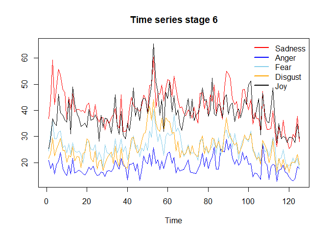<!-- -->

``` r
# (1) order of integration
auto.arima(emotions_TK$sadness[cp_emotions_TK[5]:dim(emotions_TK)[1]])
```

    ## Series: emotions_TK$sadness[cp_emotions_TK[5]:dim(emotions_TK)[1]] 
    ## ARIMA(0,1,1) 
    ## 
    ## Coefficients:
    ##           ma1
    ##       -0.6696
    ## s.e.   0.0701
    ## 
    ## sigma^2 estimated as 27.27:  log likelihood=-380.7
    ## AIC=765.4   AICc=765.49   BIC=771.04

``` r
auto.arima(emotions_TK$anger[cp_emotions_TK[5]:dim(emotions_TK)[1]])
```

    ## Series: emotions_TK$anger[cp_emotions_TK[5]:dim(emotions_TK)[1]] 
    ## ARIMA(2,0,0) with non-zero mean 
    ## 
    ## Coefficients:
    ##          ar1     ar2     mean
    ##       0.3310  0.2454  18.7421
    ## s.e.  0.0863  0.0862   0.5900
    ## 
    ## sigma^2 estimated as 8.252:  log likelihood=-307.92
    ## AIC=623.84   AICc=624.18   BIC=635.16

``` r
auto.arima(emotions_TK$fear[cp_emotions_TK[5]:dim(emotions_TK)[1]])
```

    ## Series: emotions_TK$fear[cp_emotions_TK[5]:dim(emotions_TK)[1]] 
    ## ARIMA(1,1,1) 
    ## 
    ## Coefficients:
    ##          ar1      ma1
    ##       0.2477  -0.8106
    ## s.e.  0.1332   0.0847
    ## 
    ## sigma^2 estimated as 12.85:  log likelihood=-333.61
    ## AIC=673.22   AICc=673.42   BIC=681.69

``` r
auto.arima(emotions_TK$disgust[cp_emotions_TK[5]:dim(emotions_TK)[1]])
```

    ## Series: emotions_TK$disgust[cp_emotions_TK[5]:dim(emotions_TK)[1]] 
    ## ARIMA(1,0,1) with non-zero mean 
    ## 
    ## Coefficients:
    ##          ar1      ma1     mean
    ##       0.8808  -0.3436  25.1325
    ## s.e.  0.0554   0.1179   1.6744
    ## 
    ## sigma^2 estimated as 13:  log likelihood=-336.59
    ## AIC=681.17   AICc=681.51   BIC=692.49

``` r
auto.arima(emotions_TK$joy[cp_emotions_TK[5]:dim(emotions_TK)[1]])
```

    ## Series: emotions_TK$joy[cp_emotions_TK[5]:dim(emotions_TK)[1]] 
    ## ARIMA(1,0,1) with non-zero mean 
    ## 
    ## Coefficients:
    ##          ar1      ma1     mean
    ##       0.8981  -0.6187  37.9269
    ## s.e.  0.0753   0.1319   1.8674
    ## 
    ## sigma^2 estimated as 31.77:  log likelihood=-392.27
    ## AIC=792.53   AICc=792.87   BIC=803.85

``` r
# (2) lag selection
var_lag <- tsDyn::lags.select(emotions_TK[cp_emotions_TK[5]:dim(emotions_TK)[1],1:5], lag=30)
var_lag
```

    ## Best AIC:  lag= 18 
    ## Best BIC:  lag= 18 
    ## Best HQ :  lag= 18

``` r
# (3) Cointegration
coi_6 <- ca.jo(emotions_TK[cp_emotions_TK[5]:dim(emotions_TK)[1],1:5], type = 'trace', ecdet='const', K=4)
summary(coi_6)
```

    ## 
    ## ###################### 
    ## # Johansen-Procedure # 
    ## ###################### 
    ## 
    ## Test type: trace statistic , without linear trend and constant in cointegration 
    ## 
    ## Eigenvalues (lambda):
    ## [1] 2.508326e-01 1.633695e-01 1.175037e-01 7.936769e-02 3.333548e-02
    ## [6] 1.484660e-17
    ## 
    ## Values of teststatistic and critical values of test:
    ## 
    ##           test 10pct  5pct  1pct
    ## r <= 4 |  4.10  7.52  9.24 12.97
    ## r <= 3 | 14.11 17.85 19.96 24.60
    ## r <= 2 | 29.23 32.00 34.91 41.07
    ## r <= 1 | 50.82 49.65 53.12 60.16
    ## r = 0  | 85.76 71.86 76.07 84.45
    ## 
    ## Eigenvectors, normalised to first column:
    ## (These are the cointegration relations)
    ## 
    ##            sadness.l4   anger.l4   fear.l4  disgust.l4      joy.l4    constant
    ## sadness.l4  1.0000000  1.0000000  1.000000   1.0000000   1.0000000   1.0000000
    ## anger.l4    0.8370912 -1.5110294 -1.593541   2.4798878  -1.1037634  -0.9401864
    ## fear.l4    -3.4661706  0.1062908 -1.408892  -0.2317484  -0.4092731   0.3048393
    ## disgust.l4  1.2230712  0.4325676 -1.131776  -2.0859202   0.3510967  -0.8171212
    ## joy.l4     -0.7533450 -1.4915415  1.188428   0.1524135   0.3367477   0.2452574
    ## constant   31.2172980 32.2904618  8.723368 -33.3146673 -30.8901966 -32.6266497
    ## 
    ## Weights W:
    ## (This is the loading matrix)
    ## 
    ##           sadness.l4     anger.l4      fear.l4  disgust.l4      joy.l4
    ## sadness.d 0.14991629  0.022832115 -0.023302448 -0.13496146 -0.10921730
    ## anger.d   0.07070114  0.094316052  0.085600594 -0.08930912 -0.01645163
    ## fear.d    0.29731064 -0.009597276  0.005780899 -0.04869280 -0.02988794
    ## disgust.d 0.14121526  0.069533516  0.086196159 -0.01045893 -0.08551592
    ## joy.d     0.25897786  0.309126967 -0.083038547 -0.03484843 -0.05323166
    ##                constant
    ## sadness.d -2.435362e-16
    ## anger.d   -4.463216e-16
    ## fear.d    -9.501351e-16
    ## disgust.d -8.606560e-16
    ## joy.d     -1.524409e-15

``` r
# (4) VAR
var_result_6 <- VAR(emotions_TK[cp_emotions_TK[5]:dim(emotions_TK)[1],1:5], p=4)

#VAR stability
roots(var_result_6)
```

    ##  [1] 0.9220066 0.7939677 0.7542105 0.7542105 0.7459368 0.7459368 0.7422134
    ##  [8] 0.7030767 0.7030767 0.7021087 0.6741239 0.6741239 0.6093743 0.6093743
    ## [15] 0.5750035 0.5750035 0.5565862 0.5565862 0.3536591 0.3536591

``` r
serial.test(var_result_6)
```

    ## 
    ##  Portmanteau Test (asymptotic)
    ## 
    ## data:  Residuals of VAR object var_result_6
    ## Chi-squared = 275.84, df = 300, p-value = 0.8382

``` r
# (5) Toda-Yamamoto

toda.yamamoto(var_result_6, max.oi=1)
```

    ##    predictor  causes     chisq           p
    ## 1    sadness   anger  5.854688 0.210266265
    ## 2    sadness    fear  3.304319 0.508248171
    ## 3    sadness disgust  7.104185 0.130483869
    ## 4    sadness     joy  4.222093 0.376782458
    ## 5      anger sadness  2.480765 0.648083408
    ## 6      anger    fear  7.157362 0.127802377
    ## 7      anger disgust  4.067013 0.397012619
    ## 8      anger     joy  2.452326 0.653192499
    ## 9       fear sadness  8.286675 0.081623735
    ## 10      fear   anger  5.516318 0.238298846
    ## 11      fear disgust 13.651602 0.008494173
    ## 12      fear     joy 11.150175 0.024927099
    ## 13   disgust sadness  6.980150 0.136940922
    ## 14   disgust   anger  3.174935 0.528988802
    ## 15   disgust    fear  6.140926 0.188868100
    ## 16   disgust     joy 17.594020 0.001481156
    ## 17       joy sadness  3.339082 0.502764030
    ## 18       joy   anger  2.513824 0.642162077
    ## 19       joy    fear  6.380951 0.172447683
    ## 20       joy disgust  1.520764 0.822957071
