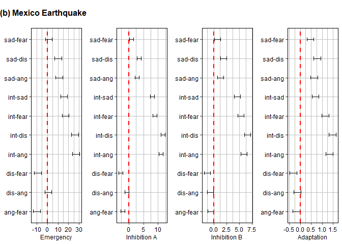

### 1) Data preparation


```r
Base_LA <- read.csv(here::here("data", "SI_1_DDBB_LA.csv"), header = TRUE)
Base_MX <- read.csv(here::here("data", "SI_2_DDBB_Mexico.csv"), header = TRUE)
Base_TK <- read.csv(here::here("data", "SI_3_DDBB_Turkey.csv"), header = TRUE)

#Creation of dataframes
sadness_LA <- aggregate(sadness~one_minutes, data = Base_LA, sum)$sadness
anger_LA <- aggregate(anger~one_minutes, data = Base_LA, sum)$anger
fear_LA <- aggregate(fear~one_minutes, data = Base_LA, sum)$fear
disgust_LA <- aggregate(disgust~one_minutes, data = Base_LA, sum)$disgust
joy_LA <- aggregate(joy~one_minutes, data = Base_LA, sum)$joy
count_LA <- aggregate(count~one_minutes, data = Base_LA, sum)$count

emotions_LA <- as.data.frame(cbind(sadness_LA, anger_LA, fear_LA, disgust_LA, joy_LA, count_LA))
colnames(emotions_LA) <- c('sadness', 'anger', 'fear', 'disgust', 'joy', 'count')

sadness_MX <- aggregate(sadness~one_minutes, data = Base_MX, sum)$sadness
anger_MX <- aggregate(anger~one_minutes, data = Base_MX, sum)$anger
fear_MX <- aggregate(fear~one_minutes, data = Base_MX, sum)$fear
disgust_MX <- aggregate(disgust~one_minutes, data = Base_MX, sum)$disgust
joy_MX <- aggregate(joy~one_minutes, data = Base_MX, sum)$joy
count_MX <- aggregate(count~one_minutes, data = Base_MX, sum)$count

emotions_MX <- as.data.frame(cbind(sadness_MX, anger_MX, fear_MX, disgust_MX, joy_MX, count_MX))
colnames(emotions_MX) <- c('sadness', 'anger', 'fear', 'disgust', 'joy', 'count')

sadness_TK <- aggregate(sadness~one_minutes, data = Base_TK, sum)$sadness
anger_TK <- aggregate(anger~one_minutes, data = Base_TK, sum)$anger
fear_TK <- aggregate(fear~one_minutes, data = Base_TK, sum)$fear
disgust_TK <- aggregate(disgust~one_minutes, data = Base_TK, sum)$disgust
joy_TK <- aggregate(joy~one_minutes, data = Base_TK, sum)$joy
count_TK <- aggregate(count~one_minutes, data = Base_TK, sum)$count

emotions_TK <- as.data.frame(cbind(sadness_TK, anger_TK, fear_TK, disgust_TK, joy_TK, count_TK))
colnames(emotions_TK) <- c('sadness', 'anger', 'fear', 'disgust', 'joy', 'count')

#Variable count normalized
emotions_LA['count_norm']<- emotions_LA$count/max(emotions_LA$count)
emotions_MX['count_norm']<- emotions_MX$count/max(emotions_MX$count)
emotions_TK['count_norm']<- emotions_TK$count/max(emotions_TK$count)

#Variables sum of emotions
emotions_LA['emo_sum']<- emotions_LA$sadness + emotions_LA$anger + emotions_LA$fear +
                         emotions_LA$disgust + emotions_LA$joy
emotions_MX['emo_sum']<- emotions_MX$sadness + emotions_MX$anger + emotions_MX$fear +
                         emotions_MX$disgust + emotions_MX$joy
emotions_TK['emo_sum']<- emotions_TK$sadness + emotions_TK$anger + emotions_TK$fear +
                         emotions_TK$disgust + emotions_TK$joy

#Variables sum of emotions normalized
emotions_LA['sum_norm']<- emotions_LA$emo_sum/max(emotions_LA$emo_sum)
emotions_MX['sum_norm']<- emotions_MX$emo_sum/max(emotions_MX$emo_sum)
emotions_TK['sum_norm']<- emotions_TK$emo_sum/max(emotions_TK$emo_sum)
```


#### 1.1) Data descriptive analysis

A summary of the data for each case studied.


```r
summary(Base_LA)
```

```
##   created_at         one_minutes       sent_score       sent_label       
##  Length:144095      Min.   :   1.0   Min.   :-1.0000   Length:144095     
##  Class :character   1st Qu.:  40.0   1st Qu.:-0.6106   Class :character  
##  Mode  :character   Median :  98.0   Median : 0.0000   Mode  :character  
##                     Mean   : 218.7   Mean   :-0.1733                     
##                     3rd Qu.: 244.0   3rd Qu.: 0.0000                     
##                     Max.   :1440.0   Max.   : 0.9998                     
##     sadness            joy              fear            disgust       
##  Min.   :0.0000   Min.   :0.0000   Min.   :0.00000   Min.   :0.00000  
##  1st Qu.:0.1137   1st Qu.:0.1201   1st Qu.:0.06258   1st Qu.:0.05406  
##  Median :0.2079   Median :0.1845   Median :0.08851   Median :0.09292  
##  Mean   :0.2420   Mean   :0.2457   Mean   :0.14045   Mean   :0.12426  
##  3rd Qu.:0.3257   3rd Qu.:0.3507   3rd Qu.:0.16184   3rd Qu.:0.17879  
##  Max.   :0.9368   Max.   :0.9939   Max.   :0.98677   Max.   :0.93103  
##      anger             count  
##  Min.   :0.00000   Min.   :1  
##  1st Qu.:0.07351   1st Qu.:1  
##  Median :0.10401   Median :1  
##  Mean   :0.15055   Mean   :1  
##  3rd Qu.:0.16489   3rd Qu.:1  
##  Max.   :0.98177   Max.   :1
```

```r
summary(Base_MX)
```

```
##   created_at         one_minutes       sent_score       sent_label       
##  Length:24835       Min.   :   1.0   Min.   :-0.9990   Length:24835      
##  Class :character   1st Qu.:  55.0   1st Qu.:-0.5052   Class :character  
##  Mode  :character   Median : 139.0   Median : 0.0000   Mode  :character  
##                     Mean   : 258.1   Mean   :-0.1587                     
##                     3rd Qu.: 394.0   3rd Qu.: 0.0000                     
##                     Max.   :1440.0   Max.   : 0.9971                     
##                                      NA's   :156                         
##     sadness            joy              fear            disgust       
##  Min.   :0.0000   Min.   :0.0000   Min.   :0.00000   Min.   :0.00000  
##  1st Qu.:0.1378   1st Qu.:0.1899   1st Qu.:0.09238   1st Qu.:0.05969  
##  Median :0.1702   Median :0.4117   Median :0.14925   Median :0.08974  
##  Mean   :0.2018   Mean   :0.3565   Mean   :0.16905   Mean   :0.09728  
##  3rd Qu.:0.1938   3rd Qu.:0.5308   3rd Qu.:0.24190   3rd Qu.:0.10166  
##  Max.   :0.9885   Max.   :0.9765   Max.   :0.99047   Max.   :0.84259  
##                                                                       
##      anger             count       
##  Min.   :0.00000   Min.   :0.0000  
##  1st Qu.:0.02914   1st Qu.:1.0000  
##  Median :0.06485   Median :1.0000  
##  Mean   :0.10353   Mean   :0.9937  
##  3rd Qu.:0.12983   3rd Qu.:1.0000  
##  Max.   :0.92089   Max.   :1.0000  
## 
```

```r
summary(Base_TK)
```

```
##   created_at         one_minutes       sent_score       sent_label       
##  Length:286117      Min.   :   1.0   Min.   :-1.0000   Length:286117     
##  Class :character   1st Qu.: 156.0   1st Qu.:-0.7515   Class :character  
##  Mode  :character   Median : 373.0   Median :-0.3726   Mode  :character  
##                     Mean   : 454.8   Mean   :-0.2630                     
##                     3rd Qu.: 602.0   3rd Qu.: 0.0000                     
##                     Max.   :1440.0   Max.   : 1.0000                     
##                                      NA's   :2                           
##     sadness            joy              fear            disgust       
##  Min.   :0.0000   Min.   :0.0000   Min.   :0.00000   Min.   :0.00000  
##  1st Qu.:0.1558   1st Qu.:0.1083   1st Qu.:0.06845   1st Qu.:0.07546  
##  Median :0.2496   Median :0.2277   Median :0.12082   Median :0.16508  
##  Mean   :0.2992   Mean   :0.2772   Mean   :0.16321   Mean   :0.19996  
##  3rd Qu.:0.4019   3rd Qu.:0.4193   3rd Qu.:0.20328   3rd Qu.:0.28290  
##  Max.   :0.9886   Max.   :1.0000   Max.   :0.98528   Max.   :0.97205  
##                                                                       
##      anger             count  
##  Min.   :0.00000   Min.   :0  
##  1st Qu.:0.02985   1st Qu.:1  
##  Median :0.06670   Median :1  
##  Mean   :0.10106   Mean   :1  
##  3rd Qu.:0.13256   3rd Qu.:1  
##  Max.   :0.95381   Max.   :1  
## 
```

### 2) Joy assessment

#### 2.1) Name update

After reassessing tweets with high level of joy, we updated the name of variable.


```r
names(emotions_LA)[5] <- "interest"
names(emotions_MX)[5] <- "interest"
names(emotions_TK)[5] <- "interest"
```

### 3) Timeseries plots

#### 3.1) Figure S.F. 1: Time series count and sum all emotions

Supplemental Figure 1 shows the time series of tweets count and sum of
all emotions for the cases LA, MX , and TK.


```r
library(ggplot2)

#Timeseries plots
par(mfrow=c(2,1))
ts.plot(cbind(emotions_LA$count, emotions_MX$count, emotions_TK$count), col=c('red', 'blue', 'skyblue'),
        main='(a) Timeseries Count')
legend('topright',c('LA','Mexico','Turkey'),col=c('red', 'blue', 'skyblue'),lwd=c(2), bty='n')

ts.plot(cbind(emotions_LA$emo_sum, emotions_MX$emo_sum, emotions_TK$emo_sum), col=c('red', 'blue', 'skyblue'),
        main='(b) Timeseries Sum All Emotions')
legend('topright',c('LA','Mexico','Turkey'),col=c('red', 'blue', 'skyblue'),lwd=c(2), bty='n')
```

<!-- -->
 

#### 3.2) Figure S.F. 2: Time series count and sum all emotions normalized

Supplemental Figure 2 shows the comparison of the three cases by
normalizing using the maximum number of tweets (a) or sum of all
emotions (b). After normalyzing the number obtained are between 0 and 1.


```r
#Time series normalized plots
par(mfrow=c(2,1))
ts.plot(cbind(emotions_LA$count_norm, emotions_MX$count_norm, emotions_TK$count_norm), 
        col=c('red', 'blue', 'skyblue'),
        main='(a) Timeseries Count (normalized)')
legend('topright',c('LA','Mexico','Turkey'),col=c('red', 'blue', 'skyblue'),lwd=c(2), bty='n')

ts.plot(cbind(emotions_LA$sum_norm, emotions_MX$sum_norm, emotions_TK$sum_norm), 
        col=c('red', 'blue', 'skyblue'),
        main='(b) Timeseries Sum All Emotions (normalized)')
legend('topright',c('LA','Mexico','Turkey'),col=c('red', 'blue', 'skyblue'),lwd=c(2), bty='n')
```

<!-- -->


### 4) Correlation

This correlation analysis shows the high and positive level of
correlation between the time series of emotions the count of the number
of tweets for each case. From here we conclude that the stages defined
by the structural changes in the time series of the number of tweets is
a good proxy to analyze the time series of emotions. The code shows the
correlation between tweets count and anger for the LA and MX cases, and
the correlation between tweets count and disgust for the TK case because
are the smallest and cited in the manuscript.


```r
cor(emotions_LA)
```

```
##              sadness     anger      fear   disgust  interest     count
## sadness    1.0000000 0.9713653 0.9908413 0.9944592 0.9937788 0.9985640
## anger      0.9713653 1.0000000 0.9860455 0.9672592 0.9597970 0.9723064
## fear       0.9908413 0.9860455 1.0000000 0.9898018 0.9825098 0.9925777
## disgust    0.9944592 0.9672592 0.9898018 1.0000000 0.9911221 0.9969479
## interest   0.9937788 0.9597970 0.9825098 0.9911221 1.0000000 0.9953983
## count      0.9985640 0.9723064 0.9925777 0.9969479 0.9953983 1.0000000
## count_norm 0.9985640 0.9723064 0.9925777 0.9969479 0.9953983 1.0000000
## emo_sum    0.9978263 0.9814821 0.9956009 0.9954362 0.9941608 0.9986505
## sum_norm   0.9978263 0.9814821 0.9956009 0.9954362 0.9941608 0.9986505
##            count_norm   emo_sum  sum_norm
## sadness     0.9985640 0.9978263 0.9978263
## anger       0.9723064 0.9814821 0.9814821
## fear        0.9925777 0.9956009 0.9956009
## disgust     0.9969479 0.9954362 0.9954362
## interest    0.9953983 0.9941608 0.9941608
## count       1.0000000 0.9986505 0.9986505
## count_norm  1.0000000 0.9986505 0.9986505
## emo_sum     0.9986505 1.0000000 1.0000000
## sum_norm    0.9986505 1.0000000 1.0000000
```

```r
cor(emotions_MX)
```

```
##              sadness     anger      fear   disgust  interest     count
## sadness    1.0000000 0.9574256 0.9657899 0.9829104 0.9492451 0.9787413
## anger      0.9574256 1.0000000 0.9011378 0.9480545 0.9135341 0.9419518
## fear       0.9657899 0.9011378 1.0000000 0.9775242 0.9742314 0.9862997
## disgust    0.9829104 0.9480545 0.9775242 1.0000000 0.9687596 0.9881105
## interest   0.9492451 0.9135341 0.9742314 0.9687596 1.0000000 0.9905488
## count      0.9787413 0.9419518 0.9862997 0.9881105 0.9905488 1.0000000
## count_norm 0.9787413 0.9419518 0.9862997 0.9881105 0.9905488 1.0000000
## emo_sum    0.9838052 0.9474281 0.9873041 0.9909990 0.9886241 0.9986139
## sum_norm   0.9838052 0.9474281 0.9873041 0.9909990 0.9886241 0.9986139
##            count_norm   emo_sum  sum_norm
## sadness     0.9787413 0.9838052 0.9838052
## anger       0.9419518 0.9474281 0.9474281
## fear        0.9862997 0.9873041 0.9873041
## disgust     0.9881105 0.9909990 0.9909990
## interest    0.9905488 0.9886241 0.9886241
## count       1.0000000 0.9986139 0.9986139
## count_norm  1.0000000 0.9986139 0.9986139
## emo_sum     0.9986139 1.0000000 1.0000000
## sum_norm    0.9986139 1.0000000 1.0000000
```

```r
cor(emotions_TK)
```

```
##              sadness     anger      fear   disgust  interest     count
## sadness    1.0000000 0.9755921 0.9847835 0.9504063 0.9793921 0.9943490
## anger      0.9755921 1.0000000 0.9616485 0.9515571 0.9542059 0.9776338
## fear       0.9847835 0.9616485 1.0000000 0.9228228 0.9792450 0.9896615
## disgust    0.9504063 0.9515571 0.9228228 1.0000000 0.9378030 0.9523985
## interest   0.9793921 0.9542059 0.9792450 0.9378030 1.0000000 0.9899685
## count      0.9943490 0.9776338 0.9896615 0.9523985 0.9899685 1.0000000
## count_norm 0.9943490 0.9776338 0.9896615 0.9523985 0.9899685 1.0000000
## emo_sum    0.9950561 0.9799184 0.9865818 0.9660059 0.9893335 0.9977000
## sum_norm   0.9950561 0.9799184 0.9865818 0.9660059 0.9893335 0.9977000
##            count_norm   emo_sum  sum_norm
## sadness     0.9943490 0.9950561 0.9950561
## anger       0.9776338 0.9799184 0.9799184
## fear        0.9896615 0.9865818 0.9865818
## disgust     0.9523985 0.9660059 0.9660059
## interest    0.9899685 0.9893335 0.9893335
## count       1.0000000 0.9977000 0.9977000
## count_norm  1.0000000 0.9977000 0.9977000
## emo_sum     0.9977000 1.0000000 1.0000000
## sum_norm    0.9977000 1.0000000 1.0000000
```

```r
cor.test(emotions_LA$count, emotions_LA$anger)
```

```
## 
## 	Pearson's product-moment correlation
## 
## data:  emotions_LA$count and emotions_LA$anger
## t = 157.76, df = 1438, p-value < 2.2e-16
## alternative hypothesis: true correlation is not equal to 0
## 95 percent confidence interval:
##  0.9693357 0.9749930
## sample estimates:
##       cor 
## 0.9723064
```

```r
cor.test(emotions_MX$count, emotions_MX$anger)
```

```
## 
## 	Pearson's product-moment correlation
## 
## data:  emotions_MX$count and emotions_MX$anger
## t = 106.39, df = 1438, p-value < 2.2e-16
## alternative hypothesis: true correlation is not equal to 0
## 95 percent confidence interval:
##  0.9358308 0.9475048
## sample estimates:
##       cor 
## 0.9419518
```

```r
cor.test(emotions_TK$count, emotions_TK$disgust)
```

```
## 
## 	Pearson's product-moment correlation
## 
## data:  emotions_TK$count and emotions_TK$disgust
## t = 118.47, df = 1438, p-value < 2.2e-16
## alternative hypothesis: true correlation is not equal to 0
## 95 percent confidence interval:
##  0.9473492 0.9569743
## sample estimates:
##       cor 
## 0.9523985
```


### 5) Change point analysis

Changepoint analysis assumes that having a sequence of data with $n$
datapoints $y_1, y_2, ... , y_n$ it is possible to generate $m$ changepoints $\tau_1, \tau_2, ... , \tau_m$. Defining
$\tau_0 = y_1$ and $\tau_m = y_n$ and assuming that the changepoints are ordered such that $\tau_i < \tau_j$ if, and only if,
$i<j$. Then, the $m$ changepoints will split the data into $m+1$ segments. Here an implementation of the PELT algorithm (Killick et al., 2012) was used to identify the structural changes.


```r
library(changepoint)
```

```
## Loading required package: zoo
```

```
## 
## Attaching package: 'zoo'
```

```
## The following objects are masked from 'package:base':
## 
##     as.Date, as.Date.numeric
```

```
## Successfully loaded changepoint package version 2.3
##  WARNING: From v.2.3 the default method in cpt.* functions has changed from AMOC to PELT.
##  See NEWS for details of all changes.
```

```r
#Change points of the variable count
cp_LA_count <- cpt.var(emotions_LA$count, method = 'PELT')
cp_MX_count <- cpt.var(emotions_MX$count, method = 'PELT')
cp_TK_count <- cpt.var(emotions_TK$count, method = 'PELT')


#Change points
cpts(cp_LA_count)
```

```
## [1]  88 182 248 328
```

```r
cpts(cp_MX_count)
```

```
## [1] 118 217 300 548 885
```

```r
cpts(cp_TK_count)
```

```
## [1]   22  167  622  701 1187
```

#### 5.1) Figure S.F. 3: Time series and change points

Supplemental Figure 3 presents the plot of the three cases including the
changepoints that were computed using the PELT algorithm.


```r
#Time variable for the timeseries plot
emotions_LA['time'] <- seq(1,1440)
emotions_MX['time'] <- seq(1,1440)
emotions_TK['time'] <- seq(1,1440)

#Plots with change points
ts_cp_LA <- ggplot(emotions_LA, aes(time, count)) +
  geom_line() +
  geom_vline(xintercept=as.vector(cpts(cp_LA_count)), col='red', size = .75) +
  ggtitle("(1) LA Earthquake") +
  theme_classic() +
  theme(plot.title = element_text(hjust = 0.5))
```

```
## Warning: Using `size` aesthetic for lines was deprecated in ggplot2 3.4.0.
## ℹ Please use `linewidth` instead.
## This warning is displayed once every 8 hours.
## Call `lifecycle::last_lifecycle_warnings()` to see where this warning was
## generated.
```

```r
ts_cp_MX <- ggplot(emotions_MX, aes(time, count)) +
  geom_line() +
  geom_vline(xintercept=as.vector(cpts(cp_MX_count)), col='red', size = .75) +
  ggtitle("(b) Mexico Earthquake") +
  theme_classic() +
  theme(plot.title = element_text(hjust = 0.5))

ts_cp_TK <- ggplot(emotions_TK, aes(time, count)) +
  geom_line() +
  geom_vline(xintercept=as.vector(cpts(cp_TK_count)), col='red', size = .75) +
  ggtitle("(c) Turkey Earthquake") +
  theme_classic() +
  theme(plot.title = element_text(hjust = 0.5))

#Plotting the three timeseries
library(gridExtra)

grid.arrange(ts_cp_LA, ts_cp_MX, ts_cp_TK, ncol = 1, nrow = 3)
```

<!-- -->


#### 5.2) Functions to review changepoint analysis

Set of functions used later to describe statistically the different
stages defined by the changepoint analysis.


```r
################################
## Function to separate stages##
################################

timeframes <- function(stationary_ts,change_points){
  
  result <- list()
  
  for (i in 1:(length(change_points)+1)){
    
    if (i==1){
      
      aux1 = change_points[i]
      result[[i]] <- stationary_ts[1:aux1]
    } 
    
    else if (i==(length(change_points)+1)){
      
      aux0 = change_points[i-1]
      result[[i]] <- stationary_ts[(aux0+1):(length(stationary_ts))]
    } 
    
    else{
      
      aux0 = change_points[i-1]
      aux1 = change_points[i]
      result[[i]] <- stationary_ts[(aux0+1):aux1]
    }
    
  }
  return(result)
}


#########################################
## Function for the standard deviation ##
#########################################


sd.list <- function(A_list){

  result <- list()
  for (i in 1:length(A_list)){
  result[i] <- sd(A_list[[i]]) 
  
  }
  return(result)  
}

###########################
## Function for the mean ##
###########################

mean.list <- function(A_list){

  result <- list()
  for (i in 1:length(A_list)){
  result[i] <- mean(A_list[[i]]) 
  
  }
  return(result)  
}

##############################
## Function for the maximum ##
##############################

max.list <- function(A_list){

  result <- list()
  for (i in 1:length(A_list)){
  result[i] <- max(A_list[[i]]) 
  
  }
  return(result)  
}
```

#### 5.3) Standard deviation of number of tweets by stage

Here we calculate the standard deviation for the different stages
defined by the changepoint analysis.


```r
#Separation of LA stages based on change point results
stages_LA <- timeframes(emotions_LA$count,cpts(cp_LA_count))
stages_MX <- timeframes(emotions_MX$count,cpts(cp_MX_count))
stages_TK <- timeframes(emotions_TK$count,cpts(cp_TK_count))

#Compute all the standard deviations by stage defined by change point analysis
sd_LA <- sd.list(stages_LA)
sd_MX <- sd.list(stages_MX)
sd_TK <- sd.list(stages_TK)

sd_LA
```

```
## [[1]]
## [1] 260.4444
## 
## [[2]]
## [1] 63.55011
## 
## [[3]]
## [1] 28.29073
## 
## [[4]]
## [1] 13.50592
## 
## [[5]]
## [1] 13.88724
```

```r
sd_MX
```

```
## [[1]]
## [1] 39.87923
## 
## [[2]]
## [1] 6.807586
## 
## [[3]]
## [1] 5.25626
## 
## [[4]]
## [1] 4.41378
## 
## [[5]]
## [1] 3.312908
## 
## [[6]]
## [1] 1.278852
```

```r
sd_TK
```

```
## [[1]]
## [1] 68.55492
## 
## [[2]]
## [1] 76.46795
## 
## [[3]]
## [1] 41.25172
## 
## [[4]]
## [1] 45.67548
## 
## [[5]]
## [1] 27.86466
## 
## [[6]]
## [1] 17.84487
```


#### 5.4) Mean of number of tweets by stage

Here we calculate the mean for the different stages defined by the
changepoint analysis.


```r
#Compute all the means by stage defined by change point analysis
m_LA <- mean.list(timeframes(emotions_LA$count,c(88,182,248)))
m_MX <- mean.list(timeframes(emotions_MX$count,c(118,217,300)))
m_TK <- mean.list(timeframes(emotions_TK$count,c(167,622,701)))

m_LA
```

```
## [[1]]
## [1] 773.125
## 
## [[2]]
## [1] 316.5426
## 
## [[3]]
## [1] 164.9394
## 
## [[4]]
## [1] 29.71393
```

```r
m_MX
```

```
## [[1]]
## [1] 97.72881
## 
## [[2]]
## [1] 38.60606
## 
## [[3]]
## [1] 23.20482
## 
## [[4]]
## [1] 6.490351
```

```r
m_TK
```

```
## [[1]]
## [1] 454.8563
## 
## [[2]]
## [1] 317.4879
## 
## [[3]]
## [1] 213.6709
## 
## [[4]]
## [1] 66.05819
```

#### 5.5) Slope of linear trend of the number of tweets by stage

Here we calculate slope of the linear trend for the different stages
defined by the changepoint analysis.


```r
#Sorting data in dataframe structure
data_LA <- as.data.frame(rbind(cbind(stages_LA[[1]],'st1'), cbind(stages_LA[[2]], 'st2'), 
                               cbind(stages_LA[[3]],'st3'), cbind(stages_LA[[4]], 'st4'),
                               cbind(stages_LA[[5]],'st5')))

colnames(data_LA) <- c('count', 'stage')
data_LA$count <-  as.numeric(data_LA$count)
data_LA$time <- seq(1,1440)

data_MX <- as.data.frame(rbind(cbind(stages_MX[[1]],'st1'), cbind(stages_MX[[2]], 'st2'), 
                               cbind(stages_MX[[3]],'st3'), cbind(stages_MX[[4]], 'st4'),
                               cbind(stages_MX[[5]],'st5'), cbind(stages_MX[[6]], 'st6')))

colnames(data_MX) <- c('count', 'stage')
data_MX$count <-  as.numeric(data_MX$count)
data_MX$time <- seq(1,1440)

data_TK <- as.data.frame(rbind(cbind(stages_TK[[1]],'st1'), cbind(stages_TK[[2]], 'st2'), 
                               cbind(stages_TK[[3]],'st3'), cbind(stages_TK[[4]], 'st4'),
                               cbind(stages_TK[[5]],'st5'), cbind(stages_TK[[6]], 'st6')))

colnames(data_TK) <- c('count', 'stage')
data_TK$count <-  as.numeric(data_TK$count)
data_TK$time <- seq(1,1440)


library(data.table)
```

```
## 
## Attaching package: 'data.table'
```

```
## The following objects are masked from 'package:zoo':
## 
##     yearmon, yearqtr
```

```r
d_LA <- data.table(data_LA)
d_LA[,as.list(coef(lm(count ~ time))), by = stage]
```

```
##     stage (Intercept)        time
##    <char>       <num>       <num>
## 1:    st1   951.63636 -4.01149132
## 2:    st2   606.66028 -2.14109020
## 3:    st3   435.52336 -1.25561006
## 4:    st4   202.79605 -0.36224801
## 5:    st5    56.46921 -0.03582661
```

```r
d_MX <- data.table(data_MX)
d_MX[,as.list(coef(lm(count ~ time))), by = stage]
```

```
##     stage (Intercept)          time
##    <char>       <num>         <num>
## 1:    st1  117.967840 -0.3401517061
## 2:    st2   55.871515 -0.1027705628
## 3:    st3   32.261828 -0.0349691449
## 4:    st4   12.836461  0.0067494741
## 5:    st5   20.903876 -0.0178066626
## 6:    st6    1.091905  0.0002432243
```

```r
d_TK <- data.table(data_TK)
d_TK[,as.list(coef(lm(count ~ time))), by = stage]
```

```
##     stage (Intercept)        time
##    <char>       <num>       <num>
## 1:    st1    26.71429  9.90231508
## 2:    st2   510.76236 -0.08657298
## 3:    st3   330.19237 -0.03216318
## 4:    st4  1341.56870 -1.70377313
## 5:    st5    24.98100  0.02680067
## 6:    st6   188.00333 -0.06975907
```

#### 5.6) Figure Pennebaker stages and change point analysis

##### 5.6.1) LA case


```r
#Stages variable defined by the change point results
emotions_LA['stages'] <- c(rep('st 1', length(stages_LA[[1]])), rep('st 2A', length(stages_LA[[2]])),
                           rep('st 2B', length(stages_LA[[3]])), rep('st 3A', length(stages_LA[[4]])),
                           rep('st 3B', length(stages_LA[[5]])))

#Stages variable defined by the theoretical model and change point analysis
emotions_LA['penn_stages'] <- c(rep('Emergency', length(stages_LA[[1]])), rep('Inhibition', length(stages_LA[[2]])),
                           rep('Inhibition', length(stages_LA[[3]])), rep('Adaptation', length(stages_LA[[4]])),
                           rep('Adaptation', length(stages_LA[[5]])))

emotions_LA$penn_stages <- factor(emotions_LA$penn_stages, levels=c('Emergency', 'Inhibition', 'Adaptation'))

#Plot with Pennebaker stages and change points
ts_penn_cp_LA <- ggplot(emotions_LA, aes(time, count, penn_stages)) +
  geom_rect(aes(NULL, NULL, xmin=time-0.5, xmax=time+0.5, 
                ymin=min(count), ymax=max(count), fill=penn_stages)) +
  scale_fill_grey(start = .75, end = .97) +
  guides(fill=guide_legend(title="Pennebaker Stages")) +
  geom_line() +
  geom_vline(xintercept=as.vector(cpts(cp_LA_count)), col='red', size = .75) +
  ggtitle("(a) LA Earthquake") +
  theme_classic() +
  theme(plot.title = element_text(hjust = 0.5, size = 12))
```

##### 5.6.2) Mexico case


```r
#Stages variable defined by the change point results
emotions_MX['stages'] <- c(rep('st 1', length(stages_MX[[1]])), rep('st 2A', length(stages_MX[[2]])),
                           rep('st 2B', length(stages_MX[[3]])), rep('st 3A', length(stages_MX[[4]])),
                           rep('st 3B', length(stages_MX[[5]])), rep('st 3C', length(stages_MX[[6]])))

#Stages variable defined by the theoretical model and change point analysis
emotions_MX['penn_stages'] <- c(rep('Emergency', length(stages_MX[[1]])), rep('Inhibition', length(stages_MX[[2]])),
                           rep('Inhibition', length(stages_MX[[3]])), rep('Adaptation', length(stages_MX[[4]])),
                           rep('Adaptation', length(stages_MX[[5]])), rep('Adaptation', length(stages_MX[[6]])))

emotions_MX$penn_stages <- factor(emotions_MX$penn_stages, levels=c('Emergency', 'Inhibition', 'Adaptation'))

#Plot with Pennebaker stages and change points
ts_penn_cp_MX <- ggplot(emotions_MX, aes(time, count, penn_stages)) +
  geom_rect(aes(NULL, NULL, xmin=time-0.5, xmax=time+0.5, 
                ymin=min(count), ymax=max(count), fill=penn_stages)) +
  scale_fill_grey(start = .75, end = .97) +
  guides(fill=guide_legend(title="Pennebaker Stages")) +
  geom_line() +
  geom_vline(xintercept=as.vector(cpts(cp_MX_count)), col='red', size = .75) +
  ggtitle("(b) Mexico Earthquake") +
  theme_classic() +
  theme(plot.title = element_text(hjust = 0.5, size = 12))
```

##### 5.6.3) Turkey case


```r
#Stages variable defined by the change point results
emotions_TK['stages'] <- c(rep('st 1A', length(stages_TK[[1]])), rep('st 1B', length(stages_TK[[2]])),
                           rep('st 2A', length(stages_TK[[3]])), rep('st 2B', length(stages_TK[[4]])),
                           rep('st 3A', length(stages_TK[[5]])), rep('st 3B', length(stages_TK[[6]])))

#Stages variable defined by the theoretical model and change point analysis
emotions_TK['penn_stages'] <- c(rep('Emergency', length(stages_TK[[1]])), rep('Emergency', length(stages_TK[[2]])),
                           rep('Inhibition', length(stages_TK[[3]])), rep('Inhibition', length(stages_TK[[4]])),
                           rep('Adaptation', length(stages_TK[[5]])), rep('Adaptation', length(stages_TK[[6]])))

emotions_TK$penn_stages <- factor(emotions_TK$penn_stages, levels=c('Emergency', 'Inhibition', 'Adaptation'))

#Plot with Pennebaker stages and change points
ts_penn_cp_TK <- ggplot(emotions_TK, aes(time, count, penn_stages)) +
  geom_rect(aes(NULL, NULL, xmin=time-0.5, xmax=time+0.5, 
                ymin=min(count), ymax=max(count), fill=penn_stages)) +
  scale_fill_grey(start = .75, end = .97) +
  guides(fill=guide_legend(title="Pennebaker Stages")) +
  geom_line() +
  geom_vline(xintercept=as.vector(cpts(cp_TK_count)), col='red', size = .75) +
  ggtitle("(c) Turkey Earthquake") +
  theme_classic() +
  theme(plot.title = element_text(hjust = 0.5, size = 12))
```

##### 5.6.4) Figure 1 manuscript

Figure 1 included in the manuscript. It presents the intersection
between the timeframes defined by the changepoint analysis and
Pennebaker’s model.


```r
#Plot
library(ggpubr)

ggarrange(ts_penn_cp_LA, ts_penn_cp_MX, ts_penn_cp_TK, ncol = 1, nrow = 3,
          common.legend = TRUE, legend="bottom")
```

<!-- -->


##### 5.6.5) Figure 2 manuscript

Figure 2 included in the manuscript. It presents the percentage of
reduction on the average number of tweets.


```r
library(reshape2)
```

```
## 
## Attaching package: 'reshape2'
```

```
## The following objects are masked from 'package:data.table':
## 
##     dcast, melt
```

```r
m_LA <- c(m_LA[[1]],m_LA[[2]],m_LA[[3]],m_LA[[4]])
m_MX <- c(m_MX[[1]],m_MX[[2]],m_MX[[3]],m_MX[[4]])
m_TK <- c(m_TK[[1]],m_TK[[2]],m_TK[[3]],m_TK[[4]])

ts_mean_st <- as.data.frame(cbind(m_LA/max(m_LA), m_MX/max(m_MX), m_TK/max(m_TK), c(1,2,3,4)))
colnames(ts_mean_st) <- c('LA', 'MX', 'TK', 'time')
meltdf <- melt(ts_mean_st,id="time")
colnames(meltdf) <- c('time', 'Earthquake', 'value')

ts_mean_st <- as.data.frame(cbind(ts_mean_st, c('Emergency', 'Inhibition', 'Inhibition', 'Adaptation')))
colnames(ts_mean_st) <- c('LA', 'MX', 'TK', 'time','st')
ts_mean_st$st <- factor(ts_mean_st$st, levels=c('Emergency', 'Inhibition', 'Adaptation'))


ggplot(ts_mean_st, aes(x=time)) + 
  geom_rect(aes(NULL, NULL, xmin=as.numeric(time)-0.5, xmax=as.numeric(time)+0.5, 
                ymin=0, ymax=1, fill=st)) +
  scale_fill_grey(start = .75, end = .97) +
  geom_line(meltdf,mapping=aes(x=time, y=value, colour=Earthquake, group=Earthquake, linetype=Earthquake)) +
  geom_point(meltdf,mapping=aes(x=time,y=value, colour=Earthquake, group=Earthquake, shape=Earthquake)) +
  guides(fill=guide_legend(title="Pennebaker Stages")) +
  scale_y_continuous(name = 'Percentage', labels = scales::percent) +
  geom_vline(xintercept=as.vector(c(1.5 , 2.5, 3.5)), col='red', size = .75) +
  scale_x_discrete() +
  #ggtitle("% of reduction on the average intensity") +
  theme_classic() +
  theme(plot.title = element_text(hjust = 0.5, size = 12)) +
  annotate("label", x = 1, y = 0.6, label = "Emergency") +
  annotate("label", x = 2, y = 0.6, label = "Inhibition A") +
  annotate("label", x = 3, y = 0.6, label = "Inhibition B") +
  annotate("label", x = 4, y = 0.6, label = "Adaptation") 
```

<!-- -->


### 6) Description of emotions by stages

#### 6.1) LA case

Creation of bar graph for emotions by stages in LA case.


```r
library(ggplot2)
library(dplyr)
```

```
## 
## Attaching package: 'dplyr'
```

```
## The following objects are masked from 'package:data.table':
## 
##     between, first, last
```

```
## The following object is masked from 'package:gridExtra':
## 
##     combine
```

```
## The following objects are masked from 'package:stats':
## 
##     filter, lag
```

```
## The following objects are masked from 'package:base':
## 
##     intersect, setdiff, setequal, union
```

```r
#Change points selected
cp_LA <- c(88, 182, 248)

fear_LA <- timeframes(emotions_LA$fear,cp_LA)
anger_LA <- timeframes(emotions_LA$anger,cp_LA)
disgust_LA <- timeframes(emotions_LA$disgust,cp_LA)
sadness_LA <- timeframes(emotions_LA$sadness,cp_LA)
interest_LA <- timeframes(emotions_LA$interest,cp_LA)

emotions <- c('fear', 'anger', 'disgust', 'sadness', 'interest')

#Data transformation for the plot
st <- rep('Emergency',5)
value <- c(sum(fear_LA[[1]]),sum(anger_LA[[1]]),sum(disgust_LA[[1]]),
           sum(sadness_LA[[1]]), sum(interest_LA[[1]]))
st1_LA <- as.data.frame(cbind(st, value, emotions))

st <- rep('Inhibition A',5)
value <- c(sum(fear_LA[[2]]),sum(anger_LA[[2]]),sum(disgust_LA[[2]]),
           sum(sadness_LA[[2]]), sum(interest_LA[[2]]))
st2A_LA <- as.data.frame(cbind(st, value, emotions))

st <- rep('Inhibition B',5)
value <- c(sum(fear_LA[[3]]),sum(anger_LA[[3]]),sum(disgust_LA[[3]]),
           sum(sadness_LA[[3]]), sum(interest_LA[[3]]))
st2B_LA <- as.data.frame(cbind(st, value, emotions))

st <- rep('Adaptation',5)
value <- c(sum(fear_LA[[4]]),sum(anger_LA[[4]]),sum(disgust_LA[[4]]),
           sum(sadness_LA[[4]]), sum(interest_LA[[4]]))
st3_LA <- as.data.frame(cbind(st, value, emotions))


graph_st_LA <- rbind(st1_LA, st2A_LA, st2B_LA, st3_LA)
graph_st_LA$value <- as.numeric(graph_st_LA$value)
 
#adding column with percentages
graph_st_LA <- graph_st_LA %>%
                group_by(st) %>% mutate(perc = value/sum(value))

#Definition of the order to plot stages and emotions
graph_st_LA$st <- factor(graph_st_LA$st, levels=c('Emergency', 'Inhibition A', 'Inhibition B', 'Adaptation'))
graph_st_LA$emotions <- factor(graph_st_LA$emotions, levels=c('fear', 'anger', 'disgust', 'sadness', 'interest'))

#Stacked Graph
bgraph_LA <- graph_st_LA #Duplicate data for the graph
levels(bgraph_LA$st) <- list('Eme' = 'Emergency', 'In A' = 'Inhibition A',
                             'In B' = 'Inhibition B', 'Adp' = 'Adaptation')
g_stacked_LA <- ggplot(bgraph_LA, aes(x = st, y = as.numeric(value), group=emotions)) +
  geom_col(position = position_fill(), aes(fill= emotions)) +
  geom_text(aes(label = scales::percent(perc, accuracy = 0.1)), position=position_fill(0.9), size=3, col='white') +
  scale_y_continuous(labels = scales::percent) + 
  scale_fill_grey(start = .1, end = .8) + 
  guides(fill=guide_legend(title="Emotions")) +
  theme_bw()+
  labs(x = "Stages", y = "Percentage") +
  ggtitle("(a) LA Earthquake") +
  theme(plot.title = element_text(hjust = 0.5))
#g_stacked_LA


#Bar graph
g_bar_LA <- ggplot(graph_st_LA, aes(x = st, y = as.numeric(perc), group = emotions)) + 
  geom_col(position = position_dodge(), aes(fill= emotions)) +
  geom_text(aes(label = scales::percent(perc, accuracy = 0.1)), position=position_dodge(0.9), size=2, vjust=1) +
  scale_y_continuous(labels = scales::percent) +
  scale_fill_grey(start = .5, end = .95) +
  theme_bw()+
  labs(x = NULL, y = "Percentage") +
  ggtitle("(a) LA Earthquake") +
  theme(plot.title = element_text(hjust = 0.5)) #+ 
#g_bar_LA
```

#### 6.2) Mexico case

Creation of bar graph for emotions by stages in Mexico case.


```r
#Change point selected
cp_MX <- c(118, 217, 300)

fear_MX <- timeframes(emotions_MX$fear,cp_MX)
anger_MX <- timeframes(emotions_MX$anger,cp_MX)
disgust_MX <- timeframes(emotions_MX$disgust,cp_MX)
sadness_MX <- timeframes(emotions_MX$sadness,cp_MX)
interest_MX <- timeframes(emotions_MX$interest,cp_MX)

emotions <- c('fear', 'anger', 'disgust', 'sadness', 'interest')

#Data transformation for the plot
st <- rep('Emergency',5)
value <- c(sum(fear_MX[[1]]),sum(anger_MX[[1]]),sum(disgust_MX[[1]]),
           sum(sadness_MX[[1]]), sum(interest_MX[[1]]))
st1_MX <- as.data.frame(cbind(st, value, emotions))

st <- rep('Inhibition A',5)
value <- c(sum(fear_MX[[2]]),sum(anger_MX[[2]]),sum(disgust_MX[[2]]),
           sum(sadness_MX[[2]]), sum(interest_MX[[2]]))
st2A_MX <- as.data.frame(cbind(st, value, emotions))

st <- rep('Inhibition B',5)
value <- c(sum(fear_MX[[3]]),sum(anger_MX[[3]]),sum(disgust_MX[[3]]),
           sum(sadness_MX[[3]]), sum(interest_MX[[3]]))
st2B_MX <- as.data.frame(cbind(st, value, emotions))

st <- rep('Adaptation',5)
value <- c(sum(fear_MX[[4]]),sum(anger_MX[[4]]),sum(disgust_MX[[4]]),
           sum(sadness_MX[[4]]), sum(interest_MX[[4]]))
st3_MX <- as.data.frame(cbind(st, value, emotions))


graph_st_MX <- rbind(st1_MX, st2A_MX, st2B_MX, st3_MX)
graph_st_MX$value <- as.numeric(graph_st_MX$value)
 
#adding column with percentages
graph_st_MX <- graph_st_MX %>%
                group_by(st) %>% mutate(perc = value/sum(value))

#Definition of the order to plot stages and emotions
graph_st_MX$st <- factor(graph_st_MX$st, levels=c('Emergency', 'Inhibition A', 'Inhibition B', 'Adaptation'))
graph_st_MX$emotions <- factor(graph_st_MX$emotions, levels=c('fear', 'anger', 'disgust', 'sadness', 'interest'))

#Stacked Graph
bgraph_MX <- graph_st_MX #Duplicate data for the graph
levels(bgraph_MX$st) <- list('Eme' = 'Emergency', 'In A' = 'Inhibition A',
                             'In B' = 'Inhibition B', 'Adp' = 'Adaptation')
g_stacked_MX <- ggplot(bgraph_MX, aes(x = st, y = as.numeric(value), group=emotions)) +
  geom_col(position = position_fill(), aes(fill= emotions)) +
  geom_text(aes(label = scales::percent(perc, accuracy = 0.1)), position=position_fill(0.9), size=3, col='white') +
  scale_y_continuous(labels = scales::percent) + 
  scale_fill_grey(start = .1, end = .8) + 
  guides(fill=guide_legend(title="Emotions")) +
  theme_bw()+
  labs(x = "Stages", y = "Percentage") +
  ggtitle("(b) Mexico Earthquake") +
  theme(plot.title = element_text(hjust = 0.5))
#g_stacked_MX


#Bar Graph
g_bar_MX <- ggplot(graph_st_MX, aes(x = st, y = as.numeric(perc), group = emotions)) + 
  geom_col(position = position_dodge(), aes(fill= emotions)) +
  geom_text(aes(label = scales::percent(perc, accuracy = 0.1)), position=position_dodge(0.9), size=2, vjust=1) +
  scale_y_continuous(labels = scales::percent) +
  scale_fill_grey(start = .5, end = .95) +
  theme_bw()+
  labs(x = NULL, y = "Percentage") +
  ggtitle("(b) Mexico Earthquake") +
  theme(plot.title = element_text(hjust = 0.5)) #+ 
#g_bar_MX
```

#### 6.3) Turkey case

Creation of bar graph for emotions by stages in Turkey case.


```r
#Change point selected
cp_TK <- c(167, 622, 701)

fear_TK <- timeframes(emotions_TK$fear,cp_TK)
anger_TK <- timeframes(emotions_TK$anger,cp_TK)
disgust_TK <- timeframes(emotions_TK$disgust,cp_TK)
sadness_TK <- timeframes(emotions_TK$sadness,cp_TK)
interest_TK <- timeframes(emotions_TK$interest,cp_TK)

emotions <- c('fear', 'anger', 'disgust', 'sadness', 'interest')

#Data transformation for the plot
st <- rep('Emergency',5)
value <- c(sum(fear_TK[[1]]),sum(anger_TK[[1]]),sum(disgust_TK[[1]]),
           sum(sadness_TK[[1]]), sum(interest_TK[[1]]))
st1_TK <- as.data.frame(cbind(st, value, emotions))

st <- rep('Inhibition A',5)
value <- c(sum(fear_TK[[2]]),sum(anger_TK[[2]]),sum(disgust_TK[[2]]),
           sum(sadness_TK[[2]]), sum(interest_TK[[2]]))
st2A_TK <- as.data.frame(cbind(st, value, emotions))

st <- rep('Inhibition B',5)
value <- c(sum(fear_TK[[3]]),sum(anger_TK[[3]]),sum(disgust_TK[[3]]),
           sum(sadness_TK[[3]]), sum(interest_TK[[3]]))
st2B_TK <- as.data.frame(cbind(st, value, emotions))

st <- rep('Adaptation',5)
value <- c(sum(fear_TK[[4]]),sum(anger_TK[[4]]),sum(disgust_TK[[4]]),
           sum(sadness_TK[[4]]), sum(interest_TK[[4]]))
st3_TK <- as.data.frame(cbind(st, value, emotions))


graph_st_TK <- rbind(st1_TK, st2A_TK, st2B_TK, st3_TK)
graph_st_TK$value <- as.numeric(graph_st_TK$value)
 
#adding column with percentages
graph_st_TK <- graph_st_TK %>%
                group_by(st) %>% mutate(perc = value/sum(value))

#Definition of the order to plot stages and emotions
graph_st_TK$st <- factor(graph_st_TK$st, levels=c('Emergency', 'Inhibition A', 'Inhibition B', 'Adaptation'))
graph_st_TK$emotions <- factor(graph_st_TK$emotions, levels=c('fear', 'anger', 'disgust', 'sadness', 'interest'))

#Stacked Graph
bgraph_TK <- graph_st_TK #Duplicate data for the graph
levels(bgraph_TK$st) <- list('Eme' = 'Emergency', 'In A' = 'Inhibition A',
                             'In B' = 'Inhibition B', 'Adp' = 'Adaptation')
g_stacked_TK <- ggplot(bgraph_TK, aes(x = st, y = as.numeric(value), group=emotions)) +
  geom_col(position = position_fill(), aes(fill= emotions)) +
  geom_text(aes(label = scales::percent(perc, accuracy = 0.1)), position=position_fill(0.9), size=3, col='white') +
  scale_y_continuous(labels = scales::percent) + 
  scale_fill_grey(start = .1, end = .8) + 
  guides(fill=guide_legend(title="Emotions")) +
  theme_bw()+
  labs(x = "Stages", y = "Percentage") +
  ggtitle("(c) Turkey Earthquake") +
  theme(plot.title = element_text(hjust = 0.5))
#g_stacked_TK


#Bar Graph
g_bar_TK <- ggplot(graph_st_TK, aes(x = st, y = as.numeric(perc), group = emotions)) + 
  geom_col(position = position_dodge(), aes(fill= emotions)) +
  geom_text(aes(label = scales::percent(perc, accuracy = 0.1)), position=position_dodge(0.9), size=2, vjust=1) +
  scale_y_continuous(labels = scales::percent) +
  scale_fill_grey(start = .5, end = .95) +
  theme_bw()+
  labs(x = NULL, y = "Percentage") +
  ggtitle("(c) Turkey Earthquake") +
  theme(plot.title = element_text(hjust = 0.5)) #+ 
#g_bar_TK
```

#### 6.4) Figures descriptive analysis

##### 6.4.1) Figure S.F. 4: Bar plot emotion by stage

Supplemental Figure 4. It shows the proportion of emotions by stages for
the three cases.


```r
ggarrange(g_bar_LA, g_bar_MX, g_bar_TK, ncol = 1, nrow = 3, common.legend = TRUE, legend="right")
```

<!-- -->


##### 6.4.2) Figure 3 manuscript

Figure 3 included in the manuscript. It shows the proportion of emotions
by stages in a stacked bar plot.


```r
ggarrange(g_stacked_LA, g_stacked_MX, g_stacked_TK, ncol = 3, nrow = 1, common.legend = TRUE, legend="bottom")
```

<!-- -->

### 6.5) Anova analysis

#### 6.5.1) LA case

Pairwise comparison of emotions between stages using Anova and Tukey HSD test for LA case.


```r
#Adding a variable with the stages defined from previous analysis
emotions_LA['new_stages'] <- c(rep('Emergency', length(stages_LA[[1]])), 
                               rep('Inhibition A', length(stages_LA[[2]])),
                               rep('Inhibition B', length(stages_LA[[3]])), 
                               rep('Adaptation', length(stages_LA[[4]])),
                               rep('Adaptation', length(stages_LA[[5]])))

emotions_LA['avg_emotions'] <- emotions_LA$emo_sum/5 

#Emotions across all the stages. We used Tukey correction for the pairwise comparison
TukeyHSD(aov(sadness ~ new_stages, data=emotions_LA))
```

```
##   Tukey multiple comparisons of means
##     95% family-wise confidence level
## 
## Fit: aov(formula = sadness ~ new_stages, data = emotions_LA)
## 
## $new_stages
##                                 diff        lwr        upr p adj
## Emergency-Adaptation       182.36815  177.33094  187.40537     0
## Inhibition A-Adaptation     69.00848   64.12326   73.89369     0
## Inhibition B-Adaptation     33.78069   28.01441   39.54697     0
## Inhibition A-Emergency    -113.35968 -120.12356 -106.59580     0
## Inhibition B-Emergency    -148.58746 -156.01273 -141.16219     0
## Inhibition B-Inhibition A  -35.22779  -42.55079  -27.90478     0
```

```r
TukeyHSD(aov(anger ~ new_stages, data=emotions_LA))
```

```
##   Tukey multiple comparisons of means
##     95% family-wise confidence level
## 
## Fit: aov(formula = anger ~ new_stages, data = emotions_LA)
## 
## $new_stages
##                                 diff        lwr       upr p adj
## Emergency-Adaptation       120.23941  116.28924 124.18957     0
## Inhibition A-Adaptation     39.86276   36.03180  43.69373     0
## Inhibition B-Adaptation     19.20276   14.68087  23.72465     0
## Inhibition A-Emergency     -80.37664  -85.68085 -75.07244     0
## Inhibition B-Emergency    -101.03665 -106.85952 -95.21378     0
## Inhibition B-Inhibition A  -20.66000  -26.40267 -14.91733     0
```

```r
TukeyHSD(aov(fear ~ new_stages, data=emotions_LA))
```

```
##   Tukey multiple comparisons of means
##     95% family-wise confidence level
## 
## Fit: aov(formula = fear ~ new_stages, data = emotions_LA)
## 
## $new_stages
##                                diff       lwr       upr p adj
## Emergency-Adaptation      102.37172  99.61201 105.13142     0
## Inhibition A-Adaptation    39.12491  36.44848  41.80134     0
## Inhibition B-Adaptation    18.11015  14.95102  21.26928     0
## Inhibition A-Emergency    -63.24680 -66.95248 -59.54112     0
## Inhibition B-Emergency    -84.26157 -88.32960 -80.19354     0
## Inhibition B-Inhibition A -21.01477 -25.02677 -17.00276     0
```

```r
TukeyHSD(aov(disgust ~ new_stages, data=emotions_LA))
```

```
##   Tukey multiple comparisons of means
##     95% family-wise confidence level
## 
## Fit: aov(formula = disgust ~ new_stages, data = emotions_LA)
## 
## $new_stages
##                                diff       lwr       upr p adj
## Emergency-Adaptation       88.94351  86.61297  91.27405     0
## Inhibition A-Adaptation    36.69971  34.43950  38.95992     0
## Inhibition B-Adaptation    18.17508  15.50724  20.84293     0
## Inhibition A-Emergency    -52.24380 -55.37320 -49.11441     0
## Inhibition B-Emergency    -70.76843 -74.20383 -67.33303     0
## Inhibition B-Inhibition A -18.52462 -21.91271 -15.13654     0
```

```r
TukeyHSD(aov(interest ~ new_stages, data=emotions_LA))
```

```
##   Tukey multiple comparisons of means
##     95% family-wise confidence level
## 
## Fit: aov(formula = interest ~ new_stages, data = emotions_LA)
## 
## $new_stages
##                                 diff        lwr        upr p adj
## Emergency-Adaptation       190.33661  184.71643  195.95679     0
## Inhibition A-Adaptation     70.72792   65.27733   76.17850     0
## Inhibition B-Adaptation     31.70647   25.27286   38.14008     0
## Inhibition A-Emergency    -119.60870 -127.15536 -112.06203     0
## Inhibition B-Emergency    -158.63014 -166.91475 -150.34554     0
## Inhibition B-Inhibition A  -39.02145  -47.19195  -30.85095     0
```

```r
#Average emotions
TukeyHSD(aov(avg_emotions ~ new_stages, data=emotions_LA))
```

```
##   Tukey multiple comparisons of means
##     95% family-wise confidence level
## 
## Fit: aov(formula = avg_emotions ~ new_stages, data = emotions_LA)
## 
## $new_stages
##                                 diff        lwr        upr p adj
## Emergency-Adaptation       136.85188  133.08690  140.61686     0
## Inhibition A-Adaptation     51.08475   47.43338   54.73613     0
## Inhibition B-Adaptation     24.19503   19.88512   28.50494     0
## Inhibition A-Emergency     -85.76712  -90.82267  -80.71158     0
## Inhibition B-Emergency    -112.65685 -118.20674 -107.10696     0
## Inhibition B-Inhibition A  -26.88973  -32.36318  -21.41627     0
```

#### 6.5.2) LA case

Pairwise comparison of emotions within stages using Anova and Tukey HSD test for LA case.


```r
#Emotions within stages
emotions_LA_st1 <- data.frame(cbind(fear_LA[[1]],anger_LA[[1]],disgust_LA[[1]],sadness_LA[[1]],
                                    interest_LA[[1]], seq(1,length(fear_LA[[1]]))))
colnames(emotions_LA_st1) <- c('fear','ang','dis','sad','int', 'time')

emotions_LA_st2A <- data.frame(cbind(fear_LA[[2]],anger_LA[[2]],disgust_LA[[2]],sadness_LA[[2]],
                                     interest_LA[[2]], seq(1,length(fear_LA[[2]]))))
colnames(emotions_LA_st2A) <- c('fear','ang','dis','sad','int', 'time')

emotions_LA_st2B <- data.frame(cbind(fear_LA[[3]],anger_LA[[3]],disgust_LA[[3]],sadness_LA[[3]],
                                     interest_LA[[3]], seq(1,length(fear_LA[[3]]))))
colnames(emotions_LA_st2B) <- c('fear','ang','dis','sad','int', 'time')

emotions_LA_st3 <- data.frame(cbind(fear_LA[[4]],anger_LA[[4]],disgust_LA[[4]],sadness_LA[[4]],
                                    interest_LA[[4]], seq(1,length(fear_LA[[4]]))))
colnames(emotions_LA_st3) <- c('fear','ang','dis','sad','int', 'time')

#Transform the dataframes divided by column to an extended version
melt_LA_st1 <- melt(emotions_LA_st1,id="time")
colnames(melt_LA_st1) <- c('time', 'emotions', 'value')

melt_LA_st2A <- melt(emotions_LA_st2A,id="time")
colnames(melt_LA_st2A) <- c('time', 'emotions', 'value')

melt_LA_st2B <- melt(emotions_LA_st2B,id="time")
colnames(melt_LA_st2B) <- c('time', 'emotions', 'value')

melt_LA_st3 <- melt(emotions_LA_st3,id="time")
colnames(melt_LA_st3) <- c('time', 'emotions', 'value')

#ANOVA results
summary((aov(value ~ emotions, data = melt_LA_st1)))
```

```
##              Df  Sum Sq Mean Sq F value Pr(>F)    
## emotions      4  815864  203966   66.81 <2e-16 ***
## Residuals   435 1328132    3053                   
## ---
## Signif. codes:  0 '***' 0.001 '**' 0.01 '*' 0.05 '.' 0.1 ' ' 1
```

```r
summary((aov(value ~ emotions, data = melt_LA_st2A)))
```

```
##              Df Sum Sq Mean Sq F value Pr(>F)    
## emotions      4 132137   33034     221 <2e-16 ***
## Residuals   465  69505     149                   
## ---
## Signif. codes:  0 '***' 0.001 '**' 0.01 '*' 0.05 '.' 0.1 ' ' 1
```

```r
summary((aov(value ~ emotions, data = melt_LA_st2B)))
```

```
##              Df Sum Sq Mean Sq F value Pr(>F)    
## emotions      4  23285    5821   176.5 <2e-16 ***
## Residuals   325  10721      33                   
## ---
## Signif. codes:  0 '***' 0.001 '**' 0.01 '*' 0.05 '.' 0.1 ' ' 1
```

```r
summary((aov(value ~ emotions, data = melt_LA_st3)))
```

```
##               Df Sum Sq Mean Sq F value Pr(>F)    
## emotions       4  11584  2896.0   150.5 <2e-16 ***
## Residuals   5955 114565    19.2                   
## ---
## Signif. codes:  0 '***' 0.001 '**' 0.01 '*' 0.05 '.' 0.1 ' ' 1
```

#### 6.5.3) Figure S.F. 5: TukeyHSD LA

Supplemental Figure 5. Representation of pairwise comparison using Anova
and Tukey HSD test for LA case.


```r
####################################
## Function to plot TukeyHSD test ##
####################################

# The code to plot the TukeyHSD test was obtained and adapted from
# https://rpubs.com/Edbbio/885399

GGTukey<-function(Tukey){
  A<-require("tidyverse")
  if(A==TRUE){
    library(tidyverse)
  } else {
    install.packages("tidyverse")
    library(tidyverse)
  }
  B<-as.data.frame(Tukey[1])
  colnames(B)[2:3]<-c("min",
                      "max")
  C<-data.frame(id=row.names(B),
                min=B$min,
                max=B$max)
  D<-C%>%
    ggplot(aes(id))+
    geom_errorbar(aes(ymin=min,
                      ymax=max),
                  width = 0.2)+
    geom_hline(yintercept=0,
               color="red", linetype=2, size=0.75)+
    labs(x=NULL)+
    coord_flip()+
    theme(#text=element_text(family="TimesNewRoman"),
          title=element_text(color="black",size=15),
          axis.text = element_text(color="black",size=9),
          axis.title = element_text(color="black",size=9),
          panel.grid=element_line(color="grey75"),
          axis.line=element_blank(),
          plot.background=element_rect(fill="white",color="white"),
          panel.background=element_rect(fill="white"),
          panel.border = element_rect(colour = "black", fill = NA,size=0.59),
          legend.key= element_rect(color="white",fill="white")
    )
  return(D)
}
##########################

#Plot of TukeyHSD for each one of the stages
Tukey_LA_st1 <- GGTukey(TukeyHSD(aov(value ~ emotions, data = melt_LA_st1))) +
  ylab("Emergency")
```

```
## Loading required package: tidyverse
```

```
## ── Attaching core tidyverse packages ──────────────────────── tidyverse 2.0.0 ──
## ✔ forcats   1.0.0     ✔ stringr   1.5.1
## ✔ lubridate 1.9.4     ✔ tibble    3.2.1
## ✔ purrr     1.0.2     ✔ tidyr     1.3.1
## ✔ readr     2.1.5     
## ── Conflicts ────────────────────────────────────────── tidyverse_conflicts() ──
## ✖ dplyr::between()     masks data.table::between()
## ✖ dplyr::combine()     masks gridExtra::combine()
## ✖ dplyr::filter()      masks stats::filter()
## ✖ dplyr::first()       masks data.table::first()
## ✖ lubridate::hour()    masks data.table::hour()
## ✖ lubridate::isoweek() masks data.table::isoweek()
## ✖ dplyr::lag()         masks stats::lag()
## ✖ dplyr::last()        masks data.table::last()
## ✖ lubridate::mday()    masks data.table::mday()
## ✖ lubridate::minute()  masks data.table::minute()
## ✖ lubridate::month()   masks data.table::month()
## ✖ lubridate::quarter() masks data.table::quarter()
## ✖ lubridate::second()  masks data.table::second()
## ✖ purrr::transpose()   masks data.table::transpose()
## ✖ lubridate::wday()    masks data.table::wday()
## ✖ lubridate::week()    masks data.table::week()
## ✖ lubridate::yday()    masks data.table::yday()
## ✖ lubridate::year()    masks data.table::year()
## ℹ Use the conflicted package (<http://conflicted.r-lib.org/>) to force all conflicts to become errors
```

```
## Warning: The `size` argument of `element_rect()` is deprecated as of ggplot2 3.4.0.
## ℹ Please use the `linewidth` argument instead.
## This warning is displayed once every 8 hours.
## Call `lifecycle::last_lifecycle_warnings()` to see where this warning was
## generated.
```

```r
Tukey_LA_st2A <- GGTukey(TukeyHSD(aov(value ~ emotions, data = melt_LA_st2A))) +
  ylab('Inhibition A')

Tukey_LA_st2B <- GGTukey(TukeyHSD(aov(value ~ emotions, data = melt_LA_st2B))) +
  ylab("Inhibition B")

Tukey_LA_st3 <- GGTukey(TukeyHSD(aov(value ~ emotions, data = melt_LA_st3))) +
  ylab("Adaptation")

#Title for the plot arrange
tgrob <- text_grob("(a) LA Earthquake",size = 12, face = "bold")
plot_t <- as_ggplot(tgrob) + theme(plot.margin = margin(0,0,0,.1, "cm"),
                                   plot.background=element_rect(fill="white",color="white"))

Tukeyplot_LA <- ggarrange(plot_t, NULL, NULL, NULL,
                          Tukey_LA_st1, Tukey_LA_st2A, Tukey_LA_st2B, Tukey_LA_st3,
                          ncol = 4, nrow = 2, heights = c(1,9))

#TukeyHSD plot results
Tukeyplot_LA
```

<!-- -->

#### 6.5.4) Mexico case

Pairwise comparison of emotions between stages using Anova and Tukey HSD test for Mexico case.


```r
#Adding a variable with the stages defined in this work
emotions_MX['new_stages'] <- c(rep('Emergency', length(stages_MX[[1]])),
                               rep('Inhibition A', length(stages_MX[[2]])),
                               rep('Inhibition B', length(stages_MX[[3]])), 
                               rep('Adaptation', length(stages_MX[[4]])),
                               rep('Adaptation', length(stages_MX[[5]])), 
                               rep('Adaptation', length(stages_MX[[6]])))

emotions_MX['avg_emotions'] <- emotions_MX$emo_sum/5 

#Emotions across all the stages. I use Tukey correction for the pairwise comparison
TukeyHSD(aov(sadness ~ new_stages, data=emotions_MX))
```

```
##   Tukey multiple comparisons of means
##     95% family-wise confidence level
## 
## Fit: aov(formula = sadness ~ new_stages, data = emotions_MX)
## 
## $new_stages
##                                 diff        lwr        upr p adj
## Emergency-Adaptation       17.911801  17.146624  18.676977     0
## Inhibition A-Adaptation     5.508359   4.679310   6.337409     0
## Inhibition B-Adaptation     2.775943   1.876370   3.675517     0
## Inhibition A-Emergency    -12.403442 -13.481857 -11.325026     0
## Inhibition B-Emergency    -15.135857 -16.269387 -14.002328     0
## Inhibition B-Inhibition A  -2.732416  -3.910005  -1.554827     0
```

```r
TukeyHSD(aov(anger ~ new_stages, data=emotions_MX))
```

```
##   Tukey multiple comparisons of means
##     95% family-wise confidence level
## 
## Fit: aov(formula = anger ~ new_stages, data = emotions_MX)
## 
## $new_stages
##                                diff       lwr        upr p adj
## Emergency-Adaptation       7.420024  7.096276  7.7437722     0
## Inhibition A-Adaptation    3.237289  2.886517  3.5880618     0
## Inhibition B-Adaptation    2.108226  1.727615  2.4888377     0
## Inhibition A-Emergency    -4.182735 -4.639015 -3.7264553     0
## Inhibition B-Emergency    -5.311798 -5.791397 -4.8321993     0
## Inhibition B-Inhibition A -1.129063 -1.627303 -0.6308223     0
```

```r
TukeyHSD(aov(fear ~ new_stages, data=emotions_MX))
```

```
##   Tukey multiple comparisons of means
##     95% family-wise confidence level
## 
## Fit: aov(formula = fear ~ new_stages, data = emotions_MX)
## 
## $new_stages
##                                 diff        lwr        upr p adj
## Emergency-Adaptation       17.145513  16.439358  17.851668     0
## Inhibition A-Adaptation     5.092519   4.327418   5.857620     0
## Inhibition B-Adaptation     2.496898   1.666713   3.327083     0
## Inhibition A-Emergency    -12.052994 -13.048227 -11.057762     0
## Inhibition B-Emergency    -14.648615 -15.694710 -13.602520     0
## Inhibition B-Inhibition A  -2.595621  -3.682378  -1.508865     0
```

```r
TukeyHSD(aov(disgust ~ new_stages, data=emotions_MX))
```

```
##   Tukey multiple comparisons of means
##     95% family-wise confidence level
## 
## Fit: aov(formula = disgust ~ new_stages, data = emotions_MX)
## 
## $new_stages
##                                diff       lwr        upr p adj
## Emergency-Adaptation       8.535179  8.190358  8.8800008 0e+00
## Inhibition A-Adaptation    2.738020  2.364415  3.1116254 0e+00
## Inhibition B-Adaptation    1.585989  1.180603  1.9913753 0e+00
## Inhibition A-Emergency    -5.797159 -6.283139 -5.3111791 0e+00
## Inhibition B-Emergency    -6.949190 -7.460007 -6.4383735 0e+00
## Inhibition B-Inhibition A -1.152031 -1.682703 -0.6213589 2e-07
```

```r
TukeyHSD(aov(interest ~ new_stages, data=emotions_MX))
```

```
##   Tukey multiple comparisons of means
##     95% family-wise confidence level
## 
## Fit: aov(formula = interest ~ new_stages, data = emotions_MX)
## 
## $new_stages
##                                 diff        lwr        upr p adj
## Emergency-Adaptation       33.035420  31.911493  34.159347     0
## Inhibition A-Adaptation    12.864808  11.647062  14.082554     0
## Inhibition B-Adaptation     6.666314   5.344979   7.987648     0
## Inhibition A-Emergency    -20.170612 -21.754638 -18.586586     0
## Inhibition B-Emergency    -26.369106 -28.034086 -24.704126     0
## Inhibition B-Inhibition A  -6.198494  -7.928191  -4.468797     0
```

```r
#Average emotions
TukeyHSD(aov(avg_emotions ~ new_stages, data=emotions_MX))
```

```
##   Tukey multiple comparisons of means
##     95% family-wise confidence level
## 
## Fit: aov(formula = avg_emotions ~ new_stages, data = emotions_MX)
## 
## $new_stages
##                                 diff        lwr        upr p adj
## Emergency-Adaptation       16.809588  16.197251  17.421924     0
## Inhibition A-Adaptation     5.888199   5.224748   6.551650     0
## Inhibition B-Adaptation     3.126674   2.406786   3.846562     0
## Inhibition A-Emergency    -10.921389 -11.784396 -10.058381     0
## Inhibition B-Emergency    -13.682914 -14.590026 -12.775801     0
## Inhibition B-Inhibition A  -2.761525  -3.703897  -1.819153     0
```

#### 6.5.5) Mexico case

Pairwise comparison of emotions within stages using Anova and Tukey HSD test for Mexico case.


```r
#Emotions within stages
emotions_MX_st1 <- data.frame(cbind(fear_MX[[1]],anger_MX[[1]],disgust_MX[[1]],sadness_MX[[1]],
                                    interest_MX[[1]], seq(1,length(fear_MX[[1]]))))
colnames(emotions_MX_st1) <- c('fear','ang','dis','sad','int', 'time')

emotions_MX_st2A <- data.frame(cbind(fear_MX[[2]],anger_MX[[2]],disgust_MX[[2]],sadness_MX[[2]],
                                     interest_MX[[2]], seq(1,length(fear_MX[[2]]))))
colnames(emotions_MX_st2A) <- c('fear','ang','dis','sad','int', 'time')

emotions_MX_st2B <- data.frame(cbind(fear_MX[[3]],anger_MX[[3]],disgust_MX[[3]],sadness_MX[[3]],
                                     interest_MX[[3]], seq(1,length(fear_MX[[3]]))))
colnames(emotions_MX_st2B) <- c('fear','ang','dis','sad','int', 'time')

emotions_MX_st3 <- data.frame(cbind(fear_MX[[4]],anger_MX[[4]],disgust_MX[[4]],sadness_MX[[4]],
                                    interest_MX[[4]], seq(1,length(fear_MX[[4]]))))
colnames(emotions_MX_st3) <- c('fear','ang','dis','sad','int', 'time')

#Transform the dataframes divided by column to an extended version
melt_MX_st1 <- melt(emotions_MX_st1,id="time")
colnames(melt_MX_st1) <- c('time', 'emotions', 'value')

melt_MX_st2A <- melt(emotions_MX_st2A,id="time")
colnames(melt_MX_st2A) <- c('time', 'emotions', 'value')

melt_MX_st2B <- melt(emotions_MX_st2B,id="time")
colnames(melt_MX_st2B) <- c('time', 'emotions', 'value')

melt_MX_st3 <- melt(emotions_MX_st3,id="time")
colnames(melt_MX_st3) <- c('time', 'emotions', 'value')

#ANOVA results
summary((aov(value ~ emotions, data = melt_MX_st1)))
```

```
##              Df Sum Sq Mean Sq F value Pr(>F)    
## emotions      4  55445   13861   174.7 <2e-16 ***
## Residuals   585  46418      79                   
## ---
## Signif. codes:  0 '***' 0.001 '**' 0.01 '*' 0.05 '.' 0.1 ' ' 1
```

```r
summary((aov(value ~ emotions, data = melt_MX_st2A)))
```

```
##              Df Sum Sq Mean Sq F value Pr(>F)    
## emotions      4   8572  2143.0     677 <2e-16 ***
## Residuals   490   1551     3.2                   
## ---
## Signif. codes:  0 '***' 0.001 '**' 0.01 '*' 0.05 '.' 0.1 ' ' 1
```

```r
summary((aov(value ~ emotions, data = melt_MX_st2B)))
```

```
##              Df Sum Sq Mean Sq F value Pr(>F)    
## emotions      4 2249.7   562.4     284 <2e-16 ***
## Residuals   410  812.1     2.0                   
## ---
## Signif. codes:  0 '***' 0.001 '**' 0.01 '*' 0.05 '.' 0.1 ' ' 1
```

```r
summary((aov(value ~ emotions, data = melt_MX_st3)))
```

```
##               Df Sum Sq Mean Sq F value Pr(>F)    
## emotions       4   1632   408.1   213.3 <2e-16 ***
## Residuals   5695  10897     1.9                   
## ---
## Signif. codes:  0 '***' 0.001 '**' 0.01 '*' 0.05 '.' 0.1 ' ' 1
```

#### 6.5.6) Figure S.F. 6: TukeyHSD Mexico

Supplemental Figure 6. Representation of pairwise comparison using Anova
and Tukey HSD test for Mexico case.


```r
#Plot of TukeyHSD for each one of the stages
Tukey_MX_st1 <- GGTukey(TukeyHSD(aov(value ~ emotions, data = melt_MX_st1))) +
  ylab("Emergency")

Tukey_MX_st2A <- GGTukey(TukeyHSD(aov(value ~ emotions, data = melt_MX_st2A))) +
  ylab('Inhibition A')

Tukey_MX_st2B <- GGTukey(TukeyHSD(aov(value ~ emotions, data = melt_MX_st2B))) +
  ylab("Inhibition B")

Tukey_MX_st3 <- GGTukey(TukeyHSD(aov(value ~ emotions, data = melt_MX_st3))) +
  ylab("Adaptation")

#Title for the plot arrange
tgrob <- text_grob("(b) Mexico Earthquake",size = 12, face = "bold")
plot_t <- as_ggplot(tgrob) + theme(plot.margin = margin(0,0,0,.1, "cm"),
                                   plot.background=element_rect(fill="white",color="white"))

Tukeyplot_MX <- ggarrange(plot_t, NULL, NULL, NULL,
                          Tukey_MX_st1, Tukey_MX_st2A, Tukey_MX_st2B, Tukey_MX_st3,
                          ncol = 4, nrow = 2, heights = c(1,9))
Tukeyplot_MX
```

<!-- -->

#### 6.5.7) Turkey case

Pairwise comparison of emotions between stages using Anova and Tukey HSD test for Turkey case.


```r
#Adding a variable with the stages defined in this work
emotions_TK['new_stages'] <- c(rep('Emergency', length(stages_TK[[1]])), 
                               rep('Emergency', length(stages_TK[[2]])),
                               rep('Inhibition A', length(stages_TK[[3]])), 
                               rep('Inhibition B', length(stages_TK[[4]])),
                               rep('Adaptation', length(stages_TK[[5]])), 
                               rep('Adaptation', length(stages_TK[[6]])))

emotions_TK['avg_emotions'] <- emotions_TK$emo_sum/5 

#Emotions across all the stages. I use Tukey correction for the pairwise comparison
TukeyHSD(aov(sadness ~ new_stages, data=emotions_TK))
```

```
##   Tukey multiple comparisons of means
##     95% family-wise confidence level
## 
## Fit: aov(formula = sadness ~ new_stages, data = emotions_TK)
## 
## $new_stages
##                                diff       lwr       upr p adj
## Emergency-Adaptation      112.44352 108.37668 116.51035     0
## Inhibition A-Adaptation    74.62575  71.79731  77.45419     0
## Inhibition B-Adaptation    39.53877  33.92036  45.15719     0
## Inhibition A-Emergency    -37.81777 -42.11219 -33.52335     0
## Inhibition B-Emergency    -72.90474 -79.38614 -66.42334     0
## Inhibition B-Inhibition A -35.08698 -40.87226 -29.30169     0
```

```r
TukeyHSD(aov(anger ~ new_stages, data=emotions_TK))
```

```
##   Tukey multiple comparisons of means
##     95% family-wise confidence level
## 
## Fit: aov(formula = anger ~ new_stages, data = emotions_TK)
## 
## $new_stages
##                                 diff        lwr        upr p adj
## Emergency-Adaptation       39.016787  37.472527  40.561048     0
## Inhibition A-Adaptation    23.942855  22.868838  25.016872     0
## Inhibition B-Adaptation    16.922722  14.789295  19.056148     0
## Inhibition A-Emergency    -15.073932 -16.704610 -13.443255     0
## Inhibition B-Emergency    -22.094066 -24.555184 -19.632947     0
## Inhibition B-Inhibition A  -7.020133  -9.216922  -4.823345     0
```

```r
TukeyHSD(aov(fear ~ new_stages, data=emotions_TK))
```

```
##   Tukey multiple comparisons of means
##     95% family-wise confidence level
## 
## Fit: aov(formula = fear ~ new_stages, data = emotions_TK)
## 
## $new_stages
##                                diff       lwr       upr p adj
## Emergency-Adaptation       65.44774  63.07523  67.82025     0
## Inhibition A-Adaptation    41.71854  40.06848  43.36859     0
## Inhibition B-Adaptation    21.58111  18.30343  24.85878     0
## Inhibition A-Emergency    -23.72920 -26.23448 -21.22392     0
## Inhibition B-Emergency    -43.86663 -47.64775 -40.08551     0
## Inhibition B-Inhibition A -20.13743 -23.51245 -16.76241     0
```

```r
TukeyHSD(aov(disgust ~ new_stages, data=emotions_TK))
```

```
##   Tukey multiple comparisons of means
##     95% family-wise confidence level
## 
## Fit: aov(formula = disgust ~ new_stages, data = emotions_TK)
## 
## $new_stages
##                                diff       lwr       upr p adj
## Emergency-Adaptation       62.24336  58.98540  65.50132     0
## Inhibition A-Adaptation    50.25360  47.98772  52.51948     0
## Inhibition B-Adaptation    33.41975  28.91880  37.92069     0
## Inhibition A-Emergency    -11.98976 -15.43004  -8.54948     0
## Inhibition B-Emergency    -28.82361 -34.01590 -23.63133     0
## Inhibition B-Inhibition A -16.83385 -21.46847 -12.19924     0
```

```r
TukeyHSD(aov(interest ~ new_stages, data=emotions_TK))
```

```
##   Tukey multiple comparisons of means
##     95% family-wise confidence level
## 
## Fit: aov(formula = interest ~ new_stages, data = emotions_TK)
## 
## $new_stages
##                                diff       lwr       upr p adj
## Emergency-Adaptation      102.31333  98.42352 106.20313     0
## Inhibition A-Adaptation    73.11979  70.41447  75.82510     0
## Inhibition B-Adaptation    44.02642  38.65257  49.40026     0
## Inhibition A-Emergency    -29.19354 -33.30102 -25.08606     0
## Inhibition B-Emergency    -58.28691 -64.48617 -52.08765     0
## Inhibition B-Inhibition A -29.09337 -34.62681 -23.55992     0
```

```r
#Average emotions
TukeyHSD(aov(avg_emotions ~ new_stages, data=emotions_MX))
```

```
##   Tukey multiple comparisons of means
##     95% family-wise confidence level
## 
## Fit: aov(formula = avg_emotions ~ new_stages, data = emotions_MX)
## 
## $new_stages
##                                 diff        lwr        upr p adj
## Emergency-Adaptation       16.809588  16.197251  17.421924     0
## Inhibition A-Adaptation     5.888199   5.224748   6.551650     0
## Inhibition B-Adaptation     3.126674   2.406786   3.846562     0
## Inhibition A-Emergency    -10.921389 -11.784396 -10.058381     0
## Inhibition B-Emergency    -13.682914 -14.590026 -12.775801     0
## Inhibition B-Inhibition A  -2.761525  -3.703897  -1.819153     0
```

#### 6.5.8) Turkey case

Pairwise comparison of emotions within stages using Anova and Tukey HSD test for Turkey case.


```r
#Emotions within stages
emotions_TK_st1 <- data.frame(cbind(fear_TK[[1]],anger_TK[[1]],disgust_TK[[1]],sadness_TK[[1]],
                                    interest_TK[[1]], seq(1,length(fear_TK[[1]]))))
colnames(emotions_TK_st1) <- c('fear','ang','dis','sad','int', 'time')

emotions_TK_st2A <- data.frame(cbind(fear_TK[[2]],anger_TK[[2]],disgust_TK[[2]],sadness_TK[[2]],
                                     interest_TK[[2]], seq(1,length(fear_TK[[2]]))))
colnames(emotions_TK_st2A) <- c('fear','ang','dis','sad','int', 'time')

emotions_TK_st2B <- data.frame(cbind(fear_TK[[3]],anger_TK[[3]],disgust_TK[[3]],sadness_TK[[3]],
                                     interest_TK[[3]], seq(1,length(fear_TK[[3]]))))
colnames(emotions_TK_st2B) <- c('fear','ang','dis','sad','int', 'time')

emotions_TK_st3 <- data.frame(cbind(fear_TK[[4]],anger_TK[[4]],disgust_TK[[4]],sadness_TK[[4]],
                                    interest_TK[[4]], seq(1,length(fear_TK[[4]]))))
colnames(emotions_TK_st3) <- c('fear','ang','dis','sad','int', 'time')

#Transform the dataframes divided by column to an extended version
melt_TK_st1 <- melt(emotions_TK_st1,id="time")
colnames(melt_TK_st1) <- c('time', 'emotions', 'value')

melt_TK_st2A <- melt(emotions_TK_st2A,id="time")
colnames(melt_TK_st2A) <- c('time', 'emotions', 'value')

melt_TK_st2B <- melt(emotions_TK_st2B,id="time")
colnames(melt_TK_st2B) <- c('time', 'emotions', 'value')

melt_TK_st3 <- melt(emotions_TK_st3,id="time")
colnames(melt_TK_st3) <- c('time', 'emotions', 'value')

#ANOVA results
summary((aov(value ~ emotions, data = melt_TK_st1)))
```

```
##              Df Sum Sq Mean Sq F value Pr(>F)    
## emotions      4 843790  210947   179.7 <2e-16 ***
## Residuals   830 974409    1174                   
## ---
## Signif. codes:  0 '***' 0.001 '**' 0.01 '*' 0.05 '.' 0.1 ' ' 1
```

```r
summary((aov(value ~ emotions, data = melt_TK_st2A)))
```

```
##               Df  Sum Sq Mean Sq F value Pr(>F)    
## emotions       4 1313023  328256    2965 <2e-16 ***
## Residuals   2270  251341     111                   
## ---
## Signif. codes:  0 '***' 0.001 '**' 0.01 '*' 0.05 '.' 0.1 ' ' 1
```

```r
summary((aov(value ~ emotions, data = melt_TK_st2B)))
```

```
##              Df Sum Sq Mean Sq F value Pr(>F)    
## emotions      4  89254   22314     198 <2e-16 ***
## Residuals   390  43946     113                   
## ---
## Signif. codes:  0 '***' 0.001 '**' 0.01 '*' 0.05 '.' 0.1 ' ' 1
```

```r
summary((aov(value ~ emotions, data = melt_TK_st3)))
```

```
##               Df Sum Sq Mean Sq F value Pr(>F)    
## emotions       4  88045   22011   373.4 <2e-16 ***
## Residuals   3690 217535      59                   
## ---
## Signif. codes:  0 '***' 0.001 '**' 0.01 '*' 0.05 '.' 0.1 ' ' 1
```

#### 6.5.9) Figure S.F. 7: ANOVA and TukeyHSD Turkey

Supplemental Figure 7. Representation of pairwise comparison using Anova
and Tukey HSD test for Turkey case.


```r
#Plot of TukeyHSD for each one of the stages
Tukey_TK_st1 <- GGTukey(TukeyHSD(aov(value ~ emotions, data = melt_TK_st1))) +
  ylab("Emergency")

Tukey_TK_st2A <- GGTukey(TukeyHSD(aov(value ~ emotions, data = melt_TK_st2A))) +
  ylab('Inhibition A')

Tukey_TK_st2B <- GGTukey(TukeyHSD(aov(value ~ emotions, data = melt_TK_st2B))) +
  ylab("Inhibition B")

Tukey_TK_st3 <- GGTukey(TukeyHSD(aov(value ~ emotions, data = melt_TK_st3))) +
  ylab("Adaptation")

#Title for the plot arrange
tgrob <- text_grob("(c) Turkey Earthquake",size = 12, face = "bold")
plot_t <- as_ggplot(tgrob) + theme(plot.margin = margin(0,0,0,.1, "cm"),
                                   plot.background=element_rect(fill="white",color="white"))

Tukeyplot_TK <- ggarrange(plot_t, NULL, NULL, NULL,
                          Tukey_TK_st1, Tukey_TK_st2A, Tukey_TK_st2B, Tukey_TK_st3,
                          ncol = 4, nrow = 2, heights = c(1,9))
Tukeyplot_TK
```

<!-- -->

#### 6.5.8) Figure 4 manuscript

Figure 4 included in the manuscript. We present the results of the TukeyHSD pairwise 
comparisons between emotion within stages for each case.


```r
ggarrange(Tukeyplot_LA, Tukeyplot_MX, Tukeyplot_TK,
          ncol=1, nrow=3)
```

<!-- -->

### 7) Clustering

#### 7.1) Figure S.F. 8: Cluster LA case

Supplemental Figure 8. Clustering of emotions by stage for LA case.


```r
library(TSclust)
```

```
## Loading required package: pdc
```

```
## Loading required package: cluster
```

```
## Registered S3 method overwritten by 'quantmod':
##   method            from
##   as.zoo.data.frame zoo
```

```r
#library(seriation) #for plotting
library(ggplot2)

########################################
## Function for min-max normalization ##
########################################

min_max_norm <- function(x) {
    (x - min(x)) / (max(x) - min(x))
  }

#Compute dissimilarity based on ACF
diss_LA_st1 <- diss(as.data.frame(lapply(emotions_LA_st1[,1:5], min_max_norm)), "ACF")
diss_LA_st2A <- diss(as.data.frame(lapply(emotions_LA_st2A[,1:5], min_max_norm)), "ACF")
diss_LA_st2B<- diss(as.data.frame(lapply(emotions_LA_st2B[,1:5], min_max_norm)), "ACF")
diss_LA_st3 <- diss(as.data.frame(lapply(emotions_LA_st3[,1:5], min_max_norm)), "ACF")

#Clustering
clus_LA_st1 <- factoextra::hcut(diss_LA_st1, isdiss = inherits(diss_LA_st1, "dist"), 
                                 hc_func = 'hclust', hc_method = 'complete', k=2)
clus_LA_st2A <- factoextra::hcut(diss_LA_st2A, isdiss = inherits(diss_LA_st2A, "dist"), 
                                 hc_func = 'hclust', hc_method = 'complete', k=2)
clus_LA_st2B <- factoextra::hcut(diss_LA_st2B, isdiss = inherits(diss_LA_st2B, "dist"), 
                                 hc_func = 'hclust', hc_method = 'complete', k=2)
clus_LA_st3 <- factoextra::hcut(diss_LA_st3, isdiss = inherits(diss_LA_st3, "dist"), 
                                 hc_func = 'hclust', hc_method = 'complete', k=2)

#Clustering plots
clus_LA_st1 <- factoextra::fviz_dend(clus_LA_st1, main = NULL, k_colors = c("black", "grey"), xlab = "Emergency")
```

```
## Warning: The `<scale>` argument of `guides()` cannot be `FALSE`. Use "none" instead as
## of ggplot2 3.3.4.
## ℹ The deprecated feature was likely used in the factoextra package.
##   Please report the issue at <https://github.com/kassambara/factoextra/issues>.
## This warning is displayed once every 8 hours.
## Call `lifecycle::last_lifecycle_warnings()` to see where this warning was
## generated.
```

```r
clus_LA_st2A <- factoextra::fviz_dend(clus_LA_st2A, main = NULL, k_colors = c("black", "grey"), xlab = "Inhibition A")
clus_LA_st2B <- factoextra::fviz_dend(clus_LA_st2B, main = NULL, k_colors = c("black", "grey"), xlab = "Inhibition B")
clus_LA_st3 <- factoextra::fviz_dend(clus_LA_st3, main = NULL, k_colors = c("black", "grey"), xlab = "Adaptation")

#Title for the plot arrange
tgrob <- text_grob("(a) LA Earthquake",size = 12, face = "bold")
plot_t <- as_ggplot(tgrob) + theme(plot.margin = margin(0,0,0,.1, "cm"),
                                   plot.background=element_rect(fill="white",color="white"))

clusterplot_LA <- ggarrange(plot_t, NULL, NULL, NULL,
                            clus_LA_st1, clus_LA_st2A, clus_LA_st2B, clus_LA_st3,
                            ncol = 4, nrow = 2, heights = c(1,9))

#Cluster plot results
clusterplot_LA
```

<!-- -->

#### 7.2) Figure S.F. 9: Cluster Mexico case

Supplemental Figure 9. Clustering of emotions by stage for Mexico case.


```r
#Compute dissimilarity based on ACF
diss_MX_st1 <- diss(as.data.frame(lapply(emotions_MX_st1[,1:5], min_max_norm)), "ACF")
diss_MX_st2A <- diss(as.data.frame(lapply(emotions_MX_st2A[,1:5], min_max_norm)), "ACF")
diss_MX_st2B <- diss(as.data.frame(lapply(emotions_MX_st2B[,1:5], min_max_norm)), "ACF")
diss_MX_st3 <- diss(as.data.frame(lapply(emotions_MX_st3[,1:5], min_max_norm)), "ACF")

#Clustering
clus_MX_st1 <- factoextra::hcut(diss_MX_st1, isdiss = inherits(diss_MX_st1, "dist"), 
                                 hc_func = 'hclust', hc_method = 'complete', k=2)
clus_MX_st2A <- factoextra::hcut(diss_MX_st2A, isdiss = inherits(diss_MX_st2A, "dist"), 
                                 hc_func = 'hclust', hc_method = 'complete', k=2)
clus_MX_st2B <- factoextra::hcut(diss_MX_st2B, isdiss = inherits(diss_MX_st2B, "dist"), 
                                 hc_func = 'hclust', hc_method = 'complete', k=2)
clus_MX_st3 <- factoextra::hcut(diss_MX_st3, isdiss = inherits(diss_MX_st3, "dist"), 
                                 hc_func = 'hclust', hc_method = 'complete', k=2)

#Clustering plots
clus_MX_st1 <- factoextra::fviz_dend(clus_MX_st1, main = NULL, k_colors = c("black", "grey"), xlab = "Emergency")
clus_MX_st2A <- factoextra::fviz_dend(clus_MX_st2A, main = NULL, k_colors = c("black", "grey"), xlab = "Inhibition A")
clus_MX_st2B <- factoextra::fviz_dend(clus_MX_st2B, main = NULL, k_colors = c("black", "grey"), xlab = "Inhibition B")
clus_MX_st3 <- factoextra::fviz_dend(clus_MX_st3, main = NULL, k_colors = c("black", "grey"), xlab = "Adaptation")

#Title for the plot arrange
tgrob <- text_grob("(b) Mexico Earthquake",size = 12, face = "bold")
plot_t <- as_ggplot(tgrob) + theme(plot.margin = margin(0,0,0,.1, "cm"),
                                   plot.background=element_rect(fill="white",color="white"))

clusterplot_MX <- ggarrange(plot_t, NULL, NULL, NULL,
                            clus_MX_st1, clus_MX_st2A, clus_MX_st2B, clus_MX_st3,
                            ncol = 4, nrow = 2, heights = c(1,9))

#Cluster plot results
clusterplot_MX
```

<!-- -->

#### 7.3) Figure S.F. 10: Cluster Turkey case

Supplemental Figure 10. Clustering of emotions by stage for Turkey case.


```r
#Compute dissimilarity based on ACF
diss_TK_st1 <- diss(as.data.frame(lapply(emotions_TK_st1[,1:5], min_max_norm)), "ACF")
diss_TK_st2A <- diss(as.data.frame(lapply(emotions_TK_st2A[,1:5], min_max_norm)), "ACF")
diss_TK_st2B<- diss(as.data.frame(lapply(emotions_TK_st2B[,1:5], min_max_norm)), "ACF")
diss_TK_st3 <- diss(as.data.frame(lapply(emotions_TK_st3[,1:5], min_max_norm)), "ACF")

#Clustering
clus_TK_st1 <- factoextra::hcut(diss_TK_st1, isdiss = inherits(diss_TK_st1, "dist"), 
                                 hc_func = 'hclust', hc_method = 'complete', k=2)
clus_TK_st2A <- factoextra::hcut(diss_TK_st2A, isdiss = inherits(diss_TK_st2A, "dist"), 
                                 hc_func = 'hclust', hc_method = 'complete', k=2)
clus_TK_st2B <- factoextra::hcut(diss_TK_st2B, isdiss = inherits(diss_TK_st2B, "dist"), 
                                 hc_func = 'hclust', hc_method = 'complete', k=2)
clus_TK_st3 <- factoextra::hcut(diss_TK_st3, isdiss = inherits(diss_TK_st3, "dist"), 
                                 hc_func = 'hclust', hc_method = 'complete', k=2)

#Clustering plots
clus_TK_st1 <- factoextra::fviz_dend(clus_TK_st1, main = NULL, k_colors = c("black", "grey"), xlab = "Emergency")
clus_TK_st2A <- factoextra::fviz_dend(clus_TK_st2A, main = NULL, k_colors = c("black", "grey"), xlab = "Inhibition A")
clus_TK_st2B <- factoextra::fviz_dend(clus_TK_st2B, main = NULL, k_colors = c("black", "grey"), xlab = "Inhibition B")
clus_TK_st3 <- factoextra::fviz_dend(clus_TK_st3, main = NULL, k_colors = c("black", "grey"), xlab = "Adaptation", palette = 'grey')

#Title for the plot arrange
tgrob <- text_grob("(c) Turkey Earthquake",size = 12, face = "bold")
plot_t <- as_ggplot(tgrob) + theme(plot.margin = margin(0,0,0,.1, "cm"),
                                   plot.background=element_rect(fill="white",color="white"))

clusterplot_TK <- ggarrange(plot_t, NULL, NULL, NULL,
                            clus_TK_st1, clus_TK_st2A, clus_TK_st2B, clus_TK_st3,
                            ncol = 4, nrow = 2, heights = c(1,9))

#Cluster plot results
clusterplot_TK
```

<!-- -->

#### 7.4) Figure 4 manuscript

Figure 5 included in the manuscript. Clustering result for emotions by
stage. We use the ACF (autocorrelation function) for clustering because
it represents the similarity between a time series and a lagged version
of itself, therefore, it accounts for the time structure of the data.


```r
ggarrange(clusterplot_LA, clusterplot_MX, clusterplot_TK,
          ncol=1, nrow=3)
```

<!-- -->


### 8) Granger Causality

#### 8.1) Toda-Yamamoto Granger causality correction

The work developed for Toda and Yamamoto (1995) allows to adjust the
Granger-causality test in cases in which the time series under analysis
are non-stationary. Using the Toda-Yamamoto procedure it is possible to
analyze time series even if they are cointegrated to determine their
Granger-causality. To perform Toda-Yamamoto we (1) test the stationarity
of the time series, (2) determine the maximum order of integration for
each one of the time series, (3) analyze the lag for the VAR model based
on information criteria, (4) compute the VAR model, (5) review the
stability and correlation of residuals of the VAR model, (6) perform the
test Granger causality using the Toda-Yamamoto procedure.


```r
##########################
# Toda-Yamamoto Function #
##########################

# The code of the Toda-Yamamoto function was obtained from
# https://github.com/jlukito/ira_3media/blob/master/final_analysis.md
# We make a modification to the code so we can add the maximum order of integration as parameter
# This work is cited in the main text as (Lukito, 2020)

toda.yamamoto <- function(var, max.oi) {
  # It requires the VAR function plus the maximum order of integration with the time series at level
  ty.df <- eval(var$call$y);
  ty.varnames <- colnames(ty.df);
  ty.lags <- var$p + max.oi;
  ty.augmented_var <- VAR(ty.df, ty.lags, type=var$type);
  
  ty.results <- data.frame(predictor = character(0), causes = character(0), chisq = numeric(0), p = numeric(0));
  
  for (current_variable in ty.varnames) {
    # Construct the restriction matrix: to test if *current_variable* causes any of the others,
    # Test if the lagged values of current variable (ignoring the lags added with max.oi) are jointly insignificant
    
    ty.restrictions <- as.matrix(Bcoef(ty.augmented_var))*0+1;
    ty.coefres <- head(grep(current_variable, colnames(ty.restrictions), value=T), -1);
    ty.restrictions[which(rownames(ty.restrictions) != current_variable), ty.coefres] <- 0;
    # Estimate restricted var
    ty.restricted_var <- restrict(ty.augmented_var, 'manual', resmat=ty.restrictions);
    
    for (k in 1:length(ty.varnames)) {
      if (ty.varnames[k] != current_variable) {
        my.wald <- waldtest(ty.augmented_var$varresult[[k]], ty.restricted_var$varresult[[k]], test='Chisq');
        ty.results <- rbind(ty.results, data.frame(
          predictor = current_variable, 
          causes = ty.varnames[k], 
          chisq = as.numeric(my.wald$Chisq[2]), 
          p = my.wald$`Pr(>Chisq)`[2])
        );
      }
    }
  }
  return(ty.results);
}
```

#### 8.2) LA case

##### 8.2.1) Emergency Stage

Granger causality test for emergency stage in LA case.


```r
library('tseries')
library('vars')
```

```
## Loading required package: MASS
```

```
## 
## Attaching package: 'MASS'
```

```
## The following object is masked from 'package:dplyr':
## 
##     select
```

```
## Loading required package: strucchange
```

```
## Loading required package: sandwich
```

```
## 
## Attaching package: 'strucchange'
```

```
## The following object is masked from 'package:stringr':
## 
##     boundary
```

```
## Loading required package: urca
```

```
## Loading required package: lmtest
```

```r
library('forecast')
```

```
## 
## Attaching package: 'forecast'
```

```
## The following object is masked from 'package:ggpubr':
## 
##     gghistogram
```

```r
# Plot
ts.plot(emotions_LA_st1[,1:5], col=c('red', 'blue', 'skyblue', 'orange', 'black'), main='Time series Emergency')
legend("topright",c("fear","anger","disgust","sadness","interest"),col=c('red', 'blue', 'skyblue', 'orange', 'black'),lwd=c(2),bty="n")
```

<!-- -->

```r
colnames(emotions_LA_st1) <- c('fear', 'anger', 'disgust', 'sadness', 'interest', 'time')

# (1) Stationarity tests
adf.test(emotions_LA_st1$fear)
```

```
## Warning in adf.test(emotions_LA_st1$fear): p-value smaller than printed p-value
```

```
## 
## 	Augmented Dickey-Fuller Test
## 
## data:  emotions_LA_st1$fear
## Dickey-Fuller = -8.6129, Lag order = 4, p-value = 0.01
## alternative hypothesis: stationary
```

```r
adf.test(emotions_LA_st1$anger)
```

```
## Warning in adf.test(emotions_LA_st1$anger): p-value smaller than printed
## p-value
```

```
## 
## 	Augmented Dickey-Fuller Test
## 
## data:  emotions_LA_st1$anger
## Dickey-Fuller = -10.243, Lag order = 4, p-value = 0.01
## alternative hypothesis: stationary
```

```r
adf.test(emotions_LA_st1$disgust)
```

```
## Warning in adf.test(emotions_LA_st1$disgust): p-value smaller than printed
## p-value
```

```
## 
## 	Augmented Dickey-Fuller Test
## 
## data:  emotions_LA_st1$disgust
## Dickey-Fuller = -5.8352, Lag order = 4, p-value = 0.01
## alternative hypothesis: stationary
```

```r
adf.test(emotions_LA_st1$sadness)
```

```
## Warning in adf.test(emotions_LA_st1$sadness): p-value smaller than printed
## p-value
```

```
## 
## 	Augmented Dickey-Fuller Test
## 
## data:  emotions_LA_st1$sadness
## Dickey-Fuller = -5.4859, Lag order = 4, p-value = 0.01
## alternative hypothesis: stationary
```

```r
adf.test(emotions_LA_st1$interest)
```

```
## 
## 	Augmented Dickey-Fuller Test
## 
## data:  emotions_LA_st1$interest
## Dickey-Fuller = -4.0499, Lag order = 4, p-value = 0.01088
## alternative hypothesis: stationary
```

```r
kpss.test(emotions_LA_st1$fear)
```

```
## Warning in kpss.test(emotions_LA_st1$fear): p-value smaller than printed
## p-value
```

```
## 
## 	KPSS Test for Level Stationarity
## 
## data:  emotions_LA_st1$fear
## KPSS Level = 0.82396, Truncation lag parameter = 3, p-value = 0.01
```

```r
kpss.test(emotions_LA_st1$anger)
```

```
## Warning in kpss.test(emotions_LA_st1$anger): p-value smaller than printed
## p-value
```

```
## 
## 	KPSS Test for Level Stationarity
## 
## data:  emotions_LA_st1$anger
## KPSS Level = 0.96046, Truncation lag parameter = 3, p-value = 0.01
```

```r
kpss.test(emotions_LA_st1$disgust)
```

```
## 
## 	KPSS Test for Level Stationarity
## 
## data:  emotions_LA_st1$disgust
## KPSS Level = 0.57763, Truncation lag parameter = 3, p-value = 0.02467
```

```r
kpss.test(emotions_LA_st1$sadness)
```

```
## Warning in kpss.test(emotions_LA_st1$sadness): p-value smaller than printed
## p-value
```

```
## 
## 	KPSS Test for Level Stationarity
## 
## data:  emotions_LA_st1$sadness
## KPSS Level = 0.82134, Truncation lag parameter = 3, p-value = 0.01
```

```r
kpss.test(emotions_LA_st1$interest)
```

```
## Warning in kpss.test(emotions_LA_st1$interest): p-value smaller than printed
## p-value
```

```
## 
## 	KPSS Test for Level Stationarity
## 
## data:  emotions_LA_st1$interest
## KPSS Level = 0.75585, Truncation lag parameter = 3, p-value = 0.01
```

```r
# (2) order of integration
auto.arima(emotions_LA_st1$fear)
```

```
## Series: emotions_LA_st1$fear 
## ARIMA(3,1,3) 
## 
## Coefficients:
##          ar1      ar2     ar3      ma1     ma2      ma3
##       2.1914  -1.6856  0.3931  -2.3540  2.1955  -0.7853
## s.e.  0.2214   0.4159  0.2338   0.1832  0.3218   0.1744
## 
## sigma^2 = 145.3:  log likelihood = -339.36
## AIC=692.72   AICc=694.14   BIC=709.98
```

```r
auto.arima(emotions_LA_st1$anger)
```

```
## Series: emotions_LA_st1$anger 
## ARIMA(5,1,1) 
## 
## Coefficients:
##          ar1     ar2     ar3      ar4      ar5      ma1
##       0.7273  0.1007  0.0884  -0.0313  -0.4431  -0.7233
## s.e.  0.1267  0.1260  0.1255   0.1255   0.1092   0.1224
## 
## sigma^2 = 268.7:  log likelihood = -365.67
## AIC=745.34   AICc=746.76   BIC=762.6
```

```r
auto.arima(emotions_LA_st1$disgust)
```

```
## Series: emotions_LA_st1$disgust 
## ARIMA(0,1,0) 
## 
## sigma^2 = 140.5:  log likelihood = -338.55
## AIC=679.1   AICc=679.15   BIC=681.57
```

```r
auto.arima(emotions_LA_st1$sadness)
```

```
## Series: emotions_LA_st1$sadness 
## ARIMA(0,2,1) 
## 
## Coefficients:
##           ma1
##       -0.9104
## s.e.   0.0518
## 
## sigma^2 = 482.5:  log likelihood = -388.11
## AIC=780.22   AICc=780.36   BIC=785.13
```

```r
auto.arima(emotions_LA_st1$interest)
```

```
## Series: emotions_LA_st1$interest 
## ARIMA(1,2,2) 
## 
## Coefficients:
##           ar1     ma1      ma2
##       -0.9858  0.0650  -0.8342
## s.e.   0.0382  0.0961   0.0987
## 
## sigma^2 = 490.7:  log likelihood = -387.9
## AIC=783.81   AICc=784.3   BIC=793.62
```

```r
# (3) lag selection
var_lag <- tsDyn::lags.select(emotions_LA_st1[,1:5], lag=10)
var_lag
```

```
## Best AIC:  lag= 10 
## Best BIC:  lag= 1 
## Best HQ :  lag= 3
```

```r
# (4) VAR
var_LA_1 <- VAR(emotions_LA_st1[,1:5], p=3)

# (5) VAR stability and residual correlation
roots(var_LA_1)
```

```
##  [1] 0.9426223 0.9426223 0.7755518 0.7755518 0.6941923 0.6743389 0.6743389
##  [8] 0.6388921 0.6388921 0.6049850 0.5934504 0.5934504 0.4358921 0.3687717
## [15] 0.3687717
```

```r
serial.test(var_LA_1)
```

```
## 
## 	Portmanteau Test (asymptotic)
## 
## data:  Residuals of VAR object var_LA_1
## Chi-squared = 336.58, df = 325, p-value = 0.3175
```

```r
# (6) Toda-Yamamoto

toda.yamamoto(var_LA_1, max.oi=2)
```

```
##    predictor   causes     chisq          p
## 1       fear    anger  5.622588 0.22916221
## 2       fear  disgust  5.634312 0.22817319
## 3       fear  sadness  7.725896 0.10215101
## 4       fear interest  2.903733 0.57406262
## 5      anger     fear  4.539640 0.33787301
## 6      anger  disgust  3.822994 0.43049063
## 7      anger  sadness  8.251450 0.08278958
## 8      anger interest  6.151222 0.18813597
## 9    disgust     fear  9.910810 0.04195717
## 10   disgust    anger  5.298119 0.25805306
## 11   disgust  sadness 14.728622 0.00529847
## 12   disgust interest  7.199343 0.12572145
## 13   sadness     fear  2.303462 0.68013881
## 14   sadness    anger  2.111526 0.71525518
## 15   sadness  disgust  4.031330 0.40178241
## 16   sadness interest  4.622093 0.32831486
## 17  interest     fear  3.990911 0.40723727
## 18  interest    anger  1.549930 0.81776167
## 19  interest  disgust  7.059680 0.13276781
## 20  interest  sadness 10.103594 0.03871834
```

##### 8.2.2) Inhibition-A Stage

Granger causality test for inhibition-A stage in LA case.


```r
# Plot
ts.plot(emotions_LA_st2A[,1:5], col=c('red', 'blue', 'skyblue', 'orange', 'black'), main='Time series Inhibition A')
legend("topright",c("fear","anger","disgust","sadness","interest"),col=c('red', 'blue', 'skyblue', 'orange', 'black'),lwd=c(2),bty="n")
```

<!-- -->

```r
colnames(emotions_LA_st2A) <- c('fear', 'anger', 'disgust', 'sadness', 'interest', 'time')

# (1) Stationarity tests
adf.test(emotions_LA_st2A$fear)
```

```
## 
## 	Augmented Dickey-Fuller Test
## 
## data:  emotions_LA_st2A$fear
## Dickey-Fuller = -3.5979, Lag order = 4, p-value = 0.03754
## alternative hypothesis: stationary
```

```r
adf.test(emotions_LA_st2A$anger)
```

```
## 
## 	Augmented Dickey-Fuller Test
## 
## data:  emotions_LA_st2A$anger
## Dickey-Fuller = -3.6568, Lag order = 4, p-value = 0.03234
## alternative hypothesis: stationary
```

```r
adf.test(emotions_LA_st2A$disgust)
```

```
## 
## 	Augmented Dickey-Fuller Test
## 
## data:  emotions_LA_st2A$disgust
## Dickey-Fuller = -3.9359, Lag order = 4, p-value = 0.01568
## alternative hypothesis: stationary
```

```r
adf.test(emotions_LA_st2A$sadness)
```

```
## 
## 	Augmented Dickey-Fuller Test
## 
## data:  emotions_LA_st2A$sadness
## Dickey-Fuller = -3.6079, Lag order = 4, p-value = 0.03666
## alternative hypothesis: stationary
```

```r
adf.test(emotions_LA_st2A$interest)
```

```
## 
## 	Augmented Dickey-Fuller Test
## 
## data:  emotions_LA_st2A$interest
## Dickey-Fuller = -3.7488, Lag order = 4, p-value = 0.02457
## alternative hypothesis: stationary
```

```r
kpss.test(emotions_LA_st2A$fear)
```

```
## Warning in kpss.test(emotions_LA_st2A$fear): p-value smaller than printed
## p-value
```

```
## 
## 	KPSS Test for Level Stationarity
## 
## data:  emotions_LA_st2A$fear
## KPSS Level = 2.2925, Truncation lag parameter = 3, p-value = 0.01
```

```r
kpss.test(emotions_LA_st2A$anger)
```

```
## Warning in kpss.test(emotions_LA_st2A$anger): p-value smaller than printed
## p-value
```

```
## 
## 	KPSS Test for Level Stationarity
## 
## data:  emotions_LA_st2A$anger
## KPSS Level = 2.1653, Truncation lag parameter = 3, p-value = 0.01
```

```r
kpss.test(emotions_LA_st2A$disgust)
```

```
## Warning in kpss.test(emotions_LA_st2A$disgust): p-value smaller than printed
## p-value
```

```
## 
## 	KPSS Test for Level Stationarity
## 
## data:  emotions_LA_st2A$disgust
## KPSS Level = 2.2168, Truncation lag parameter = 3, p-value = 0.01
```

```r
kpss.test(emotions_LA_st2A$sadness)
```

```
## Warning in kpss.test(emotions_LA_st2A$sadness): p-value smaller than printed
## p-value
```

```
## 
## 	KPSS Test for Level Stationarity
## 
## data:  emotions_LA_st2A$sadness
## KPSS Level = 2.269, Truncation lag parameter = 3, p-value = 0.01
```

```r
kpss.test(emotions_LA_st2A$interest)
```

```
## Warning in kpss.test(emotions_LA_st2A$interest): p-value smaller than printed
## p-value
```

```
## 
## 	KPSS Test for Level Stationarity
## 
## data:  emotions_LA_st2A$interest
## KPSS Level = 2.2877, Truncation lag parameter = 3, p-value = 0.01
```

```r
# (2) order of integration
auto.arima(emotions_LA_st2A$fear)
```

```
## Series: emotions_LA_st2A$fear 
## ARIMA(0,1,1) with drift 
## 
## Coefficients:
##           ma1    drift
##       -0.8719  -0.2554
## s.e.   0.0709   0.0602
## 
## sigma^2 = 17.59:  log likelihood = -265
## AIC=536   AICc=536.27   BIC=543.59
```

```r
auto.arima(emotions_LA_st2A$anger)
```

```
## Series: emotions_LA_st2A$anger 
## ARIMA(0,1,1) with drift 
## 
## Coefficients:
##           ma1    drift
##       -0.6185  -0.3406
## s.e.   0.0850   0.1670
## 
## sigma^2 = 17.55:  log likelihood = -264.43
## AIC=534.86   AICc=535.13   BIC=542.45
```

```r
auto.arima(emotions_LA_st2A$disgust)
```

```
## Series: emotions_LA_st2A$disgust 
## ARIMA(0,1,1) with drift 
## 
## Coefficients:
##           ma1    drift
##       -0.7989  -0.2565
## s.e.   0.0908   0.0795
## 
## sigma^2 = 13.45:  log likelihood = -252.31
## AIC=510.63   AICc=510.9   BIC=518.22
```

```r
auto.arima(emotions_LA_st2A$sadness)
```

```
## Series: emotions_LA_st2A$sadness 
## ARIMA(0,1,1) with drift 
## 
## Coefficients:
##           ma1    drift
##       -0.7745  -0.5005
## s.e.   0.0812   0.1693
## 
## sigma^2 = 49.44:  log likelihood = -312.79
## AIC=631.58   AICc=631.85   BIC=639.18
```

```r
auto.arima(emotions_LA_st2A$interest)
```

```
## Series: emotions_LA_st2A$interest 
## ARIMA(0,1,1) with drift 
## 
## Coefficients:
##           ma1    drift
##       -0.7254  -0.6049
## s.e.   0.0960   0.1846
## 
## sigma^2 = 40.3:  log likelihood = -303.21
## AIC=612.42   AICc=612.69   BIC=620.02
```

```r
# (3) lag selection
var_lag <- tsDyn::lags.select(emotions_LA_st2A[,1:5], lag=10)
var_lag
```

```
## Best AIC:  lag= 1 
## Best BIC:  lag= 1 
## Best HQ :  lag= 1
```

```r
# (4) VAR
var_LA_2A <- VAR(emotions_LA_st2A[,1:5], p=1)

# (5)  VAR stability and residual correlation
roots(var_LA_2A)
```

```
## [1] 0.894777341 0.335755893 0.168519476 0.138579804 0.005557393
```

```r
serial.test(var_LA_2A)
```

```
## 
## 	Portmanteau Test (asymptotic)
## 
## data:  Residuals of VAR object var_LA_2A
## Chi-squared = 421.26, df = 375, p-value = 0.04962
```

```r
# (6) Toda-Yamamoto

toda.yamamoto(var_LA_2A, max.oi=1)
```

```
##    predictor   causes       chisq          p
## 1       fear    anger 0.003573230 0.95233364
## 2       fear  disgust 0.002546615 0.95975264
## 3       fear  sadness 0.011601251 0.91422645
## 4       fear interest 0.432605475 0.51071324
## 5      anger     fear 0.295257273 0.58687108
## 6      anger  disgust 0.140432878 0.70785105
## 7      anger  sadness 0.017441724 0.89493120
## 8      anger interest 0.465435452 0.49509460
## 9    disgust     fear 2.438011348 0.11842628
## 10   disgust    anger 0.374789007 0.54040535
## 11   disgust  sadness 0.301336440 0.58304580
## 12   disgust interest 0.205540275 0.65028558
## 13   sadness     fear 0.614540093 0.43308349
## 14   sadness    anger 0.567955363 0.45107255
## 15   sadness  disgust 1.305433411 0.25322313
## 16   sadness interest 0.620729070 0.43077649
## 17  interest     fear 0.522743265 0.46967382
## 18  interest    anger 3.835161118 0.05018817
## 19  interest  disgust 2.389964252 0.12211642
## 20  interest  sadness 1.768306797 0.18359177
```

##### 8.2.3) Inhibition-B Stage

Granger causality test for inhibition-B stage in LA case.


```r
# Plot
ts.plot(emotions_LA_st2B[,1:5], col=c('red', 'blue', 'skyblue', 'orange', 'black'), main='Time series Inhibition B')
legend("topright",c("fear","anger","disgust","sadness","interest"),col=c('red', 'blue', 'skyblue', 'orange', 'black'),lwd=c(2),bty="n")
```

<!-- -->

```r
colnames(emotions_LA_st2B) <- c('fear', 'anger', 'disgust', 'sadness', 'interest', 'time')

# (1) Stationarity tests
adf.test(emotions_LA_st2B$fear)
```

```
## 
## 	Augmented Dickey-Fuller Test
## 
## data:  emotions_LA_st2B$fear
## Dickey-Fuller = -3.9807, Lag order = 4, p-value = 0.01605
## alternative hypothesis: stationary
```

```r
adf.test(emotions_LA_st2B$anger)
```

```
## 
## 	Augmented Dickey-Fuller Test
## 
## data:  emotions_LA_st2B$anger
## Dickey-Fuller = -2.9383, Lag order = 4, p-value = 0.1944
## alternative hypothesis: stationary
```

```r
adf.test(emotions_LA_st2B$disgust)
```

```
## 
## 	Augmented Dickey-Fuller Test
## 
## data:  emotions_LA_st2B$disgust
## Dickey-Fuller = -2.3171, Lag order = 4, p-value = 0.4464
## alternative hypothesis: stationary
```

```r
adf.test(emotions_LA_st2B$sadness)
```

```
## 
## 	Augmented Dickey-Fuller Test
## 
## data:  emotions_LA_st2B$sadness
## Dickey-Fuller = -3.139, Lag order = 4, p-value = 0.113
## alternative hypothesis: stationary
```

```r
adf.test(emotions_LA_st2B$interest)
```

```
## 
## 	Augmented Dickey-Fuller Test
## 
## data:  emotions_LA_st2B$interest
## Dickey-Fuller = -3.2261, Lag order = 4, p-value = 0.09122
## alternative hypothesis: stationary
```

```r
kpss.test(emotions_LA_st2B$fear)
```

```
## Warning in kpss.test(emotions_LA_st2B$fear): p-value smaller than printed
## p-value
```

```
## 
## 	KPSS Test for Level Stationarity
## 
## data:  emotions_LA_st2B$fear
## KPSS Level = 1.5823, Truncation lag parameter = 3, p-value = 0.01
```

```r
kpss.test(emotions_LA_st2B$anger)
```

```
## Warning in kpss.test(emotions_LA_st2B$anger): p-value smaller than printed
## p-value
```

```
## 
## 	KPSS Test for Level Stationarity
## 
## data:  emotions_LA_st2B$anger
## KPSS Level = 1.6208, Truncation lag parameter = 3, p-value = 0.01
```

```r
kpss.test(emotions_LA_st2B$disgust)
```

```
## Warning in kpss.test(emotions_LA_st2B$disgust): p-value smaller than printed
## p-value
```

```
## 
## 	KPSS Test for Level Stationarity
## 
## data:  emotions_LA_st2B$disgust
## KPSS Level = 1.6007, Truncation lag parameter = 3, p-value = 0.01
```

```r
kpss.test(emotions_LA_st2B$sadness)
```

```
## Warning in kpss.test(emotions_LA_st2B$sadness): p-value smaller than printed
## p-value
```

```
## 
## 	KPSS Test for Level Stationarity
## 
## data:  emotions_LA_st2B$sadness
## KPSS Level = 1.5601, Truncation lag parameter = 3, p-value = 0.01
```

```r
kpss.test(emotions_LA_st2B$interest)
```

```
## Warning in kpss.test(emotions_LA_st2B$interest): p-value smaller than printed
## p-value
```

```
## 
## 	KPSS Test for Level Stationarity
## 
## data:  emotions_LA_st2B$interest
## KPSS Level = 1.5009, Truncation lag parameter = 3, p-value = 0.01
```

```r
# (2) order of integration
auto.arima(emotions_LA_st2B$fear)
```

```
## Series: emotions_LA_st2B$fear 
## ARIMA(1,1,1) 
## 
## Coefficients:
##           ar1      ma1
##       -0.2192  -0.7453
## s.e.   0.1404   0.0844
## 
## sigma^2 = 8.067:  log likelihood = -159.65
## AIC=325.3   AICc=325.69   BIC=331.82
```

```r
auto.arima(emotions_LA_st2B$anger)
```

```
## Series: emotions_LA_st2B$anger 
## ARIMA(5,1,0) with drift 
## 
## Coefficients:
##           ar1      ar2      ar3      ar4      ar5    drift
##       -0.9674  -0.8623  -0.7366  -0.4596  -0.2135  -0.1767
## s.e.   0.1211   0.1615   0.1706   0.1594   0.1235   0.0844
## 
## sigma^2 = 8.626:  log likelihood = -159.86
## AIC=333.73   AICc=335.69   BIC=348.95
```

```r
auto.arima(emotions_LA_st2B$disgust)
```

```
## Series: emotions_LA_st2B$disgust 
## ARIMA(0,1,1) with drift 
## 
## Coefficients:
##           ma1    drift
##       -0.8701  -0.1910
## s.e.   0.0916   0.0488
## 
## sigma^2 = 6.955:  log likelihood = -154.95
## AIC=315.91   AICc=316.3   BIC=322.43
```

```r
auto.arima(emotions_LA_st2B$sadness)
```

```
## Series: emotions_LA_st2B$sadness 
## ARIMA(3,1,1) with drift 
## 
## Coefficients:
##           ar1      ar2      ar3      ma1    drift
##       -0.0118  -0.0612  -0.0582  -0.8851  -0.2911
## s.e.   0.1860   0.1684   0.1605   0.1599   0.0815
## 
## sigma^2 = 24.07:  log likelihood = -193.88
## AIC=399.77   AICc=401.22   BIC=412.81
```

```r
auto.arima(emotions_LA_st2B$interest)
```

```
## Series: emotions_LA_st2B$interest 
## ARIMA(0,1,1) with drift 
## 
## Coefficients:
##           ma1    drift
##       -0.8259  -0.2558
## s.e.   0.1246   0.0966
## 
## sigma^2 = 17.04:  log likelihood = -183.94
## AIC=373.89   AICc=374.28   BIC=380.41
```

```r
# (3) lag selection
var_lag <- tsDyn::lags.select(emotions_LA_st2B[,1:5], lag=9)
var_lag
```

```
## Best AIC:  lag= 9 
## Best BIC:  lag= 1 
## Best HQ :  lag= 9
```

```r
# (4) VAR
var_LA_2B <- VAR(emotions_LA_st2B[,1:5], p=1)

# (5) VAR stability and residual correlation
roots(var_LA_2B)
```

```
## [1] 0.7666962 0.2536988 0.2536988 0.2496176 0.2496176
```

```r
serial.test(var_LA_2B)
```

```
## 
## 	Portmanteau Test (asymptotic)
## 
## data:  Residuals of VAR object var_LA_2B
## Chi-squared = 344.2, df = 375, p-value = 0.8713
```

```r
# (6) Toda-Yamamoto

toda.yamamoto(var_LA_2B, max.oi=1)
```

```
##    predictor   causes        chisq          p
## 1       fear    anger 1.840282e+00 0.17491786
## 2       fear  disgust 4.624143e+00 0.03152501
## 3       fear  sadness 5.916078e+00 0.01500332
## 4       fear interest 5.567806e-01 0.45556032
## 5      anger     fear 3.679350e-01 0.54413201
## 6      anger  disgust 1.770588e+00 0.18330936
## 7      anger  sadness 1.958061e+00 0.16172083
## 8      anger interest 2.041030e+00 0.15310591
## 9    disgust     fear 8.785917e-03 0.92532108
## 10   disgust    anger 3.872944e+00 0.04907038
## 11   disgust  sadness 1.032242e+00 0.30963276
## 12   disgust interest 1.804971e+00 0.17911265
## 13   sadness     fear 4.026349e+00 0.04479478
## 14   sadness    anger 2.028432e-07 0.99964065
## 15   sadness  disgust 1.276691e+00 0.25851527
## 16   sadness interest 4.434605e-01 0.50545693
## 17  interest     fear 1.463970e+00 0.22629956
## 18  interest    anger 3.241027e+00 0.07181561
## 19  interest  disgust 1.958606e+00 0.16166246
## 20  interest  sadness 4.012625e+00 0.04516078
```

##### 8.2.4) Adaptation Stage

Granger causality test for adaptation stage in LA case.


```r
# Plot
ts.plot(emotions_LA_st3[,1:5], col=c('red', 'blue', 'skyblue', 'orange', 'black'), main='Time series Adaptation')
legend("topright",c("fear","anger","disgust","sadness","interest"),col=c('red', 'blue', 'skyblue', 'orange', 'black'),lwd=c(2),bty="n")
```

<!-- -->

```r
colnames(emotions_LA_st3) <- c('fear', 'anger', 'disgust', 'sadness', 'interest', 'time')

# (1) Stationarity tests
adf.test(emotions_LA_st3$fear)
```

```
## 
## 	Augmented Dickey-Fuller Test
## 
## data:  emotions_LA_st3$fear
## Dickey-Fuller = -3.6844, Lag order = 10, p-value = 0.02478
## alternative hypothesis: stationary
```

```r
adf.test(emotions_LA_st3$anger)
```

```
## 
## 	Augmented Dickey-Fuller Test
## 
## data:  emotions_LA_st3$anger
## Dickey-Fuller = -3.939, Lag order = 10, p-value = 0.01204
## alternative hypothesis: stationary
```

```r
adf.test(emotions_LA_st3$disgust)
```

```
## Warning in adf.test(emotions_LA_st3$disgust): p-value smaller than printed
## p-value
```

```
## 
## 	Augmented Dickey-Fuller Test
## 
## data:  emotions_LA_st3$disgust
## Dickey-Fuller = -4.2518, Lag order = 10, p-value = 0.01
## alternative hypothesis: stationary
```

```r
adf.test(emotions_LA_st3$sadness)
```

```
## 
## 	Augmented Dickey-Fuller Test
## 
## data:  emotions_LA_st3$sadness
## Dickey-Fuller = -3.8961, Lag order = 10, p-value = 0.01419
## alternative hypothesis: stationary
```

```r
adf.test(emotions_LA_st3$interest)
```

```
## Warning in adf.test(emotions_LA_st3$interest): p-value smaller than printed
## p-value
```

```
## 
## 	Augmented Dickey-Fuller Test
## 
## data:  emotions_LA_st3$interest
## Dickey-Fuller = -4.0803, Lag order = 10, p-value = 0.01
## alternative hypothesis: stationary
```

```r
kpss.test(emotions_LA_st3$fear)
```

```
## Warning in kpss.test(emotions_LA_st3$fear): p-value smaller than printed
## p-value
```

```
## 
## 	KPSS Test for Level Stationarity
## 
## data:  emotions_LA_st3$fear
## KPSS Level = 10.029, Truncation lag parameter = 7, p-value = 0.01
```

```r
kpss.test(emotions_LA_st3$anger)
```

```
## Warning in kpss.test(emotions_LA_st3$anger): p-value smaller than printed
## p-value
```

```
## 
## 	KPSS Test for Level Stationarity
## 
## data:  emotions_LA_st3$anger
## KPSS Level = 9.3315, Truncation lag parameter = 7, p-value = 0.01
```

```r
kpss.test(emotions_LA_st3$disgust)
```

```
## Warning in kpss.test(emotions_LA_st3$disgust): p-value smaller than printed
## p-value
```

```
## 
## 	KPSS Test for Level Stationarity
## 
## data:  emotions_LA_st3$disgust
## KPSS Level = 8.9967, Truncation lag parameter = 7, p-value = 0.01
```

```r
kpss.test(emotions_LA_st3$sadness)
```

```
## Warning in kpss.test(emotions_LA_st3$sadness): p-value smaller than printed
## p-value
```

```
## 
## 	KPSS Test for Level Stationarity
## 
## data:  emotions_LA_st3$sadness
## KPSS Level = 9.0301, Truncation lag parameter = 7, p-value = 0.01
```

```r
kpss.test(emotions_LA_st3$interest)
```

```
## Warning in kpss.test(emotions_LA_st3$interest): p-value smaller than printed
## p-value
```

```
## 
## 	KPSS Test for Level Stationarity
## 
## data:  emotions_LA_st3$interest
## KPSS Level = 9.602, Truncation lag parameter = 7, p-value = 0.01
```

```r
# (2) order of integration
auto.arima(emotions_LA_st3$fear)
```

```
## Series: emotions_LA_st3$fear 
## ARIMA(1,1,1) with drift 
## 
## Coefficients:
##           ar1      ma1    drift
##       -0.0176  -0.8586  -0.0116
## s.e.   0.0337   0.0175   0.0049
## 
## sigma^2 = 1.44:  log likelihood = -1906.38
## AIC=3820.76   AICc=3820.79   BIC=3841.09
```

```r
auto.arima(emotions_LA_st3$anger)
```

```
## Series: emotions_LA_st3$anger 
## ARIMA(0,1,1) with drift 
## 
## Coefficients:
##           ma1    drift
##       -0.8277  -0.0118
## s.e.   0.0171   0.0054
## 
## sigma^2 = 1.174:  log likelihood = -1784.92
## AIC=3575.84   AICc=3575.86   BIC=3591.09
```

```r
auto.arima(emotions_LA_st3$disgust)
```

```
## Series: emotions_LA_st3$disgust 
## ARIMA(3,1,3) with drift 
## 
## Coefficients:
##           ar1      ar2      ar3      ma1     ma2      ma3    drift
##       -0.7177  -0.8401  -0.0195  -0.1006  0.2187  -0.6781  -0.0112
## s.e.   0.1812   0.1717   0.0428   0.1793  0.2164   0.1579   0.0047
## 
## sigma^2 = 0.8837:  log likelihood = -1613.41
## AIC=3242.82   AICc=3242.95   BIC=3283.48
```

```r
auto.arima(emotions_LA_st3$sadness)
```

```
## Series: emotions_LA_st3$sadness 
## ARIMA(1,1,1) with drift 
## 
## Coefficients:
##           ar1      ma1    drift
##       -0.0044  -0.8136  -0.0218
## s.e.   0.0363   0.0220   0.0092
## 
## sigma^2 = 2.937:  log likelihood = -2330.63
## AIC=4669.27   AICc=4669.3   BIC=4689.6
```

```r
auto.arima(emotions_LA_st3$interest)
```

```
## Series: emotions_LA_st3$interest 
## ARIMA(2,1,2) with drift 
## 
## Coefficients:
##           ar1      ar2      ma1      ma2    drift
##       -0.2744  -0.0080  -0.5569  -0.2433  -0.0208
## s.e.   1.0073   0.0391   1.0068   0.8543   0.0079
## 
## sigma^2 = 3.03:  log likelihood = -2348.3
## AIC=4708.6   AICc=4708.67   BIC=4739.09
```

```r
# (3) lag selection
var_lag <- tsDyn::lags.select(emotions_LA_st3[,1:5], lag=10)
var_lag
```

```
## Best AIC:  lag= 8 
## Best BIC:  lag= 2 
## Best HQ :  lag= 4
```

```r
# (4) VAR
var_LA_3 <- VAR(emotions_LA_st3[,1:5], p=2)

# (5) VAR stability and residual correlation
roots(var_LA_3)
```

```
##  [1] 0.9746961 0.4787766 0.3591382 0.2957832 0.2511434 0.2511434 0.2501952
##  [8] 0.2041918 0.1693283 0.1321237
```

```r
serial.test(var_LA_3)
```

```
## 
## 	Portmanteau Test (asymptotic)
## 
## data:  Residuals of VAR object var_LA_3
## Chi-squared = 757.08, df = 350, p-value < 2.2e-16
```

```r
# (6) Toda-Yamamoto

toda.yamamoto(var_LA_3, max.oi=1)
```

```
##    predictor   causes      chisq            p
## 1       fear    anger  0.2992229 8.610425e-01
## 2       fear  disgust  1.6620120 4.356109e-01
## 3       fear  sadness  2.8189774 2.442681e-01
## 4       fear interest  2.4117426 2.994310e-01
## 5      anger     fear  0.8356436 6.584795e-01
## 6      anger  disgust  1.7170327 4.237904e-01
## 7      anger  sadness  1.3919314 4.985927e-01
## 8      anger interest  0.0446023 9.779457e-01
## 9    disgust     fear  0.5130153 7.737491e-01
## 10   disgust    anger  1.1560656 5.610009e-01
## 11   disgust  sadness  4.6579113 9.739741e-02
## 12   disgust interest  3.5907716 1.660634e-01
## 13   sadness     fear  5.1025170 7.798346e-02
## 14   sadness    anger  2.2989480 3.168034e-01
## 15   sadness  disgust  8.3129445 1.566271e-02
## 16   sadness interest  4.5133839 1.046963e-01
## 17  interest     fear 23.0699829 9.781757e-06
## 18  interest    anger 17.1986034 1.842344e-04
## 19  interest  disgust 19.8485948 4.897026e-05
## 20  interest  sadness 25.7285381 2.588922e-06
```

#### 8.3) Mexico case

##### 8.3.1) Emergency Stage

Granger causality test for emergency stage in Mexico case.


```r
# Plot
ts.plot(emotions_MX_st1[,1:5], col=c('red', 'blue', 'skyblue', 'orange', 'black'), main='Time series Emergency')
legend("topright",c("fear","anger","disgust","sadness","interest"),col=c('red', 'blue', 'skyblue', 'orange', 'black'),lwd=c(2),bty="n")
```

<!-- -->

```r
colnames(emotions_MX_st1) <- c('fear', 'anger', 'disgust', 'sadness', 'interest', 'time')

# (1) Stationarity tests
adf.test(emotions_MX_st1$fear)
```

```
## 
## 	Augmented Dickey-Fuller Test
## 
## data:  emotions_MX_st1$fear
## Dickey-Fuller = -3.4925, Lag order = 4, p-value = 0.04597
## alternative hypothesis: stationary
```

```r
adf.test(emotions_MX_st1$anger)
```

```
## Warning in adf.test(emotions_MX_st1$anger): p-value smaller than printed
## p-value
```

```
## 
## 	Augmented Dickey-Fuller Test
## 
## data:  emotions_MX_st1$anger
## Dickey-Fuller = -4.3828, Lag order = 4, p-value = 0.01
## alternative hypothesis: stationary
```

```r
adf.test(emotions_MX_st1$disgust)
```

```
## 
## 	Augmented Dickey-Fuller Test
## 
## data:  emotions_MX_st1$disgust
## Dickey-Fuller = -3.7535, Lag order = 4, p-value = 0.02364
## alternative hypothesis: stationary
```

```r
adf.test(emotions_MX_st1$sadness)
```

```
## 
## 	Augmented Dickey-Fuller Test
## 
## data:  emotions_MX_st1$sadness
## Dickey-Fuller = -3.4408, Lag order = 4, p-value = 0.05116
## alternative hypothesis: stationary
```

```r
adf.test(emotions_MX_st1$interest)
```

```
## 
## 	Augmented Dickey-Fuller Test
## 
## data:  emotions_MX_st1$interest
## Dickey-Fuller = -3.3813, Lag order = 4, p-value = 0.06107
## alternative hypothesis: stationary
```

```r
kpss.test(emotions_MX_st1$fear)
```

```
## Warning in kpss.test(emotions_MX_st1$fear): p-value smaller than printed
## p-value
```

```
## 
## 	KPSS Test for Level Stationarity
## 
## data:  emotions_MX_st1$fear
## KPSS Level = 0.7467, Truncation lag parameter = 4, p-value = 0.01
```

```r
kpss.test(emotions_MX_st1$anger)
```

```
## 
## 	KPSS Test for Level Stationarity
## 
## data:  emotions_MX_st1$anger
## KPSS Level = 0.7017, Truncation lag parameter = 4, p-value = 0.01339
```

```r
kpss.test(emotions_MX_st1$disgust)
```

```
## Warning in kpss.test(emotions_MX_st1$disgust): p-value smaller than printed
## p-value
```

```
## 
## 	KPSS Test for Level Stationarity
## 
## data:  emotions_MX_st1$disgust
## KPSS Level = 0.77166, Truncation lag parameter = 4, p-value = 0.01
```

```r
kpss.test(emotions_MX_st1$sadness)
```

```
## Warning in kpss.test(emotions_MX_st1$sadness): p-value smaller than printed
## p-value
```

```
## 
## 	KPSS Test for Level Stationarity
## 
## data:  emotions_MX_st1$sadness
## KPSS Level = 0.78971, Truncation lag parameter = 4, p-value = 0.01
```

```r
kpss.test(emotions_MX_st1$interest)
```

```
## 
## 	KPSS Test for Level Stationarity
## 
## data:  emotions_MX_st1$interest
## KPSS Level = 0.34793, Truncation lag parameter = 4, p-value = 0.0996
```

```r
# (2) order of integration
auto.arima(emotions_MX_st1$fear)
```

```
## Series: emotions_MX_st1$fear 
## ARIMA(2,1,0) 
## 
## Coefficients:
##           ar1     ar2
##       -0.1700  0.2100
## s.e.   0.0899  0.0896
## 
## sigma^2 = 11.18:  log likelihood = -306.31
## AIC=618.61   AICc=618.83   BIC=626.9
```

```r
auto.arima(emotions_MX_st1$anger)
```

```
## Series: emotions_MX_st1$anger 
## ARIMA(0,1,1) 
## 
## Coefficients:
##           ma1
##       -0.2279
## s.e.   0.0919
## 
## sigma^2 = 3.957:  log likelihood = -246
## AIC=496.01   AICc=496.11   BIC=501.53
```

```r
auto.arima(emotions_MX_st1$disgust)
```

```
## Series: emotions_MX_st1$disgust 
## ARIMA(1,1,0) 
## 
## Coefficients:
##           ar1
##       -0.3887
## s.e.   0.0846
## 
## sigma^2 = 3.361:  log likelihood = -236.52
## AIC=477.03   AICc=477.14   BIC=482.56
```

```r
auto.arima(emotions_MX_st1$sadness)
```

```
## Series: emotions_MX_st1$sadness 
## ARIMA(0,1,0) 
## 
## sigma^2 = 15.89:  log likelihood = -327.82
## AIC=657.63   AICc=657.67   BIC=660.4
```

```r
auto.arima(emotions_MX_st1$interest)
```

```
## Series: emotions_MX_st1$interest 
## ARIMA(1,1,0) 
## 
## Coefficients:
##           ar1
##       -0.2601
## s.e.   0.0888
## 
## sigma^2 = 38.01:  log likelihood = -378.37
## AIC=760.73   AICc=760.84   BIC=766.26
```

```r
# (3) lag selection
var_lag <- tsDyn::lags.select(emotions_MX_st1[,1:5], lag=10)
var_lag
```

```
## Best AIC:  lag= 2 
## Best BIC:  lag= 1 
## Best HQ :  lag= 1
```

```r
# (4) VAR
var_MX_1 <- VAR(emotions_MX_st1[,1:5], p=2)

# (5) VAR stability and residual correlation
roots(var_MX_1)
```

```
##  [1] 0.94129674 0.77483353 0.77483353 0.67644749 0.52170393 0.48718529
##  [7] 0.30856930 0.29473991 0.18798265 0.05637427
```

```r
serial.test(var_MX_1)
```

```
## 
## 	Portmanteau Test (asymptotic)
## 
## data:  Residuals of VAR object var_MX_1
## Chi-squared = 364.27, df = 350, p-value = 0.2886
```

```r
# (6) Toda-Yamamoto

toda.yamamoto(var_MX_1, max.oi=1)
```

```
##    predictor   causes       chisq           p
## 1       fear    anger  1.64237657 0.439908608
## 2       fear  disgust 11.70008665 0.002879774
## 3       fear  sadness  5.00709153 0.081794460
## 4       fear interest  5.95236646 0.050987069
## 5      anger     fear  0.46396330 0.792960674
## 6      anger  disgust  0.40276310 0.817600415
## 7      anger  sadness  0.02143164 0.989341391
## 8      anger interest  1.54757196 0.461263424
## 9    disgust     fear  0.06647977 0.967306491
## 10   disgust    anger  0.55822967 0.756453029
## 11   disgust  sadness  0.27719634 0.870577784
## 12   disgust interest  0.14303444 0.930980246
## 13   sadness     fear  0.44309445 0.801278081
## 14   sadness    anger 11.25236304 0.003602304
## 15   sadness  disgust  5.29755213 0.070737739
## 16   sadness interest  0.06581232 0.967629360
## 17  interest     fear  2.27812677 0.320118709
## 18  interest    anger  5.11842488 0.077365646
## 19  interest  disgust  3.05889864 0.216654942
## 20  interest  sadness  6.16720590 0.045793966
```

##### 8.3.2) Inhibition-A Stage

Granger causality test for inhibition-A stage in Mexico case.


```r
# Plot
ts.plot(emotions_MX_st2A[,1:5], col=c('red', 'blue', 'skyblue', 'orange', 'black'), main='Time series Inhibition A')
legend("topright",c("fear","anger","disgust","sadness","interest"),col=c('red', 'blue', 'skyblue', 'orange', 'black'),lwd=c(2),bty="n")
```

<!-- -->

```r
colnames(emotions_MX_st2A) <- c('fear', 'anger', 'disgust', 'sadness', 'interest', 'time')

# (1) Stationarity tests
adf.test(emotions_MX_st2A$fear)
```

```
## 
## 	Augmented Dickey-Fuller Test
## 
## data:  emotions_MX_st2A$fear
## Dickey-Fuller = -3.0934, Lag order = 4, p-value = 0.1239
## alternative hypothesis: stationary
```

```r
adf.test(emotions_MX_st2A$anger)
```

```
## 
## 	Augmented Dickey-Fuller Test
## 
## data:  emotions_MX_st2A$anger
## Dickey-Fuller = -2.5582, Lag order = 4, p-value = 0.3455
## alternative hypothesis: stationary
```

```r
adf.test(emotions_MX_st2A$disgust)
```

```
## 
## 	Augmented Dickey-Fuller Test
## 
## data:  emotions_MX_st2A$disgust
## Dickey-Fuller = -3.583, Lag order = 4, p-value = 0.03833
## alternative hypothesis: stationary
```

```r
adf.test(emotions_MX_st2A$sadness)
```

```
## 
## 	Augmented Dickey-Fuller Test
## 
## data:  emotions_MX_st2A$sadness
## Dickey-Fuller = -2.8429, Lag order = 4, p-value = 0.2276
## alternative hypothesis: stationary
```

```r
adf.test(emotions_MX_st2A$interest)
```

```
## 
## 	Augmented Dickey-Fuller Test
## 
## data:  emotions_MX_st2A$interest
## Dickey-Fuller = -3.5196, Lag order = 4, p-value = 0.04398
## alternative hypothesis: stationary
```

```r
kpss.test(emotions_MX_st2A$fear)
```

```
## Warning in kpss.test(emotions_MX_st2A$fear): p-value smaller than printed
## p-value
```

```
## 
## 	KPSS Test for Level Stationarity
## 
## data:  emotions_MX_st2A$fear
## KPSS Level = 0.81437, Truncation lag parameter = 3, p-value = 0.01
```

```r
kpss.test(emotions_MX_st2A$anger)
```

```
## 
## 	KPSS Test for Level Stationarity
## 
## data:  emotions_MX_st2A$anger
## KPSS Level = 0.71929, Truncation lag parameter = 3, p-value = 0.01179
```

```r
kpss.test(emotions_MX_st2A$disgust)
```

```
## Warning in kpss.test(emotions_MX_st2A$disgust): p-value greater than printed
## p-value
```

```
## 
## 	KPSS Test for Level Stationarity
## 
## data:  emotions_MX_st2A$disgust
## KPSS Level = 0.33622, Truncation lag parameter = 3, p-value = 0.1
```

```r
kpss.test(emotions_MX_st2A$sadness)
```

```
## Warning in kpss.test(emotions_MX_st2A$sadness): p-value greater than printed
## p-value
```

```
## 
## 	KPSS Test for Level Stationarity
## 
## data:  emotions_MX_st2A$sadness
## KPSS Level = 0.335, Truncation lag parameter = 3, p-value = 0.1
```

```r
kpss.test(emotions_MX_st2A$interest)
```

```
## Warning in kpss.test(emotions_MX_st2A$interest): p-value smaller than printed
## p-value
```

```
## 
## 	KPSS Test for Level Stationarity
## 
## data:  emotions_MX_st2A$interest
## KPSS Level = 1.6437, Truncation lag parameter = 3, p-value = 0.01
```

```r
# (2) order of integration
auto.arima(emotions_MX_st2A$fear)
```

```
## Series: emotions_MX_st2A$fear 
## ARIMA(1,1,2) 
## 
## Coefficients:
##          ar1      ma1     ma2
##       0.7326  -1.7798  0.8522
## s.e.  0.1242   0.1145  0.1107
## 
## sigma^2 = 1.685:  log likelihood = -164.19
## AIC=336.39   AICc=336.82   BIC=346.73
```

```r
auto.arima(emotions_MX_st2A$anger)
```

```
## Series: emotions_MX_st2A$anger 
## ARIMA(0,1,1) 
## 
## Coefficients:
##           ma1
##       -0.7947
## s.e.   0.0614
## 
## sigma^2 = 0.9344:  log likelihood = -135.73
## AIC=275.45   AICc=275.58   BIC=280.62
```

```r
auto.arima(emotions_MX_st2A$disgust)
```

```
## Series: emotions_MX_st2A$disgust 
## ARIMA(1,0,1) with non-zero mean 
## 
## Coefficients:
##          ar1      ma1    mean
##       0.8598  -0.7235  3.4230
## s.e.  0.1633   0.2121  0.1539
## 
## sigma^2 = 0.66:  log likelihood = -118.46
## AIC=244.91   AICc=245.34   BIC=255.29
```

```r
auto.arima(emotions_MX_st2A$sadness)
```

```
## Series: emotions_MX_st2A$sadness 
## ARIMA(1,0,1) with non-zero mean 
## 
## Coefficients:
##          ar1      ma1    mean
##       0.9199  -0.8087  6.9585
## s.e.  0.0654   0.0846  0.2982
## 
## sigma^2 = 1.81:  log likelihood = -168.42
## AIC=344.84   AICc=345.27   BIC=355.22
```

```r
auto.arima(emotions_MX_st2A$interest)
```

```
## Series: emotions_MX_st2A$interest 
## ARIMA(2,1,1) 
## 
## Coefficients:
##           ar1      ar2      ma1
##       -0.1567  -0.2063  -0.7237
## s.e.   0.1446   0.1278   0.1242
## 
## sigma^2 = 7.136:  log likelihood = -234.45
## AIC=476.9   AICc=477.33   BIC=487.24
```

```r
# (3) lag selection
var_lag <- tsDyn::lags.select(emotions_MX_st2A[,1:5], lag=10)
var_lag
```

```
## Best AIC:  lag= 8 
## Best BIC:  lag= 1 
## Best HQ :  lag= 1
```

```r
# (4) VAR
var_MX_2A <- VAR(emotions_MX_st2A[,1:5], p=1)

# (5) VAR stability and residual correlation
roots(var_MX_2A)
```

```
## [1] 0.5563333 0.3217503 0.1056942 0.1056942 0.1008843
```

```r
serial.test(var_MX_2A)
```

```
## 
## 	Portmanteau Test (asymptotic)
## 
## data:  Residuals of VAR object var_MX_2A
## Chi-squared = 417.46, df = 375, p-value = 0.06432
```

```r
# (6) Toda-Yamamoto

toda.yamamoto(var_MX_2A, max.oi=1)
```

```
##    predictor   causes       chisq         p
## 1       fear    anger 0.152468684 0.6961873
## 2       fear  disgust 0.278869095 0.5974434
## 3       fear  sadness 0.092130983 0.7614853
## 4       fear interest 0.099296610 0.7526754
## 5      anger     fear 0.447821672 0.5033712
## 6      anger  disgust 0.018517155 0.8917598
## 7      anger  sadness 0.377428479 0.5389827
## 8      anger interest 0.184333749 0.6676750
## 9    disgust     fear 0.006786702 0.9343434
## 10   disgust    anger 0.218740367 0.6400014
## 11   disgust  sadness 1.013292624 0.3141153
## 12   disgust interest 0.684311609 0.4081060
## 13   sadness     fear 0.003343106 0.9538923
## 14   sadness    anger 0.173907852 0.6766619
## 15   sadness  disgust 0.669149771 0.4133482
## 16   sadness interest 1.947116176 0.1628979
## 17  interest     fear 4.666083923 0.0307640
## 18  interest    anger 0.021167173 0.8843245
## 19  interest  disgust 0.055391919 0.8139333
## 20  interest  sadness 0.453654652 0.5006045
```

##### 8.3.3) Inhibition-B Stage

Granger causality test for inhibition-B stage in Mexico case.


```r
# Plot
ts.plot(emotions_MX_st2B[,1:5], col=c('red', 'blue', 'skyblue', 'orange', 'black'), main='Time series Inhibition B')
legend("topright",c("fear","anger","disgust","sadness","interest"),col=c('red', 'blue', 'skyblue', 'orange', 'black'),lwd=c(2),bty="n")
```

<!-- -->

```r
colnames(emotions_MX_st2B) <- c('fear', 'anger', 'disgust', 'sadness', 'interest', 'time')

# (1) Stationarity tests
adf.test(emotions_MX_st2B$fear)
```

```
## 
## 	Augmented Dickey-Fuller Test
## 
## data:  emotions_MX_st2B$fear
## Dickey-Fuller = -3.2895, Lag order = 4, p-value = 0.07905
## alternative hypothesis: stationary
```

```r
adf.test(emotions_MX_st2B$anger)
```

```
## 
## 	Augmented Dickey-Fuller Test
## 
## data:  emotions_MX_st2B$anger
## Dickey-Fuller = -3.6389, Lag order = 4, p-value = 0.03513
## alternative hypothesis: stationary
```

```r
adf.test(emotions_MX_st2B$disgust)
```

```
## 
## 	Augmented Dickey-Fuller Test
## 
## data:  emotions_MX_st2B$disgust
## Dickey-Fuller = -3.8006, Lag order = 4, p-value = 0.0229
## alternative hypothesis: stationary
```

```r
adf.test(emotions_MX_st2B$sadness)
```

```
## 
## 	Augmented Dickey-Fuller Test
## 
## data:  emotions_MX_st2B$sadness
## Dickey-Fuller = -3.9968, Lag order = 4, p-value = 0.01383
## alternative hypothesis: stationary
```

```r
adf.test(emotions_MX_st2B$interest)
```

```
## 
## 	Augmented Dickey-Fuller Test
## 
## data:  emotions_MX_st2B$interest
## Dickey-Fuller = -3.9824, Lag order = 4, p-value = 0.0145
## alternative hypothesis: stationary
```

```r
kpss.test(emotions_MX_st2B$fear)
```

```
## Warning in kpss.test(emotions_MX_st2B$fear): p-value smaller than printed
## p-value
```

```
## 
## 	KPSS Test for Level Stationarity
## 
## data:  emotions_MX_st2B$fear
## KPSS Level = 0.84182, Truncation lag parameter = 3, p-value = 0.01
```

```r
kpss.test(emotions_MX_st2B$anger)
```

```
## 
## 	KPSS Test for Level Stationarity
## 
## data:  emotions_MX_st2B$anger
## KPSS Level = 0.53471, Truncation lag parameter = 3, p-value = 0.03385
```

```r
kpss.test(emotions_MX_st2B$disgust)
```

```
## Warning in kpss.test(emotions_MX_st2B$disgust): p-value greater than printed
## p-value
```

```
## 
## 	KPSS Test for Level Stationarity
## 
## data:  emotions_MX_st2B$disgust
## KPSS Level = 0.3163, Truncation lag parameter = 3, p-value = 0.1
```

```r
kpss.test(emotions_MX_st2B$sadness)
```

```
## Warning in kpss.test(emotions_MX_st2B$sadness): p-value greater than printed
## p-value
```

```
## 
## 	KPSS Test for Level Stationarity
## 
## data:  emotions_MX_st2B$sadness
## KPSS Level = 0.082079, Truncation lag parameter = 3, p-value = 0.1
```

```r
kpss.test(emotions_MX_st2B$interest)
```

```
## Warning in kpss.test(emotions_MX_st2B$interest): p-value smaller than printed
## p-value
```

```
## 
## 	KPSS Test for Level Stationarity
## 
## data:  emotions_MX_st2B$interest
## KPSS Level = 0.78683, Truncation lag parameter = 3, p-value = 0.01
```

```r
# (2) order of integration
auto.arima(emotions_MX_st2B$fear)
```

```
## Series: emotions_MX_st2B$fear 
## ARIMA(1,1,1) 
## 
## Coefficients:
##           ar1      ma1
##       -0.2170  -0.8729
## s.e.   0.1233   0.0814
## 
## sigma^2 = 0.9407:  log likelihood = -113.75
## AIC=233.5   AICc=233.81   BIC=240.72
```

```r
auto.arima(emotions_MX_st2B$anger)
```

```
## Series: emotions_MX_st2B$anger 
## ARIMA(0,1,1) 
## 
## Coefficients:
##           ma1
##       -0.9111
## s.e.   0.0677
## 
## sigma^2 = 1.046:  log likelihood = -118.59
## AIC=241.18   AICc=241.33   BIC=245.99
```

```r
auto.arima(emotions_MX_st2B$disgust)
```

```
## Series: emotions_MX_st2B$disgust 
## ARIMA(0,0,0) with non-zero mean 
## 
## Coefficients:
##         mean
##       2.2847
## s.e.  0.0769
## 
## sigma^2 = 0.4967:  log likelihood = -88.23
## AIC=180.45   AICc=180.6   BIC=185.29
```

```r
auto.arima(emotions_MX_st2B$sadness)
```

```
## Series: emotions_MX_st2B$sadness 
## ARIMA(0,0,0) with non-zero mean 
## 
## Coefficients:
##         mean
##       4.2500
## s.e.  0.1191
## 
## sigma^2 = 1.192:  log likelihood = -124.55
## AIC=253.1   AICc=253.25   BIC=257.93
```

```r
auto.arima(emotions_MX_st2B$interest)
```

```
## Series: emotions_MX_st2B$interest 
## ARIMA(0,1,1) 
## 
## Coefficients:
##           ma1
##       -0.8889
## s.e.   0.0638
## 
## sigma^2 = 5.842:  log likelihood = -189
## AIC=382   AICc=382.15   BIC=386.81
```

```r
# (3) lag selection
var_lag <- tsDyn::lags.select(emotions_MX_st2B[,1:5], lag=10)
var_lag
```

```
## Best AIC:  lag= 1 
## Best BIC:  lag= 1 
## Best HQ :  lag= 1
```

```r
# (4) VAR
var_MX_2B <- VAR(emotions_MX_st2B[,1:5], p=1)

# (5) VAR stability and residual correlation
roots(var_MX_2B)
```

```
## [1] 0.28319325 0.12501512 0.10103253 0.07225439 0.02464794
```

```r
serial.test(var_MX_2B)
```

```
## 
## 	Portmanteau Test (asymptotic)
## 
## data:  Residuals of VAR object var_MX_2B
## Chi-squared = 341.73, df = 375, p-value = 0.8903
```

```r
# (6) Toda-Yamamoto

toda.yamamoto(var_MX_2B, max.oi=1)
```

```
##    predictor   causes      chisq          p
## 1       fear    anger 0.54031227 0.46230334
## 2       fear  disgust 0.10474890 0.74620353
## 3       fear  sadness 0.53374423 0.46503695
## 4       fear interest 1.99617773 0.15769644
## 5      anger     fear 2.41276393 0.12034971
## 6      anger  disgust 3.55687599 0.05929924
## 7      anger  sadness 1.20236085 0.27285033
## 8      anger interest 0.01560442 0.90058874
## 9    disgust     fear 0.13080414 0.71759974
## 10   disgust    anger 0.21671921 0.64155117
## 11   disgust  sadness 0.18667030 0.66570247
## 12   disgust interest 0.45297088 0.50092750
## 13   sadness     fear 2.92842329 0.08703245
## 14   sadness    anger 1.46596125 0.22598400
## 15   sadness  disgust 1.08084496 0.29850861
## 16   sadness interest 1.27917967 0.25805162
## 17  interest     fear 0.08166549 0.77505295
## 18  interest    anger 0.47302907 0.49159695
## 19  interest  disgust 0.36094975 0.54797924
## 20  interest  sadness 0.26683955 0.60545975
```

##### 8.3.4) Adaptation Stage

Granger causality test for adaptation stage in Mexico case.


```r
# Plot
ts.plot(emotions_MX_st3[,1:5], col=c('red', 'blue', 'skyblue', 'orange', 'black'), main='Time series Adaptation')
legend("topright",c("fear","anger","disgust","sadness","interest"),col=c('red', 'blue', 'skyblue', 'orange', 'black'),lwd=c(2),bty="n")
```

<!-- -->

```r
colnames(emotions_MX_st3) <- c('fear', 'anger', 'disgust', 'sadness', 'interest', 'time')

# (1) Stationarity tests
adf.test(emotions_MX_st3$fear)
```

```
## 
## 	Augmented Dickey-Fuller Test
## 
## data:  emotions_MX_st3$fear
## Dickey-Fuller = -3.4106, Lag order = 10, p-value = 0.0516
## alternative hypothesis: stationary
```

```r
adf.test(emotions_MX_st3$anger)
```

```
## 
## 	Augmented Dickey-Fuller Test
## 
## data:  emotions_MX_st3$anger
## Dickey-Fuller = -3.8812, Lag order = 10, p-value = 0.01493
## alternative hypothesis: stationary
```

```r
adf.test(emotions_MX_st3$disgust)
```

```
## 
## 	Augmented Dickey-Fuller Test
## 
## data:  emotions_MX_st3$disgust
## Dickey-Fuller = -3.1291, Lag order = 10, p-value = 0.1004
## alternative hypothesis: stationary
```

```r
adf.test(emotions_MX_st3$sadness)
```

```
## 
## 	Augmented Dickey-Fuller Test
## 
## data:  emotions_MX_st3$sadness
## Dickey-Fuller = -3.096, Lag order = 10, p-value = 0.1144
## alternative hypothesis: stationary
```

```r
adf.test(emotions_MX_st3$interest)
```

```
## 
## 	Augmented Dickey-Fuller Test
## 
## data:  emotions_MX_st3$interest
## Dickey-Fuller = -3.7118, Lag order = 10, p-value = 0.0234
## alternative hypothesis: stationary
```

```r
kpss.test(emotions_MX_st3$fear)
```

```
## Warning in kpss.test(emotions_MX_st3$fear): p-value smaller than printed
## p-value
```

```
## 
## 	KPSS Test for Level Stationarity
## 
## data:  emotions_MX_st3$fear
## KPSS Level = 12.112, Truncation lag parameter = 7, p-value = 0.01
```

```r
kpss.test(emotions_MX_st3$anger)
```

```
## Warning in kpss.test(emotions_MX_st3$anger): p-value smaller than printed
## p-value
```

```
## 
## 	KPSS Test for Level Stationarity
## 
## data:  emotions_MX_st3$anger
## KPSS Level = 12.183, Truncation lag parameter = 7, p-value = 0.01
```

```r
kpss.test(emotions_MX_st3$disgust)
```

```
## Warning in kpss.test(emotions_MX_st3$disgust): p-value smaller than printed
## p-value
```

```
## 
## 	KPSS Test for Level Stationarity
## 
## data:  emotions_MX_st3$disgust
## KPSS Level = 11.647, Truncation lag parameter = 7, p-value = 0.01
```

```r
kpss.test(emotions_MX_st3$sadness)
```

```
## Warning in kpss.test(emotions_MX_st3$sadness): p-value smaller than printed
## p-value
```

```
## 
## 	KPSS Test for Level Stationarity
## 
## data:  emotions_MX_st3$sadness
## KPSS Level = 11.742, Truncation lag parameter = 7, p-value = 0.01
```

```r
kpss.test(emotions_MX_st3$interest)
```

```
## Warning in kpss.test(emotions_MX_st3$interest): p-value smaller than printed
## p-value
```

```
## 
## 	KPSS Test for Level Stationarity
## 
## data:  emotions_MX_st3$interest
## KPSS Level = 12.189, Truncation lag parameter = 7, p-value = 0.01
```

```r
# (2) order of integration
auto.arima(emotions_MX_st3$fear)
```

```
## Series: emotions_MX_st3$fear 
## ARIMA(4,1,4) 
## 
## Coefficients:
##           ar1     ar2     ar3      ar4      ma1      ma2      ma3     ma4
##       -0.6273  0.1711  0.6615  -0.0685  -0.3203  -0.7671  -0.5185  0.7039
## s.e.   0.1009  0.1479  0.1227   0.0374   0.0975   0.0830   0.0747  0.0898
## 
## sigma^2 = 0.2623:  log likelihood = -850.98
## AIC=1719.97   AICc=1720.13   BIC=1765.31
```

```r
auto.arima(emotions_MX_st3$anger)
```

```
## Series: emotions_MX_st3$anger 
## ARIMA(1,1,2) with drift 
## 
## Coefficients:
##          ar1      ma1     ma2   drift
##       0.1204  -1.0143  0.0756  -0.002
## s.e.  0.5517   0.5530  0.5136   0.001
## 
## sigma^2 = 0.238:  log likelihood = -797.62
## AIC=1605.23   AICc=1605.28   BIC=1630.42
```

```r
auto.arima(emotions_MX_st3$disgust)
```

```
## Series: emotions_MX_st3$disgust 
## ARIMA(2,1,1) 
## 
## Coefficients:
##           ar1     ar2      ma1
##       -0.0139  0.0143  -0.8996
## s.e.   0.0330  0.0324   0.0143
## 
## sigma^2 = 0.1286:  log likelihood = -447.64
## AIC=903.28   AICc=903.32   BIC=923.44
```

```r
auto.arima(emotions_MX_st3$sadness)
```

```
## Series: emotions_MX_st3$sadness 
## ARIMA(2,1,2) with drift 
## 
## Coefficients:
##           ar1     ar2      ma1      ma2    drift
##       -0.5524  0.0238  -0.3268  -0.5316  -0.0027
## s.e.   1.5955  0.0396   1.5950   1.4474   0.0020
## 
## sigma^2 = 0.546:  log likelihood = -1269.94
## AIC=2551.89   AICc=2551.96   BIC=2582.11
```

```r
auto.arima(emotions_MX_st3$interest)
```

```
## Series: emotions_MX_st3$interest 
## ARIMA(1,1,1) with drift 
## 
## Coefficients:
##           ar1      ma1    drift
##       -0.0547  -0.8991  -0.0058
## s.e.   0.0322   0.0133   0.0030
## 
## sigma^2 = 1.114:  log likelihood = -1677.12
## AIC=3362.24   AICc=3362.27   BIC=3382.39
```

```r
# (3) lag selection
var_lag <- tsDyn::lags.select(emotions_MX_st3[,1:5], lag=10)
var_lag
```

```
## Best AIC:  lag= 10 
## Best BIC:  lag= 3 
## Best HQ :  lag= 5
```

```r
# (4) VAR
var_MX_3 <- VAR(emotions_MX_st3[,1:5], p=5)

# (5) VAR stability and residual correlation
roots(var_MX_3)
```

```
##  [1] 0.9856658 0.8238562 0.7596908 0.7045020 0.7045020 0.7008757 0.7008757
##  [8] 0.6762153 0.6762153 0.6410281 0.6410281 0.6284191 0.6146981 0.6146981
## [15] 0.5432255 0.5432255 0.5429559 0.5429559 0.4880562 0.4880562 0.4713187
## [22] 0.4713187 0.4161583 0.4161583 0.2112608
```

```r
serial.test(var_MX_3)
```

```
## 
## 	Portmanteau Test (asymptotic)
## 
## data:  Residuals of VAR object var_MX_3
## Chi-squared = 616.77, df = 275, p-value < 2.2e-16
```

```r
# (6) Toda-Yamamoto
toda.yamamoto(var_MX_3, max.oi=1)
```

```
##    predictor   causes     chisq            p
## 1       fear    anger 14.854336 1.100321e-02
## 2       fear  disgust 10.283335 6.759379e-02
## 3       fear  sadness  8.431492 1.340041e-01
## 4       fear interest 10.534668 6.142790e-02
## 5      anger     fear  3.287457 6.557626e-01
## 6      anger  disgust  2.084660 8.373111e-01
## 7      anger  sadness  4.321583 5.041037e-01
## 8      anger interest  4.350114 5.001845e-01
## 9    disgust     fear  9.539968 8.937013e-02
## 10   disgust    anger  3.139756 6.784496e-01
## 11   disgust  sadness  6.342348 2.743174e-01
## 12   disgust interest  7.043947 2.173924e-01
## 13   sadness     fear  3.297446 6.542328e-01
## 14   sadness    anger 13.385202 2.002437e-02
## 15   sadness  disgust 12.366009 3.010260e-02
## 16   sadness interest  3.152503 6.764877e-01
## 17  interest     fear 15.895628 7.148466e-03
## 18  interest    anger 28.911891 2.412891e-05
## 19  interest  disgust 23.795479 2.376660e-04
## 20  interest  sadness  6.671034 2.462777e-01
```


#### 8.4) Turkey case

##### 8.4.1) Emergency Stage

Granger causality test for emergency stage in Turkey case.


```r
# Plot
ts.plot(emotions_TK_st1[,1:5], col=c('red', 'blue', 'skyblue', 'orange', 'black'), main='Time series Emergency')
legend("topright",c("fear","anger","disgust","sadness","interest"),col=c('red', 'blue', 'skyblue', 'orange', 'black'),lwd=c(2),bty="n")
```

<!-- -->

```r
colnames(emotions_TK_st1) <- c('fear', 'anger', 'disgust', 'sadness', 'interest', 'time')

# (1) Stationarity tests
adf.test(emotions_TK_st1$fear)
```

```
## 
## 	Augmented Dickey-Fuller Test
## 
## data:  emotions_TK_st1$fear
## Dickey-Fuller = -2.1101, Lag order = 5, p-value = 0.5303
## alternative hypothesis: stationary
```

```r
adf.test(emotions_TK_st1$anger)
```

```
## 
## 	Augmented Dickey-Fuller Test
## 
## data:  emotions_TK_st1$anger
## Dickey-Fuller = -1.687, Lag order = 5, p-value = 0.7069
## alternative hypothesis: stationary
```

```r
adf.test(emotions_TK_st1$disgust)
```

```
## 
## 	Augmented Dickey-Fuller Test
## 
## data:  emotions_TK_st1$disgust
## Dickey-Fuller = -2.2025, Lag order = 5, p-value = 0.4918
## alternative hypothesis: stationary
```

```r
adf.test(emotions_TK_st1$sadness)
```

```
## 
## 	Augmented Dickey-Fuller Test
## 
## data:  emotions_TK_st1$sadness
## Dickey-Fuller = -1.9545, Lag order = 5, p-value = 0.5953
## alternative hypothesis: stationary
```

```r
adf.test(emotions_TK_st1$interest)
```

```
## 
## 	Augmented Dickey-Fuller Test
## 
## data:  emotions_TK_st1$interest
## Dickey-Fuller = -1.8526, Lag order = 5, p-value = 0.6378
## alternative hypothesis: stationary
```

```r
kpss.test(emotions_TK_st1$fear)
```

```
## Warning in kpss.test(emotions_TK_st1$fear): p-value smaller than printed
## p-value
```

```
## 
## 	KPSS Test for Level Stationarity
## 
## data:  emotions_TK_st1$fear
## KPSS Level = 0.90934, Truncation lag parameter = 4, p-value = 0.01
```

```r
kpss.test(emotions_TK_st1$anger)
```

```
## Warning in kpss.test(emotions_TK_st1$anger): p-value smaller than printed
## p-value
```

```
## 
## 	KPSS Test for Level Stationarity
## 
## data:  emotions_TK_st1$anger
## KPSS Level = 1.4145, Truncation lag parameter = 4, p-value = 0.01
```

```r
kpss.test(emotions_TK_st1$disgust)
```

```
## Warning in kpss.test(emotions_TK_st1$disgust): p-value smaller than printed
## p-value
```

```
## 
## 	KPSS Test for Level Stationarity
## 
## data:  emotions_TK_st1$disgust
## KPSS Level = 2.4014, Truncation lag parameter = 4, p-value = 0.01
```

```r
kpss.test(emotions_TK_st1$sadness)
```

```
## Warning in kpss.test(emotions_TK_st1$sadness): p-value smaller than printed
## p-value
```

```
## 
## 	KPSS Test for Level Stationarity
## 
## data:  emotions_TK_st1$sadness
## KPSS Level = 1.4485, Truncation lag parameter = 4, p-value = 0.01
```

```r
kpss.test(emotions_TK_st1$interest)
```

```
## Warning in kpss.test(emotions_TK_st1$interest): p-value smaller than printed
## p-value
```

```
## 
## 	KPSS Test for Level Stationarity
## 
## data:  emotions_TK_st1$interest
## KPSS Level = 0.97624, Truncation lag parameter = 4, p-value = 0.01
```

```r
# (2) order of integration
auto.arima(emotions_TK_st1$fear)
```

```
## Series: emotions_TK_st1$fear 
## ARIMA(1,1,0) 
## 
## Coefficients:
##           ar1
##       -0.3504
## s.e.   0.0726
## 
## sigma^2 = 68.58:  log likelihood = -586.03
## AIC=1176.06   AICc=1176.13   BIC=1182.28
```

```r
auto.arima(emotions_TK_st1$anger)
```

```
## Series: emotions_TK_st1$anger 
## ARIMA(2,1,2) 
## 
## Coefficients:
##           ar1     ar2     ma1      ma2
##       -0.8533  0.1278  0.5740  -0.3305
## s.e.   0.3291  0.3158  0.3142   0.2648
## 
## sigma^2 = 24.22:  log likelihood = -498.34
## AIC=1006.69   AICc=1007.06   BIC=1022.25
```

```r
auto.arima(emotions_TK_st1$disgust)
```

```
## Series: emotions_TK_st1$disgust 
## ARIMA(1,1,0) 
## 
## Coefficients:
##           ar1
##       -0.2761
## s.e.   0.0751
## 
## sigma^2 = 79.14:  log likelihood = -597.89
## AIC=1199.78   AICc=1199.86   BIC=1206.01
```

```r
auto.arima(emotions_TK_st1$sadness)
```

```
## Series: emotions_TK_st1$sadness 
## ARIMA(0,1,1) 
## 
## Coefficients:
##           ma1
##       -0.3815
## s.e.   0.0708
## 
## sigma^2 = 156.2:  log likelihood = -654.37
## AIC=1312.75   AICc=1312.82   BIC=1318.97
```

```r
auto.arima(emotions_TK_st1$interest)
```

```
## Series: emotions_TK_st1$interest 
## ARIMA(1,1,1) 
## 
## Coefficients:
##           ar1     ma1
##       -0.7332  0.4275
## s.e.   0.1313  0.1803
## 
## sigma^2 = 125.2:  log likelihood = -635.53
## AIC=1277.06   AICc=1277.21   BIC=1286.4
```

```r
# (3) lag selection
var_lag <- tsDyn::lags.select(emotions_TK_st1[,1:5], lag=10)
var_lag
```

```
## Best AIC:  lag= 2 
## Best BIC:  lag= 1 
## Best HQ :  lag= 1
```

```r
# (4) VAR
var_TK_1 <- VAR(emotions_TK_st1[,1:5], p=1)

# (5) VAR stability and residual correlation
roots(var_TK_1)
```

```
## [1] 0.9486076 0.9486076 0.8055362 0.7230833 0.6198954
```

```r
serial.test(var_TK_1)
```

```
## 
## 	Portmanteau Test (asymptotic)
## 
## data:  Residuals of VAR object var_TK_1
## Chi-squared = 452.24, df = 375, p-value = 0.00378
```

```r
# (6) Toda-Yamamoto

toda.yamamoto(var_TK_1, max.oi=1)
```

```
##    predictor   causes       chisq          p
## 1       fear    anger 0.001143407 0.97302523
## 2       fear  disgust 0.169532048 0.68052803
## 3       fear  sadness 0.062969063 0.80186330
## 4       fear interest 3.071782880 0.07966206
## 5      anger     fear 0.723258961 0.39507699
## 6      anger  disgust 1.389273430 0.23852784
## 7      anger  sadness 0.279410170 0.59708807
## 8      anger interest 2.097608749 0.14752971
## 9    disgust     fear 0.298601646 0.58476039
## 10   disgust    anger 0.347957669 0.55527153
## 11   disgust  sadness 0.015427108 0.90115224
## 12   disgust interest 1.801001811 0.17959143
## 13   sadness     fear 0.043114054 0.83551066
## 14   sadness    anger 0.292223971 0.58879887
## 15   sadness  disgust 0.947572515 0.33033796
## 16   sadness interest 0.827880174 0.36288622
## 17  interest     fear 1.174701929 0.27843722
## 18  interest    anger 0.277615978 0.59826806
## 19  interest  disgust 0.390286765 0.53214870
## 20  interest  sadness 0.241524286 0.62310736
```

##### 8.4.2) Inhibition-A Stage

Granger causality test for inhibition-A stage in Turkey case.


```r
# Plot
ts.plot(emotions_TK_st2A[,1:5], col=c('red', 'blue', 'skyblue', 'orange', 'black'), main='Time series Inhibition A')
legend("topright",c("fear","anger","disgust","sadness","interest"),col=c('red', 'blue', 'skyblue', 'orange', 'black'),lwd=c(2),bty="n")
```

<!-- -->

```r
colnames(emotions_TK_st2A) <- c('fear', 'anger', 'disgust', 'sadness', 'interest', 'time')

# (1) Stationarity tests
adf.test(emotions_TK_st2A$fear)
```

```
## 
## 	Augmented Dickey-Fuller Test
## 
## data:  emotions_TK_st2A$fear
## Dickey-Fuller = -2.2138, Lag order = 7, p-value = 0.4874
## alternative hypothesis: stationary
```

```r
adf.test(emotions_TK_st2A$anger)
```

```
## 
## 	Augmented Dickey-Fuller Test
## 
## data:  emotions_TK_st2A$anger
## Dickey-Fuller = -3.8423, Lag order = 7, p-value = 0.01697
## alternative hypothesis: stationary
```

```r
adf.test(emotions_TK_st2A$disgust)
```

```
## 
## 	Augmented Dickey-Fuller Test
## 
## data:  emotions_TK_st2A$disgust
## Dickey-Fuller = -3.6897, Lag order = 7, p-value = 0.02461
## alternative hypothesis: stationary
```

```r
adf.test(emotions_TK_st2A$sadness)
```

```
## 
## 	Augmented Dickey-Fuller Test
## 
## data:  emotions_TK_st2A$sadness
## Dickey-Fuller = -3.0641, Lag order = 7, p-value = 0.1279
## alternative hypothesis: stationary
```

```r
adf.test(emotions_TK_st2A$interest)
```

```
## 
## 	Augmented Dickey-Fuller Test
## 
## data:  emotions_TK_st2A$interest
## Dickey-Fuller = -2.9462, Lag order = 7, p-value = 0.1777
## alternative hypothesis: stationary
```

```r
kpss.test(emotions_TK_st2A$fear)
```

```
## 
## 	KPSS Test for Level Stationarity
## 
## data:  emotions_TK_st2A$fear
## KPSS Level = 0.51475, Truncation lag parameter = 5, p-value = 0.03834
```

```r
kpss.test(emotions_TK_st2A$anger)
```

```
## Warning in kpss.test(emotions_TK_st2A$anger): p-value smaller than printed
## p-value
```

```
## 
## 	KPSS Test for Level Stationarity
## 
## data:  emotions_TK_st2A$anger
## KPSS Level = 2.2434, Truncation lag parameter = 5, p-value = 0.01
```

```r
kpss.test(emotions_TK_st2A$disgust)
```

```
## Warning in kpss.test(emotions_TK_st2A$disgust): p-value smaller than printed
## p-value
```

```
## 
## 	KPSS Test for Level Stationarity
## 
## data:  emotions_TK_st2A$disgust
## KPSS Level = 1.0903, Truncation lag parameter = 5, p-value = 0.01
```

```r
kpss.test(emotions_TK_st2A$sadness)
```

```
## Warning in kpss.test(emotions_TK_st2A$sadness): p-value greater than printed
## p-value
```

```
## 
## 	KPSS Test for Level Stationarity
## 
## data:  emotions_TK_st2A$sadness
## KPSS Level = 0.27136, Truncation lag parameter = 5, p-value = 0.1
```

```r
kpss.test(emotions_TK_st2A$interest)
```

```
## Warning in kpss.test(emotions_TK_st2A$interest): p-value greater than printed
## p-value
```

```
## 
## 	KPSS Test for Level Stationarity
## 
## data:  emotions_TK_st2A$interest
## KPSS Level = 0.32336, Truncation lag parameter = 5, p-value = 0.1
```

```r
# (2) order of integration
auto.arima(emotions_TK_st2A$fear)
```

```
## Series: emotions_TK_st2A$fear 
## ARIMA(0,1,1) 
## 
## Coefficients:
##           ma1
##       -0.6723
## s.e.   0.0317
## 
## sigma^2 = 25.44:  log likelihood = -1378.65
## AIC=2761.3   AICc=2761.33   BIC=2769.54
```

```r
auto.arima(emotions_TK_st2A$anger)
```

```
## Series: emotions_TK_st2A$anger 
## ARIMA(4,1,2) 
## 
## Coefficients:
##          ar1     ar2     ar3     ar4      ma1      ma2
##       0.1322  0.2150  0.0659  0.1227  -0.7952  -0.1026
## s.e.  0.5026  0.1214  0.1052  0.0563   0.5063   0.4363
## 
## sigma^2 = 10.12:  log likelihood = -1166.9
## AIC=2347.79   AICc=2348.04   BIC=2376.62
```

```r
auto.arima(emotions_TK_st2A$disgust)
```

```
## Series: emotions_TK_st2A$disgust 
## ARIMA(0,1,1) 
## 
## Coefficients:
##           ma1
##       -0.6176
## s.e.   0.0381
## 
## sigma^2 = 37.64:  log likelihood = -1467.52
## AIC=2939.03   AICc=2939.06   BIC=2947.27
```

```r
auto.arima(emotions_TK_st2A$sadness)
```

```
## Series: emotions_TK_st2A$sadness 
## ARIMA(4,0,1) with non-zero mean 
## 
## Coefficients:
##          ar1     ar2      ar3     ar4      ma1     mean
##       0.7870  0.0758  -0.0200  0.1062  -0.4894  95.4406
## s.e.  0.1454  0.0734   0.0686  0.0627   0.1416   3.6001
## 
## sigma^2 = 65.89:  log likelihood = -1596.01
## AIC=3206.02   AICc=3206.27   BIC=3234.86
```

```r
auto.arima(emotions_TK_st2A$interest)
```

```
## Series: emotions_TK_st2A$interest 
## ARIMA(1,0,1) with non-zero mean 
## 
## Coefficients:
##          ar1      ma1     mean
##       0.9546  -0.5753  90.2444
## s.e.  0.0166   0.0490   3.4808
## 
## sigma^2 = 68.65:  log likelihood = -1606.82
## AIC=3221.63   AICc=3221.72   BIC=3238.11
```

```r
# (3) lag selection
var_lag <- tsDyn::lags.select(emotions_TK_st2A[,1:5], lag=10)
var_lag
```

```
## Best AIC:  lag= 4 
## Best BIC:  lag= 2 
## Best HQ :  lag= 2
```

```r
# (4) VAR
var_TK_2A <- VAR(emotions_TK_st2A[,1:5], p=4)

# (5) VAR stability and residual correlation
roots(var_TK_2A)
```

```
##  [1] 0.97380647 0.95300881 0.90120695 0.85250979 0.82261266 0.65156419
##  [7] 0.65156419 0.61041749 0.61041749 0.59829541 0.59829541 0.56050047
## [13] 0.56050047 0.54755752 0.51182034 0.51182034 0.44423434 0.40712305
## [19] 0.40712305 0.08216011
```

```r
serial.test(var_TK_2A)
```

```
## 
## 	Portmanteau Test (asymptotic)
## 
## data:  Residuals of VAR object var_TK_2A
## Chi-squared = 321.8, df = 300, p-value = 0.185
```

```r
# (6) Toda-Yamamoto

toda.yamamoto(var_TK_2A, max.oi=1)
```

```
##    predictor   causes     chisq           p
## 1       fear    anger  1.805222 0.771526756
## 2       fear  disgust  4.196405 0.380077342
## 3       fear  sadness  4.299626 0.366971916
## 4       fear interest 14.336609 0.006294726
## 5      anger     fear  1.107141 0.893137481
## 6      anger  disgust  2.701135 0.609016029
## 7      anger  sadness  2.036595 0.729028061
## 8      anger interest  3.619840 0.459891810
## 9    disgust     fear  5.791072 0.215303916
## 10   disgust    anger  2.798235 0.592137483
## 11   disgust  sadness  6.367994 0.173300181
## 12   disgust interest  6.079561 0.193284903
## 13   sadness     fear  5.820459 0.212963751
## 14   sadness    anger  8.342079 0.079821222
## 15   sadness  disgust  2.234678 0.692685759
## 16   sadness interest  3.349893 0.501066091
## 17  interest     fear  1.471301 0.831712739
## 18  interest    anger  1.152257 0.885894892
## 19  interest  disgust  4.674967 0.322301962
## 20  interest  sadness  3.258553 0.515525797
```

##### 8.4.3) Inhibition-B Stage

Granger causality test for inhibition-B stage in Turkey case.


```r
# Plot
ts.plot(emotions_TK_st2B[,1:5], col=c('red', 'blue', 'skyblue', 'orange', 'black'), main='Time series Inhibition B')
legend("topright",c("fear","anger","disgust","sadness","interest"),col=c('red', 'blue', 'skyblue', 'orange', 'black'),lwd=c(2),bty="n")
```

<!-- -->

```r
colnames(emotions_TK_st2B) <- c('fear', 'anger', 'disgust', 'sadness', 'interest', 'time')

# (1) Stationarity tests
adf.test(emotions_TK_st2B$fear)
```

```
## 
## 	Augmented Dickey-Fuller Test
## 
## data:  emotions_TK_st2B$fear
## Dickey-Fuller = -2.3746, Lag order = 4, p-value = 0.4225
## alternative hypothesis: stationary
```

```r
adf.test(emotions_TK_st2B$anger)
```

```
## 
## 	Augmented Dickey-Fuller Test
## 
## data:  emotions_TK_st2B$anger
## Dickey-Fuller = -3.395, Lag order = 4, p-value = 0.06246
## alternative hypothesis: stationary
```

```r
adf.test(emotions_TK_st2B$disgust)
```

```
## 
## 	Augmented Dickey-Fuller Test
## 
## data:  emotions_TK_st2B$disgust
## Dickey-Fuller = -2.8476, Lag order = 4, p-value = 0.2291
## alternative hypothesis: stationary
```

```r
adf.test(emotions_TK_st2B$sadness)
```

```
## 
## 	Augmented Dickey-Fuller Test
## 
## data:  emotions_TK_st2B$sadness
## Dickey-Fuller = -3.0302, Lag order = 4, p-value = 0.1544
## alternative hypothesis: stationary
```

```r
adf.test(emotions_TK_st2B$interest)
```

```
## 
## 	Augmented Dickey-Fuller Test
## 
## data:  emotions_TK_st2B$interest
## Dickey-Fuller = -2.3724, Lag order = 4, p-value = 0.4234
## alternative hypothesis: stationary
```

```r
kpss.test(emotions_TK_st2B$fear)
```

```
## Warning in kpss.test(emotions_TK_st2B$fear): p-value smaller than printed
## p-value
```

```
## 
## 	KPSS Test for Level Stationarity
## 
## data:  emotions_TK_st2B$fear
## KPSS Level = 1.8697, Truncation lag parameter = 3, p-value = 0.01
```

```r
kpss.test(emotions_TK_st2B$anger)
```

```
## Warning in kpss.test(emotions_TK_st2B$anger): p-value smaller than printed
## p-value
```

```
## 
## 	KPSS Test for Level Stationarity
## 
## data:  emotions_TK_st2B$anger
## KPSS Level = 1.8189, Truncation lag parameter = 3, p-value = 0.01
```

```r
kpss.test(emotions_TK_st2B$disgust)
```

```
## Warning in kpss.test(emotions_TK_st2B$disgust): p-value smaller than printed
## p-value
```

```
## 
## 	KPSS Test for Level Stationarity
## 
## data:  emotions_TK_st2B$disgust
## KPSS Level = 1.8002, Truncation lag parameter = 3, p-value = 0.01
```

```r
kpss.test(emotions_TK_st2B$sadness)
```

```
## Warning in kpss.test(emotions_TK_st2B$sadness): p-value smaller than printed
## p-value
```

```
## 
## 	KPSS Test for Level Stationarity
## 
## data:  emotions_TK_st2B$sadness
## KPSS Level = 1.8694, Truncation lag parameter = 3, p-value = 0.01
```

```r
kpss.test(emotions_TK_st2B$interest)
```

```
## Warning in kpss.test(emotions_TK_st2B$interest): p-value smaller than printed
## p-value
```

```
## 
## 	KPSS Test for Level Stationarity
## 
## data:  emotions_TK_st2B$interest
## KPSS Level = 1.4254, Truncation lag parameter = 3, p-value = 0.01
```

```r
# (2) order of integration
auto.arima(emotions_TK_st2B$fear)
```

```
## Series: emotions_TK_st2B$fear 
## ARIMA(0,1,1) with drift 
## 
## Coefficients:
##           ma1    drift
##       -0.6673  -0.2722
## s.e.   0.0851   0.1251
## 
## sigma^2 = 10.73:  log likelihood = -202.5
## AIC=411   AICc=411.33   BIC=418.07
```

```r
auto.arima(emotions_TK_st2B$anger)
```

```
## Series: emotions_TK_st2B$anger 
## ARIMA(0,1,1) 
## 
## Coefficients:
##           ma1
##       -0.5308
## s.e.   0.1010
## 
## sigma^2 = 10.71:  log likelihood = -202.8
## AIC=409.61   AICc=409.77   BIC=414.32
```

```r
auto.arima(emotions_TK_st2B$disgust)
```

```
## Series: emotions_TK_st2B$disgust 
## ARIMA(0,1,1) with drift 
## 
## Coefficients:
##           ma1    drift
##       -0.6528  -0.3619
## s.e.   0.0906   0.2160
## 
## sigma^2 = 29.48:  log likelihood = -241.9
## AIC=489.81   AICc=490.13   BIC=496.88
```

```r
auto.arima(emotions_TK_st2B$sadness)
```

```
## Series: emotions_TK_st2B$sadness 
## ARIMA(0,1,1) with drift 
## 
## Coefficients:
##           ma1    drift
##       -0.7614  -0.4439
## s.e.   0.0864   0.1713
## 
## sigma^2 = 37.83:  log likelihood = -251.78
## AIC=509.57   AICc=509.89   BIC=516.64
```

```r
auto.arima(emotions_TK_st2B$interest)
```

```
## Series: emotions_TK_st2B$interest 
## ARIMA(0,1,1) 
## 
## Coefficients:
##           ma1
##       -0.6069
## s.e.   0.1057
## 
## sigma^2 = 56.48:  log likelihood = -267.73
## AIC=539.46   AICc=539.62   BIC=544.17
```

```r
# (3) lag selection
var_TKg <- tsDyn::lags.select(emotions_TK_st2B[,1:5], lag=10)
var_TKg
```

```
## Best AIC:  lag= 10 
## Best BIC:  lag= 1 
## Best HQ :  lag= 1
```

```r
# (4) VAR
var_TK_2B <- VAR(emotions_TK_st2B[,1:5], p=1)

# (5) VAR stability and residual correlation
roots(var_TK_2B)
```

```
## [1] 0.90632731 0.48369028 0.43411480 0.10964366 0.01666894
```

```r
serial.test(var_TK_2B)
```

```
## 
## 	Portmanteau Test (asymptotic)
## 
## data:  Residuals of VAR object var_TK_2B
## Chi-squared = 368.82, df = 375, p-value = 0.5802
```

```r
# (6) Toda-Yamamoto

toda.yamamoto(var_TK_2B, max.oi=1)
```

```
##    predictor   causes      chisq         p
## 1       fear    anger 1.49239005 0.2218460
## 2       fear  disgust 2.31301217 0.1282952
## 3       fear  sadness 1.27771844 0.2583237
## 4       fear interest 0.20625807 0.6497162
## 5      anger     fear 1.12496384 0.2888521
## 6      anger  disgust 0.86751583 0.3516440
## 7      anger  sadness 1.43316867 0.2312480
## 8      anger interest 0.50268165 0.4783242
## 9    disgust     fear 0.17260306 0.6778087
## 10   disgust    anger 0.34719853 0.5557033
## 11   disgust  sadness 0.17844282 0.6727149
## 12   disgust interest 0.70173131 0.4022026
## 13   sadness     fear 0.07278362 0.7873261
## 14   sadness    anger 1.20589887 0.2721459
## 15   sadness  disgust 0.17901743 0.6722190
## 16   sadness interest 0.43258424 0.5107236
## 17  interest     fear 0.33080587 0.5651850
## 18  interest    anger 1.14267777 0.2850872
## 19  interest  disgust 1.24841119 0.2638561
## 20  interest  sadness 2.67517260 0.1019243
```

##### 8.4.4) Adaptation Stage

Granger causality test for adaptation stage in Turkey case.


```r
# Plot
ts.plot(emotions_TK_st3[,1:5], col=c('red', 'blue', 'skyblue', 'orange', 'black'), main='Time series Adaptation')
legend("topright",c("fear","anger","disgust","sadness","interest"),col=c('red', 'blue', 'skyblue', 'orange', 'black'),lwd=c(2),bty="n")
```

<!-- -->

```r
colnames(emotions_TK_st3) <- c('fear', 'anger', 'disgust', 'sadness', 'interest', 'time')

# (1) Stationarity tests
adf.test(emotions_TK_st3$fear)
```

```
## 
## 	Augmented Dickey-Fuller Test
## 
## data:  emotions_TK_st3$fear
## Dickey-Fuller = -1.9657, Lag order = 9, p-value = 0.5928
## alternative hypothesis: stationary
```

```r
adf.test(emotions_TK_st3$anger)
```

```
## 
## 	Augmented Dickey-Fuller Test
## 
## data:  emotions_TK_st3$anger
## Dickey-Fuller = -1.7788, Lag order = 9, p-value = 0.6719
## alternative hypothesis: stationary
```

```r
adf.test(emotions_TK_st3$disgust)
```

```
## 
## 	Augmented Dickey-Fuller Test
## 
## data:  emotions_TK_st3$disgust
## Dickey-Fuller = -2.2182, Lag order = 9, p-value = 0.4859
## alternative hypothesis: stationary
```

```r
adf.test(emotions_TK_st3$sadness)
```

```
## 
## 	Augmented Dickey-Fuller Test
## 
## data:  emotions_TK_st3$sadness
## Dickey-Fuller = -1.4638, Lag order = 9, p-value = 0.8053
## alternative hypothesis: stationary
```

```r
adf.test(emotions_TK_st3$interest)
```

```
## 
## 	Augmented Dickey-Fuller Test
## 
## data:  emotions_TK_st3$interest
## Dickey-Fuller = -2.5762, Lag order = 9, p-value = 0.3344
## alternative hypothesis: stationary
```

```r
kpss.test(emotions_TK_st3$fear)
```

```
## Warning in kpss.test(emotions_TK_st3$fear): p-value smaller than printed
## p-value
```

```
## 
## 	KPSS Test for Level Stationarity
## 
## data:  emotions_TK_st3$fear
## KPSS Level = 5.921, Truncation lag parameter = 6, p-value = 0.01
```

```r
kpss.test(emotions_TK_st3$anger)
```

```
## Warning in kpss.test(emotions_TK_st3$anger): p-value smaller than printed
## p-value
```

```
## 
## 	KPSS Test for Level Stationarity
## 
## data:  emotions_TK_st3$anger
## KPSS Level = 5.7009, Truncation lag parameter = 6, p-value = 0.01
```

```r
kpss.test(emotions_TK_st3$disgust)
```

```
## Warning in kpss.test(emotions_TK_st3$disgust): p-value smaller than printed
## p-value
```

```
## 
## 	KPSS Test for Level Stationarity
## 
## data:  emotions_TK_st3$disgust
## KPSS Level = 5.5759, Truncation lag parameter = 6, p-value = 0.01
```

```r
kpss.test(emotions_TK_st3$sadness)
```

```
## Warning in kpss.test(emotions_TK_st3$sadness): p-value smaller than printed
## p-value
```

```
## 
## 	KPSS Test for Level Stationarity
## 
## data:  emotions_TK_st3$sadness
## KPSS Level = 6.0834, Truncation lag parameter = 6, p-value = 0.01
```

```r
kpss.test(emotions_TK_st3$interest)
```

```
## Warning in kpss.test(emotions_TK_st3$interest): p-value smaller than printed
## p-value
```

```
## 
## 	KPSS Test for Level Stationarity
## 
## data:  emotions_TK_st3$interest
## KPSS Level = 4.232, Truncation lag parameter = 6, p-value = 0.01
```

```r
# (2) order of integration
auto.arima(emotions_TK_st3$fear)
```

```
## Series: emotions_TK_st3$fear 
## ARIMA(2,1,1) 
## 
## Coefficients:
##          ar1     ar2      ma1
##       0.1462  0.0909  -0.8058
## s.e.  0.0558  0.0475   0.0407
## 
## sigma^2 = 4.579:  log likelihood = -1607.45
## AIC=3222.9   AICc=3222.95   BIC=3241.31
```

```r
auto.arima(emotions_TK_st3$anger)
```

```
## Series: emotions_TK_st3$anger 
## ARIMA(1,1,1) 
## 
## Coefficients:
##          ar1      ma1
##       0.1100  -0.8102
## s.e.  0.0467   0.0273
## 
## sigma^2 = 2.511:  log likelihood = -1386.38
## AIC=2778.75   AICc=2778.79   BIC=2792.56
```

```r
auto.arima(emotions_TK_st3$disgust)
```

```
## Series: emotions_TK_st3$disgust 
## ARIMA(2,1,2) 
## 
## Coefficients:
##           ar1     ar2      ma1      ma2
##       -0.5067  0.1070  -0.1617  -0.4307
## s.e.   0.3200  0.0572   0.3195   0.2139
## 
## sigma^2 = 7.96:  log likelihood = -1810.96
## AIC=3631.93   AICc=3632.01   BIC=3654.95
```

```r
auto.arima(emotions_TK_st3$sadness)
```

```
## Series: emotions_TK_st3$sadness 
## ARIMA(2,1,3) with drift 
## 
## Coefficients:
##           ar1      ar2     ma1     ma2      ma3    drift
##       -0.9740  -0.8139  0.3194  0.0571  -0.6372  -0.0334
## s.e.   0.0718   0.0926  0.0706  0.0928   0.0553   0.0366
## 
## sigma^2 = 14.06:  log likelihood = -2020.06
## AIC=4054.12   AICc=4054.27   BIC=4086.35
```

```r
auto.arima(emotions_TK_st3$interest)
```

```
## Series: emotions_TK_st3$interest 
## ARIMA(2,1,1) with drift 
## 
## Coefficients:
##          ar1     ar2      ma1    drift
##       0.0843  0.0668  -0.7759  -0.0414
## s.e.  0.0562  0.0477   0.0417   0.0319
## 
## sigma^2 = 10.66:  log likelihood = -1918.74
## AIC=3847.49   AICc=3847.57   BIC=3870.51
```

```r
# (3) lag selection
var_TKg <- tsDyn::lags.select(emotions_TK_st3[,1:5], lag=10)
var_TKg
```

```
## Best AIC:  lag= 7 
## Best BIC:  lag= 2 
## Best HQ :  lag= 4
```

```r
# (4) VAR
var_TK_3 <- VAR(emotions_TK_st3[,1:5], p=7)

# (5) VAR stability and residual correlation
roots(var_TK_3)
```

```
##  [1] 0.9937379 0.9498531 0.9174821 0.8093483 0.8093483 0.7769832 0.7769832
##  [8] 0.7732488 0.7554950 0.7554950 0.7467877 0.7467877 0.7255337 0.7255337
## [15] 0.7134643 0.7134643 0.7115031 0.7115031 0.7109576 0.7109576 0.6952686
## [22] 0.6952686 0.6947556 0.6947556 0.6671529 0.6671529 0.6534164 0.6534164
## [29] 0.6073906 0.6073906 0.5534820 0.5534820 0.5151349 0.5151349 0.2194592
```

```r
serial.test(var_TK_3)
```

```
## 
## 	Portmanteau Test (asymptotic)
## 
## data:  Residuals of VAR object var_TK_3
## Chi-squared = 260.66, df = 225, p-value = 0.05148
```

```r
# (6) Toda-Yamamoto

toda.yamamoto(var_TK_3, max.oi=1)
```

```
##    predictor   causes     chisq           p
## 1       fear    anger  8.260755 0.310163405
## 2       fear  disgust 11.302917 0.125940848
## 3       fear  sadness  9.851773 0.197130158
## 4       fear interest  6.640512 0.467243651
## 5      anger     fear  5.496615 0.599592242
## 6      anger  disgust  3.502276 0.834984375
## 7      anger  sadness  5.825094 0.560314466
## 8      anger interest  5.109947 0.646547858
## 9    disgust     fear  8.357645 0.302115680
## 10   disgust    anger 22.737465 0.001893587
## 11   disgust  sadness 17.959814 0.012152634
## 12   disgust interest  7.590562 0.370076946
## 13   sadness     fear 19.226927 0.007505412
## 14   sadness    anger 14.539418 0.042378064
## 15   sadness  disgust 15.801214 0.026995863
## 16   sadness interest  9.800731 0.200149906
## 17  interest     fear  6.564029 0.475637209
## 18  interest    anger  8.956852 0.255768755
## 19  interest  disgust  4.082588 0.770217316
## 20  interest  sadness  5.514735 0.597407174
```
